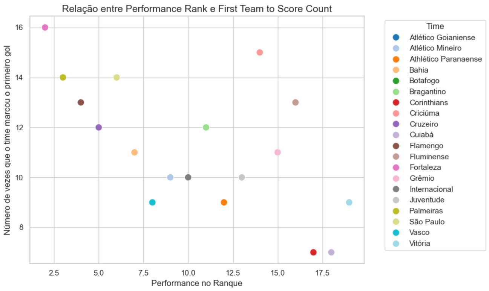

# Documentação Modelo Preditivo - Inteli

## ESTIMATCH
### StrikersAI
#### Davi Abreu, Isadora Gatto, Júlia Lika, Marco Ruas, Murilo Oliveira, Renan Reis, Vinicius Ibiapina

## Sumário
[1. Introdução](#c1)

[2. Objetivos e Justificativa](#c2)

[3. Metodologia](#c3)

[4. Desenvolvimento e Resultados](#c4)

[5. Conclusões e Recomendações](#c5)

[6. Referências](#c6)

[Anexos](#attachments)


## <a name="c1"></a>1. Introdução


&nbsp;&nbsp;&nbsp;&nbsp;&nbsp;&nbsp;Este documento apresenta o modelo preditivo desenvolvido pelo grupo StrikersAI em parceria com a International Business Machines Corporation (IBM). O projeto tem como objetivo criar previsões e análises para o futebol brasileiro durante as partidas, proporcionando estatísticas sobre os jogos e melhorando a experiência dos espectadores.

&nbsp;&nbsp;&nbsp;&nbsp;&nbsp;&nbsp;Sobre o parceiro, a IBM é uma empresa de atuação global, com sede nos Estados Unidos, e líder nos setores de nuvem híbrida, inteligência artificial e consultoria especializada. Operando em mais de 175 países e auxiliando seus clientes a otimizar processos de negócios, reduzir custos e obter uma vantagem competitiva em suas indústrias. A empresa se destaca por integrar soluções tecnológicas com conhecimento de negócios, oferecendo serviços personalizados e de valor agregado para uma ampla gama de setores industriais.

&nbsp;&nbsp;&nbsp;&nbsp;&nbsp;&nbsp;No contexto do projeto, o problema apresentado pelo parceiro é a carência de informações estratégicas e previsões precisas durante os jogos, o que limita a experiência dos espectadores e a capacidade de análise. A falta de dados, como as chances de vitória, previsões sobre quem marcará o primeiro gol e projeções do placar final, prejudica a experiência dos telespectadores e impede a obtenção de informações para todos os envolvidos no evento. No decorrer deste documento, será apresentado o problema, os objetivos, a solução e as etapas de desenvolvimento do projeto.

## <a name="c2"></a>2. Objetivos e Justificativa
### 2.1 Objetivos


#### Objetivos Gerais:
&nbsp;&nbsp;&nbsp;&nbsp;&nbsp;&nbsp;O objetivo geral deste projeto é criar uma solução que integre modelos preditivos em eventos esportivos, especificamente em partidas de futebol, com o intuito de fornecer previsões para o parceiro. Essa solução será utilizada dentro de estádios para melhorar a experiência dos espectadores, trazendo informações que não são normalmente transmitidas durante as partidas, aumentando o engajamento dos torcedores. Além de, fornecer dados para equipes técnicas, com informações técnica e físicas para prever o desempenho de determinado jogador.

&nbsp;&nbsp;&nbsp;&nbsp;&nbsp;&nbsp;O objetivo da IBM é atuar no contexto de eventos esportivos, como as partidas de futebol, na antecipação de resultados e a análise de desempenho. A aplicação de modelos preditivos permite que essas previsões sejam feitas com precisão, transformando dados históricos e estatísticas em informações para a tomada de decisões. Este projeto visa desenvolver uma solução preditiva que atenda a essas necessidades, utilizando técnicas de aprendizado de máquina para fornecer previsões durante os jogos.

#### Objetivos Específicos:

- **Prever o vencedor da partida**: Desenvolver um modelo capaz de analisar dados históricos e probabilidades para prever qual time tem mais chances de ganhar a partida.
- **Identificar o autor do primeiro gol**: Implementar algoritmos que possam prever qual jogador é mais provável de marcar o primeiro gol, com base em desempenho passado e condições de jogo.
- **Determinar o momento do primeiro gol**: Criar previsões sobre em que etapa do jogo o primeiro gol será marcado, utilizando dados temporais e estatísticas de partidas anteriores.
- **Estimativa do placar final**: Desenvolver um modelo preditivo que estime o placar final da partida, considerando o histórico de desempenho das equipes e jogadores.


### 2.2 Proposta de solução

&nbsp;&nbsp;&nbsp;&nbsp;&nbsp;&nbsp;Para cumprir com os objetivos acima, a proposta de solução consiste no desenvolvimento de um modelo preditivo, baseado em técnicas de aprendizado supervisionado, capaz de analisar dados históricos de partidas e estatísticas dos jogadores para gerar previsões sobre vários aspectos de um jogo de futebol. O modelo será treinado para responder as perguntas nos objetivos específicos.

&nbsp;&nbsp;&nbsp;&nbsp;&nbsp;&nbsp;Para garantir que as previsões sejam úteis e acionáveis, a solução incluirá a criação de um sistema de visualização interativo utilizando Jupyter Notebook. O Jupyter Notebook é uma ferramenta de código aberto que permite criar e compartilhar documentos que contêm código executável, visualizações, texto explicativo e muito mais. Esse sistema apresentará os resultados das previsões de maneira clara e intuitiva, facilitando o acesso e a compreensão por parte do parceiro. Além disso, o Jupyter Notebook permitirá a realização de análises, auxiliando na tomada de decisões tanto no contexto esportivo quanto em possíveis aplicações comerciais. Essa abordagem não apenas atende aos objetivos de melhorar a precisão das previsões em partidas de futebol, mas também aumenta o engajamento dos fãs, oferecendo-lhes uma experiência interativa e informativa durante os jogos.


### 2.3 Justificativa

&nbsp;&nbsp;&nbsp;&nbsp;&nbsp;&nbsp;A proposta de solução se destaca por sua capacidade de aplicar técnicas de aprendizado supervisionado para prever com precisão eventos esportivos, um diferencial que atende diretamente às necessidades de clubes de futebol, analistas esportivos e fãs. Ao gerar previsões detalhadas e personalizadas sobre resultados de partidas, desempenhos de jogadores e outros aspectos críticos do jogo, a solução não apenas suporta a tomada de decisões estratégicas, mas também transforma a experiência dos espectadores.

&nbsp;&nbsp;&nbsp;&nbsp;&nbsp;&nbsp;Entre os principais benefícios, destaca-se a possibilidade de oferecer dados que podem ser utilizados para antecipar estratégias de jogo, o que é fundamental tanto para os clubes quanto para os analistas. Além disso, ao envolver os fãs com visualizações interativas e acessíveis, a solução promove um maior engajamento e uma experiência maior durante as partidas.

&nbsp;&nbsp;&nbsp;&nbsp;&nbsp;&nbsp;A proposta se diferencia das soluções existentes no mercado pela combinação de análise preditiva e uma interface de usuário intuitiva, o que proporciona uma vantagem competitiva no mercado. Essa abordagem integrada não apenas melhora a acurácia das previsões esportivas, mas também facilita o acesso e a compreensão das informações, tornando-a uma ferramenta indispensável no contexto esportivo moderno.

## <a name="c3"></a>3. Metodologia

&nbsp;&nbsp;&nbsp;&nbsp;&nbsp;&nbsp;O CRISP-DM (Cross-Industry Standard Process for Data Mining)[[1]](#6-referências) é a metodologia mais comum para projetos, sendo utilizada em diferentes setores da indústria, como por exemplo a mineração de dados, análise e ciência de dados. Ela inclui descrições das fases típicas de um projeto, as tarefas envolvidas em cada fase e uma explicação dos relacionamentos entre essas tarefas, dessa forma, fornecendo uma visão geral do ciclo de vida da mineração de dados. Essa metodologia é composta por seis etapas principais: entendimento do negócio, entendimento dos dados, preparação dos dados, modelagem, avaliação e implantação. Permitindo uma compreensão profunda do contexto de negócios do projeto, além de sua natureza iterativa, que permite revisões e refinamentos contínuos para assegurar a qualidade dos resultados.

&nbsp;&nbsp;&nbsp;&nbsp;&nbsp;&nbsp;Neste projeto, é utilizado o CRISP-DM para guiar o desenvolvimento do modelo preditivo, sem incluir a fase de implantação, já que o objetivo final é construir e avaliar o modelo, não implantá-lo. A seguir, serão detalhadas as etapas do CRISP-DM aplicadas ao desenvolvimento do projeto. A figura 01 abaixo apresenta um diagrama ilustrativo dessas etapas.


<div align="center">
<sub>Figura 1 - Diagrama CRISP</sub>
<br>

<br>
<sup>Fonte: Escola DNC (2020)</sup>
</div>


&nbsp;&nbsp;&nbsp;&nbsp;&nbsp;&nbsp;As seis etapas que compõem a metodologia são:

1. **Entendimento do Negócio (Business Understanding)**: 
   - A primeira etapa tem como foco em entender os objetivos e as necessidades do negócio. Isso envolve definir o problema que o projeto pretende resolver e qual será o sucesso desejado. Além disso, é necessário avaliar a situação atual, considerando recursos disponíveis, riscos, e realizar uma análise de custo-benefício. Com isso, é possível alinhar as análises com os objetivos estratégicos da organização, definindo tanto os critérios de sucesso do negócio quanto as metas técnicas do projeto.

2. **Entendimento dos Dados (Data Understanding)**: 
   - Com os objetivos de negócio estabelecidos, a fase de Entendimento dos Dados se concentra em identificar, coletar e explorar os dados relevantes. Esta etapa inclui a coleta dos dados iniciais, a descrição das suas propriedades de superfície, a exploração detalhada para identificar relacionamentos entre os dados e a verificação da qualidade dos mesmos. O objetivo é assegurar que os dados disponíveis são adequados e suficientes para atingir as metas do projeto.

3. **Preparação dos Dados (Data Preparation)**: 
   - A preparação dos dados é uma das fases mais críticas e consome, em média, 80% do tempo total do projeto. Nesta etapa, os dados são selecionados, limpos, transformados e organizados para que estejam prontos para a modelagem. Isso inclui a derivação de novos atributos úteis, a integração de dados de diferentes fontes e o reformatamento dos dados para garantir que possam ser utilizados eficazmente nos modelos subsequentes.

4. **Modelagem (Modeling)**: 
   - A fase de modelagem é onde os diferentes algoritmos e técnicas de modelagem são aplicados para criar modelos que possam responder ao problema de negócio. As tarefas nesta fase incluem a seleção das técnicas de modelagem apropriadas, a geração do design de teste (como a divisão dos dados em conjuntos de treinamento, teste e validação), a construção dos modelos e sua avaliação inicial. A iteração contínua é recomendada até que se encontre um modelo "bom o suficiente" para os objetivos do projeto.

5. **Avaliação (Evaluation)**: 
   - Após a construção dos modelos, a fase de Avaliação assegura que os mesmos atendam aos critérios de sucesso do negócio. Isso envolve a avaliação dos resultados dos modelos, a revisão do processo como um todo e a determinação das próximas etapas. Essa fase também foca em garantir que nenhum aspecto importante foi esquecido e que todas as etapas foram executadas corretamente.

6. **Implantação (Deployment)**: 
   - A fase final, que não será abordada neste projeto, normalmente envolve a implementação dos modelos no ambiente de produção para gerar previsões ou insights. Dependendo dos requisitos, essa fase pode variar desde a geração de relatórios até a implementação de processos automatizados em toda a empresa. As tarefas nesta fase incluem o planejamento da implantação e do monitoramento contínuo, a produção de relatórios finais, e a revisão do projeto para identificar lições aprendidas.

&nbsp;&nbsp;&nbsp;&nbsp;&nbsp;&nbsp;Cada uma dessas etapas foi aplicada conforme as necessidades específicas do projeto, como detalhado anteriormente. A utilização da metodologia CRISP-DM forneceu uma estrutura organizada e eficiente, assegurando a relevância e a qualidade dos resultados obtidos.


## <a name="c4"></a>4. Desenvolvimento e Resultados
### 4.1. Compreensão do Problema
#### 4.1.1. Contexto da indústria 

&nbsp;&nbsp;&nbsp;&nbsp;&nbsp;&nbsp;A IBM, International Business Machines, é uma empresa que surgiu nos Estados Unidos com o empresário Charles Flint, e antes era chamada de CTR, ou Computing Tabulating Recording Company. Ela foi a fusão de duas outras empresas, uma que produzia máquinas de registro e outra de relógios, e seu primeiro produto foi uma balança. Isso ocorreu em 1911.

&nbsp;&nbsp;&nbsp;&nbsp;&nbsp;&nbsp;Alguns anos mais tarde, em 1917, a IBM (CTR na época) começou sua expansão para o mundo, e, curiosamente, a empresa que atua atualmente na área de informática esteve diretamente ligada ao início da informática no Brasil, visto que essa expansão que começou em 1917 teve o Brasil como primeiro “alvo”. O país recebeu sua primeira máquina mecânica automática de processamento de dados, a máquina de Hollerith (Hollerith Tabulating Machine), fornecida pela CTR[[2]](#6-referências).

&nbsp;&nbsp;&nbsp;&nbsp;&nbsp;&nbsp;Essa expansão, quase que prematura, da IBM para o mundo é um dos motivos pelos quais ela hoje é reconhecida como o principal player do mercado de informática, estando presente em mais de 150 países, além de possuir produtos em diversos segmentos dentro de tecnologia, como IA’s e softwares para empresas, nuvem híbrida, produtos de segurança da informação, e ainda na computação quântica e consultoria.

&nbsp;&nbsp;&nbsp;&nbsp;&nbsp;&nbsp;Nesse sentido, por possuir diversos produtos, a IBM também tem muitos concorrentes, que vão desde empresas multinacionais que estão entre as maiores do mundo, como Microsoft, AWS, Google Cloud, e Oracle, até pequenos concorrentes que suprem necessidades locais de consumidores, como a Resource IT Solutions, empresa brasileira de desenvolvimento de softwares empresariais.

&nbsp;&nbsp;&nbsp;&nbsp;&nbsp;&nbsp;Para concorrer com as grandes empresas citadas acima, e também com empresas menores, a IBM possui um modelo de negócios abrangente e interconectado, integrando esses elementos para oferecer soluções completas aos clientes. Esse modelo será abordado e explicado abaixo.

&nbsp;&nbsp;&nbsp;&nbsp;&nbsp;&nbsp;Podemos citar, em relação às suas principais áreas de atuação, que são: AI and Data Analytics, Cloud Computing, e Consulting, que a IBM oferece diversas soluções de IA, destacando-se o IBM Watson, que abrange desde assistentes virtuais até análise preditiva, automação de processos e ferramentas de Business Intelligence (BI). Eles geram receita através de assinaturas e licenças.

&nbsp;&nbsp;&nbsp;&nbsp;&nbsp;&nbsp;Em relação à Cloud Computing, a IBM tem um forte foco em soluções de nuvem híbrida e multicloud, com o IBM Cloud. Isso inclui tanto IaaS quanto PaaS e também SaaS. A aquisição da Red Hat pela IBM em 2019[[3]](#6-referências), por exemplo, foi uma jogada estratégica para fortalecer sua oferta de soluções de nuvem híbrida. As receitas nessa área são geradas pela provisão de infraestrutura em nuvem, em que os clientes pagam pelo uso de capacidade computacional, armazenamento e outros recursos.

&nbsp;&nbsp;&nbsp;&nbsp;&nbsp;&nbsp;Finalizando a abordagem dos principais produtos e serviços da IBM, temos a consultoria, em que ela ajuda outras empresas a integrar e otimizar suas operações com tecnologia. A IBM Consulting é a divisão que lidera essas iniciativas e vem focando atualmente em IA, como sugeriu a revista Exame[[4]](#6-referências). Nesse serviço, a receita é interessante para a IBM, uma vez que ela não apenas implementa soluções, mas também continua a gerenciá-las e a fornecer suporte contínuo.

&nbsp;&nbsp;&nbsp;&nbsp;&nbsp;&nbsp;Assim, dispondo de uma grande quantidade de serviços, produtos e soluções, a IBM consegue atuar em uma grande parte do mercado, oferecendo soluções tecnológicas para seus clientes, que são os mais diversos, visto que estão dentro de várias indústrias, desde saúde, finanças, manufatura, varejo, e governo.

&nbsp;&nbsp;&nbsp;&nbsp;&nbsp;&nbsp;Em relação ao futuro da empresa, a IBM publicou, em 2022, um texto sobre as tendências que acredita que se consolidarão nos próximos anos[[5]](#6-referências). Nele, pode-se entender que a IBM está investindo tanto em tecnologias já consolidadas no mercado quanto em novas e mais arriscadas áreas, como é o caso da computação quântica[[6]](#6-referências). Para isso, ela tem aplicado cada vez mais recursos na contratação e capacitação de colaboradores qualificados e espera que, desta ação, sejam cultivados frutos, como inovações em geral nas áreas em que atua e uma maior conexão entre as empresas de seu ecossistema, o que é muito positivo para o futuro da marca.

&nbsp;&nbsp;&nbsp;&nbsp;&nbsp;&nbsp;Por fim, ela também tem investido em aumentar a confiabilidade em relação à cibersegurança, área que, após o caso da CrowdStrike[[7]](#6-referências), empresa norte-americana de cibersegurança, no primeiro semestre deste ano, ficou ainda mais no radar do público em geral, e a sustentabilidade, que tem ganhado maior influência nas decisões de consumo de produtos do público, como aponta a pesquisa Future Consumer Index[[8]](#6-referências).

&nbsp;&nbsp;&nbsp;&nbsp;&nbsp;&nbsp;Podemos concluir, então, que a IBM é uma empresa bastante completa em relação aos serviços que oferece, tem uma gama e diversidade de concorrentes e apresenta planos futuros condizentes com a própria marca e tendências de mercado, validadas por acontecimentos e estudos recentes, como foi demonstrado acima.


##### 4.1.1.1 Cinco Forças de Porter

&nbsp;&nbsp;&nbsp;&nbsp;&nbsp;&nbsp;As cinco forças de Porter, elaboradas por Michael Porter, permitem a compreensão da competição em uma indústria ou setor. Elas incluem o poder de barganha dos fornecedores e compradores, a rivalidade entre concorrentes existentes, a ameaça de novos entrantes e a ameaça de produtos ou serviços substitutos. Essa análise é essencial para empresas identificarem oportunidades e ameaças, capacitando-as a desenvolver estratégias que as mantenham competitivas no mercado. A figura 1 situa as 5 forças de Porter da IBM.

<div align="center">
  <sub>Figura 2 - 5 Forças de Porter</sub>

<sup>Fonte: Material produzido pelo grupo StrikersAI (2024)</sup>
</div>

&nbsp;&nbsp;&nbsp;&nbsp;&nbsp;&nbsp;**Rivalidade entre os concorrentes:** Alta, a IBM opera em um setor altamente competitivo, enfrentando rivalidade de diversos grandes players em diferentes áreas de atuação. No setor de computação em nuvem, a IBM compete com empresas como Amazon (AWS) e Google Cloud, que têm uma presença significativa e oferecem soluções abrangentes de infraestrutura e serviços em nuvem. Essas plataformas são amplamente adotadas por empresas de todos os tamanhos devido à sua escalabilidade, inovação e custos competitivos.

&nbsp;&nbsp;&nbsp;&nbsp;&nbsp;&nbsp;No segmento de hardware, a IBM enfrenta a concorrência de empresas como Microsoft e Oracle, que oferecem soluções integradas para empresas. A Microsoft, além de atuar no hardware, é uma concorrente significativa em software e serviços de nuvem, consolidando uma presença forte no mercado corporativo. Oracle, por sua vez, é conhecida por suas soluções de banco de dados e hardware.

&nbsp;&nbsp;&nbsp;&nbsp;&nbsp;&nbsp;Na área de consultoria, o IBM compete com Hewlett Packard Enterprise (HPE) e Microsoft Azure, entre outros. HPE é um player importante em serviços de tecnologia e consultoria, oferecendo soluções para otimização de infraestrutura e modernização digital. A Microsoft Azure, além de sua atuação em nuvem, também se destacou com sua plataforma esportiva digital baseada em nuvem, que possibilita a criação de campanhas promocionais direcionadas e o uso de dados para rastrear e analisar o comportamento dos fãs para o Real Madrid[[9]](#6-referências).

&nbsp;&nbsp;&nbsp;&nbsp;&nbsp;&nbsp;**Poder de barganha dos fornecedores:** Moderado, a IBM mantém algumas redes de fornecedores para seus diversos produtos e serviços, que vão desde hardware até serviços de TI[[10]](#6-referências). A empresa estabelece parcerias fortes e estratégicas, como a parceria com a Samsung Electronics para a fabricação de semicondutores, para minimizar a dependência de fornecedores específicos e garantir um fornecimento contínuo de componentes críticos. No entanto, a dependência desses produtos ainda representa um desafio. Durante a pandemia, a escassez global de microchips[[11]](#6-referências) afetou a capacidade de fornecimento da IBM e resultou em uma queda de receita de 5,4%[[12]](#6-referências), evidenciando a importância de diversificar a cadeia de suprimentos para reduzir riscos.


&nbsp;&nbsp;&nbsp;&nbsp;&nbsp;&nbsp;No setor de consultoria, o poder de barganha dos fornecedores é menos significativo. O IBM, nesse segmento, conta mais com sua expertise e o valor agregado de seus serviços do que com fornecedores externos. Isso confere à empresa um maior controle sobre suas ofertas de consultoria e reduz o impacto das variações no poder de barganha dos fornecedores, permitindo-lhe manter uma posição mais forte nesse mercado.


&nbsp;&nbsp;&nbsp;&nbsp;&nbsp;&nbsp;**Poder de barganha dos clientes:**  Alto. Os clientes da IBM, que incluem desde grandes corporações até governos, possuem um poder de barganha significativo devido à ampla variedade de alternativas disponíveis no mercado. A competição é acirrada, com grandes players como Amazon, Google Cloud e Microsoft Azure. No primeiro trimestre de 2024, o Google Cloud registrou uma receita superior a 9 bilhões de dólares[[13]](#6-referências). As receitas da AWS, a unidade de serviços na nuvem da Amazon, aumentaram 19%, alcançando 26,3 bilhões de dólares apenas no segundo trimestre de 2024[[14]](#6-referências). Além disso, a Microsoft Azure teve uma receita que superou 31,8 bilhões de dólares no terceiro trimestre[[15]](#6-referências). Dessa forma, os dados demonstram a grande influência que essas empresas possuem no mesmo mercado que a IBM.


&nbsp;&nbsp;&nbsp;&nbsp;&nbsp;&nbsp;Portanto, esses concorrentes têm uma presença significativa no mercado e oferecem soluções importantes, o que amplia as opções dos clientes na escolha de fornecedores e serviços. Assim, a empresa deve garantir que suas soluções sejam competitivas tanto em termos de preço quanto de desempenho para manter uma posição sólida diante dos concorrentes.

&nbsp;&nbsp;&nbsp;&nbsp;&nbsp;&nbsp;**Ameaça de novos entrantes:** Baixa. Os altos custos em pesquisa e desenvolvimento de software necessários para ingressar no mercado dificultam a entrada de novas empresas. Além disso, a presença de mercado estabelecida da IBM e seu extenso portfólio de patentes criam barreiras para os novos competidores. A IBM possui uma longa história de inovação e uma base sólida de clientes, o que lhe confere uma vantagem competitiva. Essas barreiras tornam difícil para novas empresas não só entrar no mercado, mas também competir efetivamente com a IBM. 

&nbsp;&nbsp;&nbsp;&nbsp;&nbsp;&nbsp;**Ameaça de produtos substitutos:** Alta. A rápida evolução da tecnologia pode introduzir novas ferramentas que substituam as desenvolvidas pela IBM, oferecendo serviços inovadores e diferentes dos que o mercado está acostumado. Essa dinâmica de mudança constante exige que a IBM mantenha um foco intenso em pesquisa e desenvolvimento para garantir que seus produtos sejam continuamente reinventados e aprimorados. Investir em inovação é essencial para a empresa não apenas acompanhar as tendências tecnológicas, mas também para antecipar as necessidades dos clientes e superar a concorrência.

&nbsp;&nbsp;&nbsp;&nbsp;&nbsp;&nbsp;A análise das Cinco Forças de Porter aplicada à IBM evidencia um ambiente altamente competitivo, com intensa rivalidade nos setores de computação em nuvem e hardware, e um elevado poder de barganha dos clientes devido às diversas alternativas no mercado. Embora a IBM tenha diversificado sua cadeia de suprimentos para mitigar riscos, o poder de barganha dos fornecedores permanece moderado. A ameaça de novos entrantes é baixa, devido aos altos custos e às barreiras de entrada, enquanto a ameaça de produtos substitutos é alta, exigindo constante inovação para manter a competitividade. Essa análise reforça a importância de estratégias para que a IBM continue a liderar em um mercado em rápida evolução.


#### 4.1.2. Análise SWOT 

&nbsp;&nbsp;&nbsp;&nbsp;A análise SWOT é uma ferramenta estratégica amplamente utilizada para avaliar os aspectos internos e externos de uma empresa ou projeto. "SWOT" representa Strengths (Forças), Weaknesses (Fraquezas), Opportunities (Oportunidades) e Threats (Ameaças). As forças e fraquezas são fatores internos, como recursos e capacidades da empresa, enquanto as oportunidades e ameaças são fatores externos, como tendências de mercado. Essa ferramenta permite às empresas identificarem pontos de melhoria, explorarem novas oportunidades e mitigarem riscos, facilitando a tomada de decisões estratégicas. Com a finalidade de compreender o cenário em que a empresa se encontra e como ela se posiciona, a análise SWOT foi criada e está representada na imagem e no quadro explicativo abaixo:

<div align="center">
  <sub>Figura 3 - Analise SWOT</sub>

<sup>Fonte: Material produzido pelo grupo StrikersAI (2024)</sup>
</div>

<br>

## Forças (Strengths)

**Marca Global e Reputação:**  A IBM é amplamente reconhecida como uma das marcas mais confiáveis e respeitadas no setor de tecnologia, posicionando-se em 6º lugar no ranking das 50 empresas mais admiradas do mundo[[16]](#6-referências). Sua longa história de inovação e qualidade a posiciona como uma líder no mercado de tecnologia.


**Portfólio Diversificado:** A IBM possui um portfólio abrangente que inclui software, hardware, serviços de TI, consultoria, soluções de computação em nuvem e inteligência artificial. Exemplos incluem o IBM Watson, que trouxe mudanças significativas ao vencer o Jeopardy!, uma competição de conhecimentos gerais transmitida na televisão em 2011[[17]](#6-referências), e o IBM Cloud, que oferece uma plataforma de nuvem híbrida.


**Inovação e Pesquisa:**  A IBM é conhecida por seu compromisso com a inovação, evidenciado por seu investimento em pesquisa e desenvolvimento (P&D). A empresa frequentemente lidera o número de patentes registradas[[18]](#6-referências), especialmente em áreas como IA e computação quântica, onde o IBM Quantum é um exemplo de liderança tecnológica.


**Aquisições Estratégicas:** A aquisição da Red Hat é um exemplo de como a IBM se posiciona para ser uma líder em tecnologias emergentes, especialmente em nuvem híbrida, mercado considerado estratégico e transformado em uma das principais fontes de renda da empresa[[19]](#6-referências).


**Parcerias e Alianças:** A IBM possui uma vasta rede de parcerias que fortalece sua oferta de serviços, expande seu alcance global e destaca sua capacidade de adaptação e colaboração em diferentes setores. Um exemplo famoso é a cooperação com a Apple para o desenvolvimento de soluções empresariais móveis.

**Amplo Alcance Global:** A IBM opera em mais de 170 países[[20]](#6-referências), o que lhe confere uma base sólida e presença significativa em mercados emergentes e desenvolvidos. Sua infraestrutura global a coloca em uma posição vantajosa para atender grandes corporações multinacionais.

<br>

## Fraquezas (Weaknesses)

**Queda de Receita em Segmentos-chave:** Com a mudança de foco para outras áreas, a IBM viu seu antigo foco principal, o hardware, perder relevância, impactando o desempenho financeiro geral da empresa. A IBM tem enfrentado dificuldades em revitalizar esses setores em meio à transição para modelos de negócios digitais[[21]](#6-referências).


**Imitabilidade de Produtos:** Muitos produtos e serviços da IBM podem ser facilmente imitados por concorrentes, especialmente em um mercado competitivo como o de TI. Por exemplo, o IBM Power Systems enfrenta concorrência direta da Dell EMC PowerEdge, enquanto o IBM zSystems compete com o HPE Superdome Flex. No campo da nuvem, a IBM Cloud disputa espaço com gigantes como AWS, Microsoft Azure e Google Cloud Platform, o que reduz sua vantagem competitiva e pressiona suas margens de lucro.

**Alto custo de serviços personalizados:** As soluções personalizadas da IBM têm um alto custo, limitando sua aderência entre pequenas e médias empresas que ainda não estão estabelecidas no mercado. Essa concentração em grandes corporações pode deixar a empresa vulnerável a mudanças no comportamento de compra desses clientes.
<br>

## Oportunidades (Opportunities)

**Expansão da Computação em Nuvem:** Com a aquisição da Red Hat, a IBM está bem posicionada para se beneficiar do crescimento contínuo do mercado de computação em nuvem, especialmente em soluções de nuvem híbrida. A demanda por infraestrutura em nuvem que combina ambientes públicos e privados é uma grande oportunidade.

**Transformação Digital:** Apesar de terem algumas dificuldades no quesito de aderência da transformação digital, por conta das mudanças bruscas da gestão organizacional das empresas[[22]](#6-referências), a necessidade de transformação digital em indústrias como saúde, finanças e manufatura oferece uma grande oportunidade para os serviços de consultoria da IBM. A crescente digitalização desses setores demanda soluções inovadoras que a IBM está bem posicionada para oferecer. Um exemplo disso é a plataforma bancária inteligente de integração de dados em parceria com o State Bank of India (SBI)[[23]](#6-referências), onde foram envolvidos processos de modernização de infraestrutura, IA, segurança e compliance, automação de processos e resiliência operacional.


**Soluções Sustentáveis:** A demanda crescente por tecnologias sustentáveis oferece à IBM a oportunidade de desenvolver soluções ecológicas, como o uso de IA para otimizar operações e reduzir emissões de gases do efeito estufa. Iniciativas como o IBM Green Horizon mostram o compromisso da empresa com a sustentabilidade[[24]](#6-referências).


**Computação Quântica:** A IBM é pioneira na computação quântica[[25]](#6-referências). Com o IBM Quantum, a empresa tem a oportunidade de liderar essa revolução tecnológica. À medida que a computação quântica se aproxima da comercialização, a IBM está em uma posição estratégica para dominar este novo campo.


**Transformação constante do mercado tecnológico:** O crescimento da demanda por soluções de IA em diversos setores, como saúde e finanças, oferece uma oportunidade substancial para a empresa ampliar sua participação de mercado, visto que em diversos cenários, a IBM se adaptou rapidamente ao mercado. Um exemplo recente é a criação da Kyndryl em 2021, quando a IBM separou sua divisão de serviços de infraestrutura gerenciada. Essa decisão estratégica permitiu à IBM concentrar seus recursos e esforços em áreas de alto crescimento, como inteligência artificial, nuvem híbrida e computação quântica, ao invés de continuar operando em um negócio tradicional de menor crescimento. Essa movimentação exemplifica a capacidade da IBM de reorientar seu foco para capturar novas oportunidades no mercado tecnológico em constante evolução.
<br>

## Ameaças (Threats)

**Segurança Cibernética:** À medida que a IBM aumenta sua oferta de serviços em nuvem, os riscos associados a ameaças cibernéticas se intensificam. Uma falha de segurança pode prejudicar gravemente a reputação da empresa e levar a custos elevados com recuperação e proteção.

**Regulamentações Governamentais:** As regulamentações crescentes, especialmente em privacidade de dados e uso de IA, podem impor restrições e aumentar os custos operacionais da IBM. A conformidade com normas e regulações globais pode se tornar cada vez mais complexa e onerosa.

**Impactos Econômicos:** Crises econômicas globais ou regionais podem reduzir a demanda por serviços e produtos da IBM, especialmente em mercados emergentes onde a volatilidade é maior. As flutuações econômicas podem afetar negativamente os investimentos das grandes corporações em novas tecnologias.

&nbsp;&nbsp;&nbsp;&nbsp;Apesar da rápida transformação do mercado tecnológico ser vista como uma fraqueza — devido ao enfraquecimento de segmentos tradicionais, como hardware — essa mesma transformação oferece oportunidades significativas para a IBM se destacar em áreas emergentes, como inteligência artificial e computação em nuvem. A IBM demonstrou sua capacidade de se adaptar a tais mudanças, como evidenciado pela transição bem-sucedida do cenário de construção de computadores pessoais para o desenvolvimento do Watson, que se tornou uma plataforma líder em IA. Portanto, mesmo com a visão da transformação do mercado como uma fraqueza em segmentos menos adaptáveis, a equipe trabalhará com o ponto de vista de que, para a IBM, esse fator é uma oportunidade de crescimento em áreas inovadoras.

&nbsp;&nbsp;&nbsp;&nbsp;Concluindo, a análise SWOT da IBM revela uma empresa com uma marca global forte, um portfólio diversificado e um compromisso com a inovação, que se posiciona como líder em várias áreas tecnológicas. No entanto, enfrenta desafios como a queda de receita em segmentos tradicionais e a imitabilidade de seus produtos. O cenário externo apresenta grandes oportunidades, especialmente na computação em nuvem e quântica, enquanto as ameaças incluem a segurança cibernética e regulamentações governamentais. A IBM tem mostrado resiliência e capacidade de adaptação em um mercado em constante evolução, convertendo fraquezas em oportunidades de crescimento, particularmente em áreas emergentes como a inteligência artificial e a sustentabilidade. Esse potencial para inovação contínua sugere que a IBM está bem posicionada para manter sua relevância e liderança no setor tecnológico.

#### 4.1.3. Planejamento Geral da Solução

&nbsp;&nbsp;&nbsp;&nbsp;&nbsp;&nbsp;Ao longo dessa seção será abordado o planejamento de forma geral da solução, passando pelo problema, motivo pelo qual a este projeto será desenvolvido, até o critério de sucesso para metrificar que o problema foi solucionado com tal ferramenta. Essas informações dão um norte geral à você, leitor, que quer saber de forma resumida sobre o EstiMatch.

##### Qual é o problema a ser resolvido?

&nbsp;&nbsp;&nbsp;&nbsp;&nbsp;&nbsp;Atualmente, apesar de existirem diversas ferramentas no mercado que calculam probabilidades relacionadas ao futebol, nenhuma delas está ligada diretamente ao público do esporte de forma acessível e direta. Nesse caso, no futebol, faltam dados que sejam coletados, analisados e, especialmente, transmitidos aos espectadores de forma a agregar à sua experiência com o esporte, fornecendo referências como, por exemplo: “Qual time tem mais chances de marcar o primeiro gol?” ou então, “Em qual etapa do jogo é mais provável que o primeiro gol seja marcado?”, que podem agregar para diversos públicos, desde a transmissão de TV, espectadores, atletas, treinadores, até mesmo olheiros, que adorariam ter essas informações, já que, como dizia o CEO do LinkedIn, Jeff Weiner: “Data really powers everything that we do”. Além disso, será aproveitada a oportunidade de utilizar o camarote do parceiro no Allianz Park para mostrar esses dados durante partidas em que o espaço estiver sendo ocupado por possíveis decisores e equipes de empresas que estejam em processo de negociação com a IBM para estimular a negociação.

##### Qual é a solução proposta (visão de negócios)?

&nbsp;&nbsp;&nbsp;&nbsp;&nbsp;&nbsp;Sendo assim, visando atingir especialmente os torcedores fanáticos pelo futebol e os visitantes do camarote da IBM no Allianz Park com essas informações, a proposta foi desenvolver uma solução que, a partir de modelos preditivos que utilizem técnicas de aprendizado supervisionado e inteligência artificial, consiga prever informações relevantes, como as mencionadas no parágrafo anterior, com base em dados estatísticos passados dos campeonatos analisados, com visualização facilitada e exibida de maneira criativa para gerar essa atração dos públicos visados com o projeto.

##### Como a solução proposta deverá ser utilizada?

&nbsp;&nbsp;&nbsp;&nbsp;&nbsp;&nbsp;Esses dados poderão ser utilizados para diversos fins, desde medições de desempenho para uma substituição na partida até para torcedores definirem as apostas que vão fazer nos jogos, já que essa solução será disponibilizada ao público, e eles podem fazer o uso que quiserem. No entanto, como principais usos podemos citar: maior envolvimento dos torcedores em estádios de futebol, incentivo para que prováveis empresas que decidam fechar negócio com a IBM, entre outros.

#####  Quais são os benefícios trazidos pela solução proposta?

&nbsp;&nbsp;&nbsp;&nbsp;&nbsp;&nbsp;Dessa forma, a solução proposta trará inúmeros benefícios, tais como um aumento no engajamento e na experiência dos torcedores durante as partidas, a melhoria na qualidade das análises esportivas, e a otimização do desempenho dos jogadores com base em dados concretos, e o aumento da taxa de vendas da IBM. Esses benefícios não só melhoram a experiência geral do futebol, mas também aumentam o valor comercial do esporte ao atrair mais investimentos e patrocinadores interessados em tecnologias inovadoras no esporte, como foi o caso do surgimento do VAR, que foi utilizado no Brasil pela primeira vez no Campeonato Pernambucano, em 2018[[26]](#6-referências).

##### Qual será o critério de sucesso e qual medida será utilizada para avaliar?

&nbsp;&nbsp;&nbsp;&nbsp;&nbsp;&nbsp;Por fim, com relação ao critério de sucesso do projeto, como ainda não temos uma abordagem definida de como ele será desenvolvido, também não podemos afirmar com certeza qual métrica específica será utilizada. Isso ocorre porque não existe uma métrica padrão, dado que diferentes dados podem ser analisados para distintos propósitos em uma partida de futebol. Sendo assim, de forma mais generalista, o que será considerado é a metodologia por trás das variáveis usadas, levando em conta o modelo de negócio que definimos para o projeto, e como o modelo se traduz nesse modelo adotado.

&nbsp;&nbsp;&nbsp;&nbsp;&nbsp;&nbsp;Entretanto, para não deixar tão em aberto, por enquanto será adotado como critério de sucesso a capacidade do modelo em realizar previsões consistentes em diferentes cenários, e o quanto ele consegue generalizar e ser específico nessas previsões. Para avaliar essa capacidade, utilizaremos métricas de avaliação de modelos de IA, como acurácia, precisão, recall e F1-score. Acurácia mede a proporção de previsões corretas; precisão foca na exatidão das previsões positivas; recall avalia a capacidade do modelo de identificar corretamente os casos positivos; e F1-score combina precisão e recall para um balanço geral.

&nbsp;&nbsp;&nbsp;&nbsp;&nbsp;&nbsp;Além disso, será levada em conta a robustez do modelo, que se refere à sua capacidade de manter bom desempenho em diversos cenários. Um modelo deve evitar overfitting, ou seja, ele deve saber ser generalista, sem ser excessivamente adaptado ao conjunto de dados de treino. Somente assim o objetivo do projeto será atingido.

&nbsp;&nbsp;&nbsp;&nbsp;&nbsp;&nbsp;Concluindo, o EstiMatch entra em campo como uma resposta inovadora à carência de ferramentas preditivas acessíveis e integradas diretamente ao público do futebol. Combinando técnicas avançadas de aprendizado supervisionado e inteligência artificial, a solução visa melhorar a experiência dos torcedores durante os campeonatos e, ainda, auxiliar a IBM em negociações, visto a oportunidade existente com o camarote do Allianz Park. A reverberação (sucesso) desse gol será medido pela capacidade de realizar previsões consistentes e aplicáveis em diversos cenários nas partidas, resultado que, caso alcançado, pode mudar a forma como o futebol é assistido, contribuindo, assim, para o esporte.


#### 4.1.4. Value Proposition Canvas


&nbsp;&nbsp;&nbsp;&nbsp;&nbsp;&nbsp;O Canvas de Proposta de Valor é essencial para análise do por que nosso produto é relevante para o consumidor. Ele nos permite identificar e compreender os desafios enfrentados pelos clientes e como criar uma solução que atenda às suas necessidades. Para isso, utilizamos essa ferramenta para examinar as dores do nosso público-alvo, resultando em uma solução que abordará os seus principais problemas. Na imagem a seguir está uma representação do nosso Canvas e após ela terá uma explicação sobre cada tópico representado no templete.


<div align="center">
  <sub>Figura 4 - Template do Canvas de Proposta de Valor  </sub>

<sup>Fonte: Material produzido pelo grupo StrikersAI (2024)</sup>
</div>

#### 1. Tarefas do Cliente: 

&nbsp;&nbsp;&nbsp;&nbsp;&nbsp;&nbsp;Aqui, descrevemos as principais atividades ou tarefas que os clientes precisam realizar relacionadas ao problema que estão enfrentando. Isso nos ajuda a entender melhor as necessidades dos clientes e como nosso produto pode ajudá-los. Aqui estão as tarefas do Cliente:

- **Envolver espectadores com a narração:** As transmissões têm como objetivo envolver os espectadores com a narração porque isso cria uma experiência mais imersiva e emocionante, fazendo com que o público se sinta parte do evento. Uma narração envolvente mantém a atenção dos espectadores, aumenta sua conexão com o conteúdo e os ajuda a compreender melhor o que está acontecendo. Isso não apenas melhora a satisfação dos espectadores, mas também os incentiva a continuar assistindo e a retornar para futuras transmissões garantindo uma audiência mais engajada. 

- **Análise de dados dos jogadores:** Os analistas do time precisam analisar dados para prever o rendimento dos jogadores, utilizando essa análise para identificar padrões de desempenho e antecipar como os atletas podem se comportar em jogos futuros. No entanto, o grande volume de dados pode levar a análises inconsistentes. Ao considerar dados históricos, como estatísticas de jogos anteriores, condições físicas e outros fatores relevantes, os analistas fornecem informações para a equipe técnica. Essas previsões auxiliam na tomada de decisões, como ajustar táticas, planejar treinos específicos e determinar a melhor forma de escalar o time, visando maximizar o desempenho individual e coletivo em partidas futuras.

- **Demonstração de tecnologias IBM:** O funcionário da IBM que leva seu cliente ao camarote do Allianz Parque para assistir aos jogos do Palmeiras comenta sobre as tecnologias da empresa, destacando o uso de inteligência artificial. No entanto, ele não apresenta algo físico e funcional para o cliente.

- **Previsões de apostas esportivas:** O fã de futebol utiliza dados passados fornecidos por um aplicativo para tentar acertar os resultados de apostas esportivas. Ele analisa estatísticas, desempenhos anteriores dos times e outras informações relevantes na esperança de fazer previsões precisas. No entanto, mesmo com esses dados, ele raramente consegue uma boa margem de acerto.<br><br>

#### 2. Dores do Cliente:

&nbsp;&nbsp;&nbsp;&nbsp;&nbsp;&nbsp;Aqui, representamos as frustações que o cliente enfrenta ao tentar realizar suas tarefa. Identificar essas dores é essencial para desenvolver soluções eficazes que atendam às necessidades dos clientes. Aqui estão as dores do cliente:

- **Falta de Previsões e Estatísticas Precisas:** Os fãs de esportes enfrentam dificuldades para prever resultados e melhorar sua experiência durante as partidas ou obter sucesso em suas apostas devido à falta de acesso a dados completos e previsões detalhadas.
- **Desengajamento Durante as Transmissões:** Transmissões esportivas muitas vezes não conseguem manter o público engajado, resultando em uma experiência menos emocionante, devido à falta de análises e previsões dos jogos.
- **Falta de Demonstrações Funcionais:** A IBM não consegue impressionar seus clientes quando não apresentam demonstrações físicas e funcionais de suas tecnologias, por exemplo, sua capacidade em conseguir utilizar a inteligência artificial para realizar previsões.
- **Análises Inconsistentes:** O excesso de dados, combinado com a falta de ferramentas eficientes para que treinadores e analistas dos times realizem suas avaliações, podem resultar em previsões imprecisas, prejudicando o desempenho da equipe.<br><br>

#### 3. Ganhos do Cliente:

&nbsp;&nbsp;&nbsp;&nbsp;&nbsp;&nbsp;Aqui destacamos os benefícios ou ganhos que os clientes desejam alcançar ao resolver seus problemas. Esses ganhos podem ser funcionais, emocionais ou sociais e ajudam a direcionar o desenvolvimento do produto para atender às expectativas dos clientes. Aqui estão os ganhos dos Clientes:

- **Melhor Qualidade na Narração e Análise:** Informações precisas ajudam a melhorar a narração e a análise dos jogos, criando uma experiência mais informativa para o público. Assim, os narradores podem oferecer comentários mais profundos e contextualizados, explicando estratégias e possíveis resultados com maior clareza.

- **Engajamento Aumentado Durante as Partidas:** Transmissões mais envolventes e dados anteriores aumentam o engajamento do público. Com isso, os fãs se sentem mais conectados aos jogos e entendem melhor o que está acontecendo na partida. Isso torna a experiência mais emocionante e mantém o público mais atento e interessado ao longo da transmissão.

- **Demonstrações eficazes:** O funcionário da IBM pode levar seu cliente ao jogo do Palmeiras, comentar sobre as tecnologias da empresa, destacando o uso de inteligência artificial, e apresentar algo físico e funcional para o cliente, pois apresentações práticas das tecnologias aumentam a confiança e o interesse dos clientes nas soluções oferecidas. Por isso, quando os clientes veem as soluções em ação, conseguem visualizar como elas atenderão às suas necessidades, o que intensifica a confiança e o interesse.

- **Decisões Informadas e Precisas:** Análises de dados confiáveis permitem aos analistas e treinadores fazer previsões mais precisas e tomar decisões mais informadas para o planejamento das partidas e do time. Isso resulta em melhores desempenhos, com uma identificação mais clara de oportunidades e riscos.<br><br>

#### 4. Produto e Serviço:

&nbsp;&nbsp;&nbsp;&nbsp;&nbsp;&nbsp; Aqui descrevemos o produto em si e como ele se encaixa nas necessidades, desejos e expectativas dos clientes. Esta seção oferece uma visão geral do que está sendo oferecido e como ele aborda as tarefas, dores, ganhos, criadores de ganho e avaliador. Aqui estão o produtos:

- **Inteligência artificial de previsão de resultados:** Uma IA que oferece previsões de resultados com base na análise de dados antes dos jogos, acessível a analistas, narradores, fãs de futebol e clientes da IBM. Isso melhora a experiência dos torcedores, permite planejamentos mais precisos para as equipes e aumenta a eficiência nas apostas esportivas.

- **Ferramenta de Demonstração de IA:** Uma solução tecnológica que permite a IBM realizar demonstrações funcionais e interativas de suas tecnologias, especialmente em jogos de futebol.<br><br>
  
#### 5. Aliviadores de Dores:

&nbsp;&nbsp;&nbsp;&nbsp;&nbsp;&nbsp;Aqui listamos como o produto vai solucionar as dores do cliente diretamente. Esses aliviadores são os recursos que eliminam ou reduzem os problemas enfrentados pelo cliente, tornando a oferta mais atraente e valiosa. Aqui estão os avaliadores de Dores:

- **Redução de Erros nas Transmissões:** Acesso a informações precisas durante os jogos diminui a probabilidade de erros na narração e na análise. Assim, garantindo que as informações transmitidas ao público sejam exatas, melhorando a qualidade e a credibilidade da transmissão.

- **Confiança Aumentada para Narradores:** Com dados confiáveis, os narradores podem se sentir mais seguros ao discutir estatísticas durante as transmissões, reduzindo a chance de cometer erros. Isso se reflete em uma narração mais fluida e informativa, melhorando a qualidade geral da transmissão.

- **Demonstração Interativa:** A IA proporciona visibilidade prática ao exibir as tecnologias da IBM em ação, aumentando a confiança dos clientes ao mostrar aplicações reais e funcionais. Ela permite interação direta com as soluções em um ambiente ao vivo, abordando a falta de demonstrações físicas e proporcionando uma experiência prática que supera a ausência de provas tangíveis.<br><br>

#### 6. Criadores de Ganhos:

&nbsp;&nbsp;&nbsp;&nbsp;&nbsp;&nbsp;Por fim, essa seção descreve como o produto oferece valor aos clientes, criando benefícios ou ganhos desejados. São os elementos que tornam a proposta de valor única e atraente em comparação com outras soluções disponíveis no mercado. Aqui estão os criadores de ganhos:

- **Qualidade Superior na Narração:** A solução melhora a qualidade da narração esportiva, tornando as transmissões mais informativas e envolventes. Isso enriquece a transmissão, tornando-a mais informativa e envolvente para o público, que passa a entender melhor e participar mais dos jogos.

- **Engajamento do público:** Ferramentas interativas e previsões específicas aumentam o engajamento do público durante os jogos. Fazendo com que os torcedores se sintam mais envolvidos e conectados aos jogos, tornando a experiência mais dinâmica e envolvente.

- **Demonstração prática:** A ferramenta oferece uma experiência imersiva e interativa, melhorando o entendimento e o interesse nas tecnologias da IBM. Ao demonstrar claramente os benefícios e aplicações das soluções, ela evidencia o valor da tecnologia, aumentando o engajamento dos clientes e promovendo uma conexão mais forte com a marca e suas inovações.

&nbsp;&nbsp;&nbsp;&nbsp;&nbsp;&nbsp;Com essa análise, percebemos que nossa solução responde diretamente às principais necessidades dos narradores esportivos, cuja maior dificuldade é a falta de estatísticas dos jogos e o desafio de manter o público engajado. Com isso, fica claro que nossa ferramenta será essencial para elevar a qualidade das transmissões ao vivo, tornando-as mais informativas e envolventes, e assim oferecendo uma vantagem no mercado de narrações esportivas.

#### 4.1.5. Matriz de Riscos

&nbsp;&nbsp;&nbsp;&nbsp;&nbsp;&nbsp;A Matriz de Risco é uma ferramenta essencial para a gestão de projetos, ajudando equipes e gestores a identificar, analisar e mitigar potenciais riscos que podem impactá-los. O objetivo principal é antecipar e reduzir a probabilidade e o impacto de eventos adversos, garantindo que o projeto avance de forma eficiente e dentro dos parâmetros estabelecidos.

&nbsp;&nbsp;&nbsp;&nbsp;&nbsp;&nbsp;Nesta matriz, cada risco é detalhado com uma análise que descreve suas possíveis consequências e um plano de ação projetado para minimizar ou eliminar os efeitos negativos. A identificação dos riscos inclui desde problemas técnicos e operacionais até questões relacionadas à comunicação e ao comprometimento da equipe. Ao implementar estratégias proativas, a matriz permite uma gestão mais eficaz, possibilitando ajustes rápidos e informados ao longo do ciclo do projeto.

&nbsp;&nbsp;&nbsp;&nbsp;&nbsp;&nbsp;O uso desta ferramenta não só facilita a tomada de decisões mais bem fundamentadas, mas também promove um ambiente de trabalho mais seguro e organizado, contribuindo para a realização bem-sucedida dos objetivos do projeto (Figura 4).

<div align="center">
<sub>Figura 5 - Matriz de Risco do projeto ESTIMATCH</sub>

<sup>Fonte: Material produzido pelo grupo StrikersAI (2024)</sup>
</div>

&nbsp;&nbsp;&nbsp;&nbsp;&nbsp;&nbsp;Dessa forma, a Matriz de Risco proporciona uma abordagem organizada e proativa para gerenciar os riscos associados ao projeto. Por exemplo, para a ameaça de "Falta de Comunicação", a implementação de reuniões regulares e a utilização de ferramentas de comunicação eficazes são essenciais para evitar mal-entendidos e erros, garantindo uma execução mais coordenada e eficiente do projeto. Essas ações ajudam a garantir a execução bem-sucedida do projeto e a satisfação das partes interessadas.


<div align="center">
<sub>Quadro 01 - Matriz de risco detalhada em forma de quadro </sub>
</div>
<br>


| Ameaças                              | Análise do Risco                                                        | Nível de Risco   | Plano de Ação                                                                 |
|--------------------------------------|-------------------------------------------------------------------------|------------------|------------------------------------------------------------------------------|
| Problemas de saúde                   | Pode causar atrasos e comprometer a qualidade do trabalho.               | Baixo            | Buscar comprometimento e atenção aos prazos estabelecidos para evitar atrasos. |
| Falta de comunicação                 | Pode levar a mal-entendidos e erros.                                    | Moderado         | Implementar reuniões regulares e utilizar ferramentas de comunicação eficazes.  |
| Distribuição desigual de trabalho    | Pode causar sobrecarga em alguns membros e inatividade em outros.        | Moderado         | Distribuir tarefas de maneira justa e equilibrada e revisar a carga de trabalho regularmente. |
| Falta de conhecimento técnico        | Pode afetar a qualidade do trabalho e aumentar o tempo de desenvolvimento. | Moderado         | Oferecer treinamentos e recursos para melhorar as habilidades técnicas da equipe. |
| Confidencialidade dos dados           | Risco de vazamento ou acesso não autorizado aos dados sensíveis.         | Alto             | Implementar políticas de segurança e criptografia para proteger os dados.        |
| Falta de comprometimento dos membros do grupo | Pode resultar em atrasos e baixa qualidade no trabalho.                  | Alto             | Estabelecer metas claras e responsáveis para cada membro e promover um ambiente de colaboração. |
| Tratamento errado de dados            | Pode levar a erros nos resultados e impactar a precisão do projeto.      | Alto             | Realizar revisões e validações periódicas dos dados e treinar a equipe em boas práticas. |
| Complexidade dos dados                | Pode aumentar a dificuldade no processamento e análise dos dados.        | Alto             | Dividir os dados em partes menores e mais gerenciáveis e usar ferramentas adequadas para análise. |
| Qualidade dos dados                   | Dados de baixa qualidade podem afetar os resultados e a tomada de decisão. | Muito Alto      | Implementar procedimentos rigorosos de coleta e validação de dados.             |
| Tempo ser insuficiente               | Pode levar a atrasos e comprometer o projeto.                           | Muito Alto      | Planejar prazos realistas e monitorar o progresso continuamente.                |
| Atraso nas entregas das tasks         | Pode impactar o cronograma do projeto e a satisfação do cliente.         | Muito Alto      | Estabelecer prazos realistas e monitorar o progresso das tarefas regularmente.  |
| Vazamento de dados privados           | Pode causar danos à reputação e à privacidade.                           | Muito Alto      | Adotar medidas de segurança rigorosas e realizar auditorias regulares.          |
| Problemas com algoritmo               | Pode afetar a precisão dos resultados e a funcionalidade do projeto.     | Muito Alto      | Realizar testes rigorosos e revisões do algoritmo para garantir sua precisão e desempenho. |

<div align="center">
<sup>Fonte: Material produzido pelo grupo StrikersAI (2024)</sup>
</div>

&nbsp;&nbsp;&nbsp;&nbsp;&nbsp;&nbsp;De acordo com o quadro acima, a matriz está dividida em "Ameaças", onde cada risco é categorizado e avaliado com base na análise de suas possíveis consequências e no nível de risco associado. A coluna "Análise do Risco" descreve o impacto potencial de cada ameaça, enquanto a coluna "Nível de Risco" classifica a gravidade com que essa ameaça pode afetar o projeto. Finalmente, a coluna "Plano de Ação" apresenta estratégias específicas para gerenciar esses riscos de forma eficaz.

&nbsp;&nbsp;&nbsp;&nbsp;&nbsp;&nbsp;Este formato estruturado facilita a identificação e o gerenciamento proativo dos riscos, assegurando que as medidas adequadas sejam tomadas para minimizar impactos negativos e maximizar a probabilidade de sucesso do projeto. A implementação bem-sucedida da Matriz de Risco ajuda a manter o projeto no caminho certo, contribuindo para a entrega dentro dos prazos e a satisfação das partes interessadas.


#### 4.1.6. Personas

&nbsp;&nbsp;&nbsp;&nbsp;&nbsp;&nbsp; As personas são representações fictícias de usuários ideais baseadas em pesquisas, fundamentais para guiar estratégias no desenvolvimento de um produto. Elas permitem que empresas e equipes compreendam profundamente as necessidades, comportamentos e objetivos de seus clientes, facilitando a criação de experiências mais personalizadas e eficazes. Ao alinhar produtos e serviços à produção das personas, as organizações podem melhorar a conformidade do projeto com as expectativas do cliente, tornando-se mais próximas de um mercado cada vez mais orientado pelo consumidor.

&nbsp;&nbsp;&nbsp;&nbsp;&nbsp;&nbsp; Inicialmente, planejamos criar personas baseadas em um treinador e um narrador de futebol. Para isso realizamos uma pesquisa de campo  no dia 12/08, entrevistamos especialistas no contexto do futebol, como Eudes Viana, narrador da Band, e Carlos Vinícius, técnico do River Plate de Andrelândia, Minas Gerais. No entanto, as respostas dos especialistas indicaram que eles não veem necessidade de utilizar nossa solução em seus contextos de trabalho. Ao entrar em contato com Eudes Viana, narrador da Band, ele afirmou que, atualmente, não vê aplicabilidade para o nosso projeto em seu trabalho. Ele explicou que utiliza apenas um pequeno banco de dados com informações passadas dos jogadores e não considera relevante fazer previsões durante as partidas. Da mesma forma, Carlos Vinícius mencionou que o uso de inteligência artificial para auxiliar nos treinos dos jogadores apresenta dificuldades práticas. Ele citou como exemplo o caso dos atacantes, que costumam receber mais bolas, mas observou que com a IA, isso se torna mais complicado. 
  
&nbsp;&nbsp;&nbsp;&nbsp;&nbsp;&nbsp;Com base nas entrevistas realizadas, identificamos que as personas iniciais (treinador e narrador) não refletiam uma necessidade real para a aplicação da nossa solução. Portanto, ajustamos nossas personas para perfis mais alinhados ao contexto do projeto. As novas personas incluem um fã de futebol, um analista de desempenho e um empresário que vê valor no uso de modelos preditivos para impulsionar seu negócio. Essas personas foram selecionadas para garantir que nossa solução atenda de forma mais precisa às necessidades dos usuários. A seguir com as 3 imagens explicaremos cada persona e qual é sua necessidade. 


<div align="center">
 <sub>Figura 6 - Persona 1 (Rafael Silva)</sub>

<sup>Fonte: Material produzido pelo grupo StrikersAI (2024)</sup>
</div>

<div align="center">
 <sub>Figura 7 - Persona 2 (Ryan Ramos)</sub>

<sup>Fonte: Material produzido pelo grupo StrikersAI (2024)</sup>
</div>

<div align="center">
 <sub>Figura 8 - Persona 3 (Ricardo Lenz)</sub>

<sup>Fonte: Material produzido pelo grupo StrikersAI (2024)</sup>
</div>


&nbsp;&nbsp;&nbsp;&nbsp;Para uma melhor visualização das personas, é possível acessar o Canvas [clicando aqui](https://www.canva.com/design/DAGEOHOxLMs/dM2sBuiwAf8U9o8m9eyVbA/edit?utm_content=DAGEOHOxLMs&utm_campaign=designshare&utm_medium=link2&utm_source=sharebutton).

&nbsp;&nbsp;&nbsp;&nbsp;&nbsp;&nbsp;A partir das personas desenvolvidas, podemos prever as necessidades e expectativas dos usuários em relação ao nosso projeto. Com isso, nossa solução visa atender diretamente às dores e motivações identificadas:

- Rafael Silva: Nossa solução de modelo preditivo fornecerá previsões de jogos e estatísticas detalhadas, ajudando Rafael a tomar decisões mais informadas em suas apostas e melhorar sua experiência como fã de futebol.

- Ryan Ramos: A solução será uma ferramenta essencial para Ryan, oferecendo dados de desempenho e insights analíticos que aprimoram suas avaliações e estratégias no campo esportivo, facilitando seu trabalho como analista de desempenho.

- Ricardo Lenz: Embora Ricardo esteja fora do contexto direto do futebol, a flexibilidade da nossa solução preditiva permite que ele a utilize para prever eventos críticos em sua área de atuação, como pragas em plantações ou falhas de equipamento, ajudando-o a mitigar riscos no setor agropecuário.


&nbsp;&nbsp;&nbsp;&nbsp;&nbsp;&nbsp;Sendo assim, visando atingir as personas abordadas acima com nosso projeto de forma a mitigar suas dores e suprir suas motivações e objetivos, a solução geral que discutimos e foi proposta foi a seguinte:

<div align="center">
<sub>Figura 9 - Descrição da Solução</sub>
<br>

<br>
<sup>Fonte: Material produzido pelo grupo StrikersAI (2024)</sup>
</div>


&nbsp;&nbsp;&nbsp;&nbsp;&nbsp;&nbsp;Dessa forma, a partir de um modelo preditivo e inteligência artificial poderemos prever os dados das partidas, fornecendo importantes informações para as personas, o que, no fim, resultará em um projeto analgésico para as dores dessas personas e que visa atingir seus objetivos.

&nbsp;&nbsp;&nbsp;&nbsp;&nbsp;&nbsp; Portanto, a utilização das personas aumenta a proximidade do serviço com seus usuários, fazendo com que a tecnologia desenvolvida alcance uma maior eficácia na tomada de decisões e na personalização da experiência do usuário.


#### 4.1.7. Jornadas do Usuário
&nbsp;&nbsp;&nbsp;&nbsp;Mapa de jornada é uma ferramenta que ajuda a visualização e entender as experiências e interações de um usuário com um produto. Ela é formada por fases onde são citadas as etapas pelas quais um usuário passa desde o primeiro contato com o produto até a fase de fidelização. A ideia é mapear a jornada do usuário para identificar suas emoções, desafios, motivações e oportunidades. Com isso ajudando a entender melhor a experiência do usuário e a identificar pontos críticos onde melhorias podem ser implementadas para aumentar a satisfação e o engajamento. 

&nbsp;&nbsp;&nbsp;&nbsp;Rafael Silva é um fã de futebol, e a jornada dele foi mapeada para entender melhor sua experiência ao interagir com nossa futura plataforma. O objetivo dessa jornada é identificar as emoções e ações do Rafael em cada fase do uso, desde a desmotivação inicial ao assistir aos jogos (ou seja, identificação da dor) até a satisfação final com os resultados das previsões. A jornada de Rafael é dividida em cinco fases:
* **Desmotivação nos jogos:** Rafael começa ansioso e frustrado, especialmente por perder apostas e ver seu time, o São Paulo, não corresponder às expectativas.
* **Descoberta do modelo:** Rafael escuta sobre um modelo preditivo de jogos de futebol, instala a plataforma e começa a pesquisar mais sobre como ela pode ajudá-lo a prever os resultados dos jogos.
* **Comparação dos resultados de outros jogos:** Agora navegando pela plataforma, Rafael compara as previsões com os resultados reais e começa a se impressionar com a precisão das previsões.
* **Utilização durante os jogos:** Rafael aplica as previsões durante um churrasco com amigos, ficando mais animado e confiante ao ver que o modelo acerta as previsões, o que lhe permite ganhar apostas.
* **Aprovação:** Finalmente, Rafael decide continuar usando a plataforma, satisfeito com os resultados e como a experiência aprimorou sua interação com os jogos.

&nbsp;&nbsp;&nbsp;&nbsp;A jornada mostra uma curva emocional, onde Rafael começa frustrado, mas à medida que avança no uso da plataforma, suas emoções passam por curiosidade, surpresa, animação, até alcançar a satisfação. A jornada também destaca as oportunidades para personalizar a plataforma, focando em oferecer previsões específicas que atendam aos interesses de Rafael, como jogos do São Paulo. A imagem a seguir representa a jornada do usuário, dentro do mapa destacamos uma oportunidade e responsabilidade geral da jornada. Em seguida, abordaremos as oportunidades e responsabilidades específicas de cada fase.

<div align="center">
  <sub>Figura 10 - Jornada do Usuário</sub>
  <p align="center">

<br>
<sup>Fonte: Material produzido pelo grupo StrikersAI (2024)</sup>
</div>


&nbsp;&nbsp;&nbsp;&nbsp;Para uma melhor visualização do mapa da jornada do usuário, é possível acessar o Board no Miro [clicando aqui](https://miro.com/app/board/uXjVKlbEFD0=/?share_link_id=593835182845).


##### FASE 1<BR>
- **Oportunidade:** Explorar a frustração de Rafael para destacar a importância de uma ferramenta que ajuda a melhorar a experiência durante os jogos, após entender as frustrações utilizar materiais de marketing que mostram a precisão do modelo, incluindo depoimentos de outros usuários que tiveram sucesso, para mostrar para Rafael que existe um jeito de parar com suas frustrações.
- **Responsabilidade:** A equipe deve garantir que as previsões apresentadas são precisas e confiáveis desde o primeiro contato. Isso ajuda Rafael a sentir confiança ao usar a plataforma para suas apostas. <BR></br>
#### FASE 2<BR>
- **Oportunidade:** Utilizar a curiosidade inicial de Rafael para incentivá-lo a explorar mais profundamente a plataforma, com convites para testar previsões personalizadas. Como mostrar para ele como utilizar a personalização da plataforma. Por exemplo mostrar que ele pode ver a previsão só do time dele favorito ou de seu jogador favorito 
- **Responsabilidade 1:**  Garantir que o processo de onboarding é claro, intuitivo e suficientemente informativo para converter o interesse de Rafael em confiança na plataforma.
- **Responsabilidade 2:** Desenvolver materiais de suporte (tutoriais, FAQs, vídeos explicativos) que auxiliem Rafael a entender como navegar e utilizar a plataforma de maneira eficiente.<br></br>
#### FASE 3<BR>
- **Oportunidade:** Apresentar exemplos de previsões acertadas para motivar Rafael a utilizar mais a plataforma e seguir as recomendações.
- **Responsabilidade:**  A equipe deve garantir que a plataforma seja fácil de usar, com um layout claro e sem complicações, para que Rafael não se sinta frustrado ao tentar encontrar informações. <BR>
#### FASE 4
- **Oportunidade:** Fornecer sugestões de apostas com base no perfil de Rafael e no histórico de previsões, ajudando-o a tomar decisões mais assertivas durante os jogos.
- **Responsabilidade:** A equipe deve garantir que as sugestões de apostas sejam personalizadas com base no comportamento e preferências de Rafael, proporcionando uma experiência única e relevante. Por exemplo apenas mostrar previsões dos jogos do São Paulo. <BR>
#### FASE 5
- **Oportunidade:** Enviar notificações personalizadas sobre novas previsões, jogos do São Paulo e outras oportunidades de apostas que interessam a Rafael.
- **Responsabilidade 1:** Desenvolver estratégias para manter Rafael engajado, como enviar atualizações regulares, alertas de novas funcionalidades e oportunidades de apostas personalizadas.
- **Responsabilidade 2:** Coletar feedback de Rafael para entender melhor suas necessidades e continuar aprimorando a plataforma com base nas suas sugestões.


&nbsp;&nbsp;&nbsp;&nbsp;A transição emocional de frustração para satisfação demonstra que o verdadeiro valor da plataforma está em como ela melhora a experiência geral de Rafael com o futebol, reforçando sua confiança e proporcionando momentos de alegria. Para atingir esse resultado, a plataforma deve continuar aprimorando a precisão das previsões e considerar a personalização das análises, isso poderia ser feito por uma interface que apresente apenas jogos "favoritos" , no caso do Rafael, seria colocados todas as previsões dos jogos do São Paulo. Assim, a jornada de Rafael não só serve como uma validação do impacto positivo da plataforma, mas também destaca áreas-chave para seu contínuo desenvolvimento e sucesso.


#### 4.1.8 Política de Privacidade
**Última atualização: Agosto de 2024.**

&nbsp;&nbsp;&nbsp;&nbsp;&nbsp;&nbsp;A Política de Privacidade é um documento que descreve como uma empresa coleta, usa, compartilha e protege as informações pessoais dos usuários[[27]](#6-referências). Sendo importante para garantir transparência nas práticas de tratamento dos dados, auxiliando as pessoas a entenderem como suas informações serão utilizadas e quais direitos possuem em relação a esses dados. A Política abrange amplamente sobre assuntos como, quais tipos de dados são coletados, as finalidades dessa coleta, com quem essas informações podem ser compartilhados e as medidas de segurança adotadas para protegê-los.

&nbsp;&nbsp;&nbsp;&nbsp;&nbsp;&nbsp;Este documento é valioso ao usuário, por estabelecer confiança entre a companhia e seus clientes, demonstrando o compromisso da empresa com a privacidade e a proteção das informações pessoais. Ela também detalha os direitos dos indivíduos sobre seus dados, como o acesso, correção e a exclusão deles, além de explicar como a organização atende às exigências legais em relação à proteção de dados[[28]](#6-referências).

<br>

**IBM BRASIL-INDÚSTRIA E SERVIÇOS DE INFORMÁTICA LTDA.**

<!-- Informações gerais sobre a empresa/organização -->
&nbsp;&nbsp;&nbsp;&nbsp;&nbsp;&nbsp;A IBM BRASIL-INDÚSTRIA E SERVIÇOS DE INFORMÁTICA LTDA., pessoa jurídica de direito privado, com sede na Av. Paulista, 726 - 17º andar, conjunto 1707d - Bela Vista - São Paulo, Brasil, 01310-910, inscrita no CNPJ/MF sob o nº 33.372.251/0001-03, zela pela segurança e proteção de dados de todos os seus clientes, parceiros, fornecedores e usuários do site ibm.com/br-pt e qualquer outro site e/ou aplicativo operado pela empresa.

&nbsp;&nbsp;&nbsp;&nbsp;&nbsp;&nbsp;O grupo StrikersAI, estudantes na faculdade Inteli (Instituto de Tecnologia e Liderança), em parceria com a IBM BRASIL-INDÚSTRIA E SERVIÇOS DE INFORMÁTICA LTDA., está comprometida com a proteção dos dados pessoais em conformidade com a Lei Geral de Proteção de Dados Pessoais (LGPD). Trabalhamos em conjunto com a IBM para assegurar que todas as práticas de tratamento de dados, desde a coleta até o armazenamento, sigam rigorosamente as disposições legais aplicáveis. Nosso objetivo é garantir que as informações dos usuários sejam tratadas de forma transparente, segura e em conformidade com as exigências regulatórias, oferecendo total confiança aos nossos clientes e parceiros.

&nbsp;&nbsp;&nbsp;&nbsp;&nbsp;&nbsp;Esta Política de Privacidade (“Política de Privacidade”) destina-se a informá-lo sobre o modo como nós utilizamos e divulgamos informações coletadas em suas visitas à nossa empresa e em mensagens que trocamos com você (“Comunicações”).

&nbsp;&nbsp;&nbsp;&nbsp;&nbsp;&nbsp;Ter seus dados pessoais bem cuidados é um direito protegido pela Lei 13.709, conhecida como a Lei Geral de Proteção de Dados Pessoais (LGPD).

&nbsp;&nbsp;&nbsp;&nbsp;&nbsp;&nbsp;AO ACESSAR O CONTEÚDO, ENVIAR COMUNICAÇÕES OU FORNECER QUALQUER TIPO DE DADO PESSOAL, VOCÊ DECLARA ESTAR CIENTE E DE ACORDO COM ESTA POLÍTICA DE PRIVACIDADE, A QUAL DESCREVE AS FINALIDADES E FORMAS DE TRATAMENTO DE SEUS DADOS PESSOAIS QUE VOCÊ DISPONIBILIZAR À EMPRESA.

&nbsp;&nbsp;&nbsp;&nbsp;&nbsp;&nbsp;Esta Política de Privacidade fornece uma visão geral de nossas práticas de privacidade e das escolhas que você pode fazer, bem como direitos que você pode exercer em relação aos Dados Pessoais tratados por nós. Se você tiver alguma dúvida sobre o uso de Dados Pessoais, entre em contato com nosso DPO (Data Protection Officer) ao final do documento.

&nbsp;&nbsp;&nbsp;&nbsp;&nbsp;&nbsp;Além disso, a Política de Privacidade não se aplica a quaisquer aplicativos, produtos, serviços, site ou recursos de mídia social de terceiros que possam ser oferecidos ou acessados por meio da empresa. O acesso a esses links fará com que você deixe a empresa e possa resultar na coleta ou compartilhamento de informações sobre você por terceiros. Nós não controlamos, endossamos ou fazemos quaisquer representações sobre esses sites de terceiros ou suas práticas de privacidade, que podem ser diferentes das nossas. Recomendamos que você revise a política de privacidade de qualquer site com o qual você interaja antes de permitir a coleta e o uso de seus Dados Pessoais.

&nbsp;&nbsp;&nbsp;&nbsp;&nbsp;&nbsp;Caso você nos envie Dados Pessoais referentes a outras pessoas físicas, você declara ter a competência para fazê-lo e declara ter obtido o consentimento necessário para autorizar o uso de tais informações nos termos desta Política de Privacidade.

<!-- Informações sobre o tratamento de dados -->
### Definições

&nbsp;&nbsp;&nbsp;&nbsp;&nbsp;&nbsp;Para os fins desta Política de Privacidade:

- **“Dados Pessoais”**: significa qualquer informação que, direta ou indiretamente, identifique ou possa identificar uma pessoa natural, como por exemplo, nome, CPF, data de nascimento, endereço IP, dentre outros;
- **“Dados Pessoais Sensíveis”**: significa qualquer informação que revele, em relação a uma pessoa natural, origem racial ou étnica, convicção religiosa, opinião política, filiação a sindicato ou a organização de caráter religioso, filosófico ou político, dado referente à saúde ou à vida sexual, dado genético ou biométrico;
- **“Tratamento de Dados Pessoais”**: significa qualquer operação efetuada no âmbito dos Dados Pessoais, por meio de meios automáticos ou não, tal como a coleta, gravação, organização, estruturação, armazenamento, adaptação ou alteração, recuperação, consulta, utilização, divulgação por transmissão, disseminação ou, alternativamente, disponibilização, harmonização ou associação, restrição, eliminação ou destruição. Também é considerado Tratamento de Dados Pessoais qualquer outra operação prevista nos termos da legislação aplicável;
- **“Leis de Proteção de Dados”**: significa todas as disposições legais que regulem o Tratamento de Dados Pessoais, incluindo, porém sem se limitar, a Lei nº 13.709/18, Lei Geral de Proteção de Dados Pessoais (“LGPD”).

### Controlador e Operador dos Dados

&nbsp;&nbsp;&nbsp;&nbsp;&nbsp;&nbsp;Nesta parceria, a IBM BRASIL-INDÚSTRIA E SERVIÇOS DE INFORMÁTICA LTDA. atua como Controlador dos Dados, sendo responsável por definir as finalidades e os meios de tratamento dos Dados Pessoais. Isso significa que a IBM é a entidade que decide quais dados serão coletados, como serão utilizados, e com quais terceiros esses dados poderão ser compartilhados, sempre de acordo com as diretrizes estabelecidas na Lei Geral de Proteção de Dados Pessoais (LGPD).

&nbsp;&nbsp;&nbsp;&nbsp;&nbsp;&nbsp;O grupo StrikersAI, por sua vez, atua como Operador dos Dados. Isso significa que a equipe StrikersAI realiza o tratamento dos Dados Pessoais em nome da empresa, seguindo rigorosamente as instruções fornecidas pelo Controlador. O Operador não possui autonomia para decidir sobre as finalidades e os meios de tratamento dos dados, devendo agir estritamente conforme o estabelecido pela IBM e em conformidade com as disposições legais.

<!-- Para quais finalidades os dados são utilizados -->
### Uso de Dados Pessoais

&nbsp;&nbsp;&nbsp;&nbsp;&nbsp;&nbsp;Coletamos e usamos Dados Pessoais para gerenciar seu relacionamento conosco e melhor atendê-lo quando você estiver adquirindo produtos e/ou serviços na empresa, personalizando e melhorando sua experiência.

Exemplos de como usamos os dados incluem:

- Viabilizar que você adquira produtos e/ou serviços na empresa;
- Confirmar ou corrigir as informações que temos sobre você;
- Enviar informações que acreditamos ser do seu interesse;
- Personalizar sua experiência;
- Personalizar o envio de publicidades para você, baseada em seu interesse em nossa empresa;
- Entrar em contato por um número de telefone e/ou endereço de e-mail fornecido. Podemos entrar em contato com você através de equipamentos de discagem automática, por mensagens de texto (SMS), por e-mail, ou por qualquer outro meio de comunicação que seu dispositivo seja capaz de receber, nos termos da lei e para fins comerciais razoáveis.

Além disso, os Dados Pessoais fornecidos também podem ser utilizados na forma que julgarmos necessária ou adequada:
- Nos termos das Leis de Proteção de Dados;
- Para atender exigências de processo judicial;
- Para cumprir decisão judicial, decisão regulatória ou decisão de autoridades competentes, incluindo autoridades fora do país de residência;
- Para proteger nossas operações;
- Para proteger direitos, privacidade, segurança nossos, seus e/ou de terceiros;
- Para detectar e prevenir fraude;
- Permitir-nos usar as ações disponíveis ou limitar danos que venhamos a sofrer;
- De outros modos permitidos por lei.

&nbsp;&nbsp;&nbsp;&nbsp;&nbsp;&nbsp;**A NOSSA EMPRESA NÃO SE DESTINA A PESSOAS COM MENOS DE 18 (DEZOITO) ANOS E PEDIMOS QUE TAIS PESSOAS NÃO NOS FORNEÇAM QUALQUER DADO PESSOAL.**

### Não fornecimento de Dados Pessoais

&nbsp;&nbsp;&nbsp;&nbsp;&nbsp;&nbsp;Você não é obrigado a compartilhar os Dados Pessoais que solicitamos. No entanto, se você optar por não os compartilhar, em alguns casos, não poderemos fornecer a você acesso completo à empresa, alguns recursos especializados ou ser capaz de prestar a assistência necessária ou, ainda, viabilizar a entrega do produto ou prestar o serviço contratado por você.

<!-- Onde os dados são coletados (fonte) -->
### Dados coletados

&nbsp;&nbsp;&nbsp;&nbsp;&nbsp;&nbsp;O público em geral poderá navegar na empresa sem necessidade de qualquer cadastro e envio de Dados Pessoais. No entanto, algumas das funcionalidades da empresa poderão depender de cadastro e envio de Dados Pessoais como concluir a compra/contratação do serviço e/ou a viabilizar a entrega do produto/prestação do serviço por nós.

<!-- Quais dados pessoais são coletados (inclusive os dados não informados pelo usuário, como IP, localização, etc) -->
No contato com a empresa, nós podemos coletar:

- **Dados de contato**: Nome, sobrenome, número de telefone, cidade, Estado e endereço de e-mail;
- **Informações que você envia**: Informações que você envia via formulário (dúvidas, reclamações, sugestões, críticas, elogios etc.).

Na navegação geral na empresa, nós poderemos coletar:

- **Dados de localização**: Dados de geolocalização quando você acessa a empresa;
- **Preferências**: Informações sobre suas preferências e interesses em relação aos produtos/serviços (quando você nos diz o que eles são ou quando os deduzimos do que sabemos sobre você);
- **Dados de navegação na empresa**: Informações sobre suas visitas e atividades na empresa, incluindo o conteúdo (e quaisquer anúncios) com os quais você visualiza e interage, informações sobre o navegador e o dispositivo que você está usando, seu endereço IP, sua localização, o endereço do site a partir do qual você chegou. Algumas dessas informações são coletadas usando nossas Ferramentas de Coleta Automática de Dados, que incluem cookies, web beacons e links da web incorporados. Para saber mais, leia como nós usamos Ferramentas de Coleta Automática de Dados no item abaixo;
- **Dados anônimos ou agregados**: Respostas anônimas para pesquisas ou informações anônimas e agregadas sobre como a empresa é usufruída. Durante nossas operações, em certos casos, aplicamos um processo de desidentificação ou pseudonimização aos seus dados para que seja razoavelmente improvável que você seja identificado através do uso desses dados com a tecnologia disponível;
- **Outras informações que podemos coletar**: Outras informações que não revelem especificamente a sua identidade ou que não são diretamente relacionadas a um indivíduo, tais como informações sobre navegador e dispositivo; dados de uso da empresa; e informações coletadas por meio de cookies, pixel tags e outras tecnologias.

&nbsp;&nbsp;&nbsp;&nbsp;&nbsp;&nbsp;A MENOS QUE VOCÊ INFORME EM ALGUM FORMULÁRIO LIVRE PREENCHIDO POR VOCÊ, NÓS NÃO COLETAMOS DADOS PESSOAIS SENSÍVEIS.

<!-- Com quem esses dados são compartilhados (parceiros, fornecedores, subcontratados) -->
### Compartilhamento de Dados Pessoais com terceiros

&nbsp;&nbsp;&nbsp;&nbsp;&nbsp;&nbsp;Nós poderemos compartilhar seus Dados Pessoais:

- Com a(s) empresa(s) parceira(s) que você selecionar ou optar em enviar os seus dados, dúvidas, perguntas, etc, bem como com provedores de serviços ou parceiros para gerenciar ou suportar certos aspectos de nossas operações comerciais em nosso nome. Esses provedores de serviços ou parceiros podem estar localizados nos Estados Unidos, na Argentina, no Brasil ou em outros locais globais, incluindo servidores para homologação e produção, e prestadores de serviços de hospedagem e armazenamento de dados, gerenciamento de fraudes, suporte ao cliente, personalização de conteúdo, atividades de publicidade e marketing (incluindo publicidade digital e personalizada) e serviços de TI, por exemplo;
- Com terceiros, com o objetivo de nos ajudar a gerenciar a empresa;
- Com terceiros, na hipótese de qualquer reorganização, fusão, venda, joint venture, cessão, transferência ou outra disposição de toda ou qualquer parte do nosso negócio, ativos ou ações (inclusive em relação a qualquer falência ou processos semelhantes);
- Para atender a solicitações de autoridades públicas e governamentais, bem como atender a exigências de órgãos regulatórios, processos judiciais ou quando a lei assim o exigir;
- Para outras finalidades, com o seu consentimento específico e prévio.

### Transferência internacional de Dados Pessoais

&nbsp;&nbsp;&nbsp;&nbsp;&nbsp;&nbsp;Devido à natureza global do nosso negócio, é possível que precisemos transferir seus Dados Pessoais para empresas localizadas em outros países, inclusive fora do Brasil, especialmente para servidores de homologação e produção, e prestadores de serviços de hospedagem e armazenamento de dados.

&nbsp;&nbsp;&nbsp;&nbsp;&nbsp;&nbsp;Nestes casos, a StrikersAI tomará as medidas necessárias para assegurar que as suas informações sejam protegidas de acordo com as Leis de Proteção de Dados e em conformidade com esta Política de Privacidade.

<!-- Informações sobre como o titular de dados pode solicitar e exercer os seus direitos -->
### Direitos dos titulares de dados

<!-- Orientações sobre como a empresa/organização atende aos direitos dos usuários -->
&nbsp;&nbsp;&nbsp;&nbsp;&nbsp;&nbsp;Respeitamos os direitos de privacidade e proteção de dados e estamos empenhados em cumprir a legislação aplicável. Conforme previsto na LGPD, você tem o direito de:

- Confirmar a existência de Tratamento de Dados Pessoais;
- Acessar seus Dados Pessoais;
- Corrigir Dados Pessoais incompletos, inexatos ou desatualizados;
- Solicitar a anonimização, bloqueio ou eliminação de Dados Pessoais desnecessários, excessivos ou tratados em desconformidade com a legislação;
- Solicitar a portabilidade de seus Dados Pessoais a outro fornecedor de serviço ou produto, mediante requisição expressa e observados os segredos comercial e industrial, de acordo com a regulamentação do órgão controlador;
- Eliminar Dados Pessoais tratados com seu consentimento, na medida do permitido em lei;
- Obter informações sobre as entidades públicas ou privadas com as quais compartilhamos seus Dados Pessoais;
- Obter informações sobre a possibilidade de não fornecer o seu consentimento e sobre as consequências dessa negativa;
- Revogar seu consentimento, quando o Tratamento de Dados Pessoais for baseado no consentimento, na forma da lei.

&nbsp;&nbsp;&nbsp;&nbsp;&nbsp;&nbsp;Caso deseje exercer algum desses direitos, entre em contato conosco. Responderemos a sua solicitação conforme exigido pela legislação aplicável.

<!-- Informações sobre medidas de segurança adotadas pela empresa -->
### Segurança de Dados Pessoais

&nbsp;&nbsp;&nbsp;&nbsp;&nbsp;&nbsp;Implementamos medidas técnicas e organizacionais apropriadas para proteger os Dados Pessoais que coletamos e tratamos. As medidas que usamos são projetadas para fornecer um nível de segurança adequado ao risco de Tratamento de seus Dados Pessoais e incluem procedimentos e diretrizes para assegurar a proteção de seus dados, medidas tecnológicas para mitigar riscos cibernéticos, proteção contra acesso não autorizado, uso indevido e divulgação, bem como medidas de proteção contra perda, alteração ou destruição de Dados Pessoais. Seus dados são armazenados em servidores em nuvem ("AWS, por exemplo"), os quais são geridos de acordo com as melhores práticas de segurança da informação. <!-- Onde os dados ficam armazenados; -->

<!-- Qual o período de armazenamento dos dados (retenção) -->
### Retenção de Dados Pessoais

&nbsp;&nbsp;&nbsp;&nbsp;&nbsp;&nbsp;Reteremos seus Dados Pessoais pelo período de no máximo 12 meses, cumprindo as finalidades para as quais foram coletados, conforme descrito nesta Política de Privacidade, a menos que um período de retenção mais longo seja exigido por lei.

<!-- Uso de cookies e/ou tecnologias semelhantes -->
### Ferramentas de Coleta Automática de Dados

&nbsp;&nbsp;&nbsp;&nbsp;&nbsp;&nbsp;Podemos usar cookies, web beacons, pixel tags, log files, objetos locais compartilhados (flash cookies), ferramentas de análise e outras tecnologias de coleta automática de dados para coletar, armazenar e analisar certas informações.

### Mudanças na Política de Privacidade

&nbsp;&nbsp;&nbsp;&nbsp;&nbsp;&nbsp;Podemos alterar esta Política de Privacidade a qualquer momento. Quando o fizermos, publicaremos a Política de Privacidade atualizada na empresa e informaremos pelo meio de contato de preferência. Recomendamos que você revise a Política de Privacidade periodicamente para se manter informado sobre como estamos protegendo seus dados.

<!-- Informações de contato do Data Protection Officer (DPO) ou encarregado de proteção de dados da organização. -->
### Contato

&nbsp;&nbsp;&nbsp;&nbsp;&nbsp;&nbsp;Se você tiver qualquer dúvida sobre esta Política de Privacidade ou nossas práticas de privacidade, entre em contato com nosso DPO (Data Protection Officer).<br>
LinkedIn do 'Head of Legal and Privacy Officer': https://www.linkedin.com/in/fabiol/ 
<br>(Acesso em: 13 ago. 2024).

**Estamos à disposição para quaisquer esclarecimentos adicionais e agradeço pela confiança na StrikersAI.**

&nbsp;&nbsp;&nbsp;&nbsp;&nbsp;&nbsp;A Política de Privacidade da StrikersAI, desenvolvida em conjunto com a IBM, tem como objetivo principal assegurar a proteção dos dados pessoais de nossos usuários, de acordo com a Lei Geral de Proteção de Dados Pessoais (LGPD). O nosso objetivo é assegurar que as informações sejam tratadas de forma transparente e segura, seguindo as normas legais vigentes. Dessa forma, queremos aumentar a confiança dos usuários, demonstrando nosso empenho em proteger seus dados e respeitar os direitos de cada um.

### 4.2. Compreensão dos Dados

#### 4.2.1. Exploração de dados

&nbsp;&nbsp;&nbsp;&nbsp;&nbsp;&nbsp; Notebooks com a exploração:
[Teams1](../notebooks/exploracao/teams1_explorado.ipynb)
[Teams2](../notebooks/exploracao/teams2_explorado.ipynb)
[Matches](../notebooks/exploracao/matches_explorado.ipynb)
[Players](../notebooks/exploracao/players_explorado.ipynb)

&nbsp;&nbsp;&nbsp;&nbsp;&nbsp;&nbsp;Na área da análise de dados, o processo de compreensão dos dados é dividido em várias etapas, sendo a exploração de dados a primeira e uma das mais importantes. Esta etapa consiste em explorar e visualizar os dados de forma sistemática, com o objetivo de identificar padrões, tendências e anomalias que possam influenciar as decisões analíticas subsequentes. Durante essa fase, diversas técnicas são empregadas, incluindo a estatística descritiva e a visualização de dados, que permitem uma interpretação intuitiva e gráfica das informações. Essas ferramentas ajudam a identificar relações entre variáveis, detectar outliers, entender a distribuição dos dados e avaliar a qualidade e integridade do dataset. A exploração de dados fornece os dados necessários, que orientam as fases seguintes, como o pré-processamento, a modelagem e a interpretação dos resultados.

&nbsp;&nbsp;&nbsp;&nbsp;&nbsp;&nbsp;Além de preparar o dataset para as etapas subsequentes, a exploração de dados possibilita a formulação de hipóteses e o desenvolvimento de soluções mais eficazes. Com essas técnicas, os analistas conseguem reconhecer as necessidades específicas de tratamento dos dados, como a manipulação de valores ausentes, normalização e codificação de variáveis categóricas. Esse processo é documentado de forma detalhada, permitindo que a equipe tenha uma compreensão clara das características dos dados e do caminho escolhido para o tratamento e análise subsequente. No contexto deste projeto, a exploração e o pré-processamento dos dados foram realizados e documentados no arquivo específico do grupo StrikersAI, disponível na seção de [Anexos](#attachments).

&nbsp;&nbsp;&nbsp;&nbsp;&nbsp;&nbsp;A IBM disponibilizou 5 tabelas em formato de CSV (Comma Separated Values) com dados sobre as partidas, jogadores, times e a liga. Esses dados foram utilizados para a análise exploratória, sendo cada tabela detalhada abaixo:

#### 1. Matches

&nbsp;&nbsp;&nbsp;&nbsp;&nbsp;&nbsp;A tabela **Matches** contém dados detalhados sobre as partidas realizadas, incluindo informações sobre os times, resultados das partidas, estatísticas de jogo, e outros detalhes que permitem uma análise do desempenho das equipes.

#### 2. Teams 1

&nbsp;&nbsp;&nbsp;&nbsp;&nbsp;&nbsp;A tabela **Teams 1** apresenta dados específicos sobre os times, incluindo informações estatísticas e dados históricos que auxiliam na compreensão do desempenho geral das equipes ao longo do tempo. Esta tabela é fundamental para análises comparativas entre times, permitindo uma visão detalhada das estratégias e resultados das diferentes equipes.

#### 3. Teams 2

&nbsp;&nbsp;&nbsp;&nbsp;&nbsp;&nbsp;A tabela **Teams 2** complementa os dados da tabela Teams 1, fornecendo mais detalhes sobre os times. Assim como na tabela anterior, os dados desta tabela são essenciais para uma análise profunda do desempenho das equipes, permitindo correlações e inferências mais precisas sobre os resultados dos jogos.

#### 4. League

&nbsp;&nbsp;&nbsp;&nbsp;&nbsp;&nbsp;A tabela **League** contém dados sobre a liga, oferecendo uma visão ampla do campeonato. No entanto, essa tabela não foi utilizada na análise de dados devido à insuficiência das informações fornecidas. Os dados presentes nessa tabela não acrescentariam valor significativo à análise exploratória ou ao pré-processamento, sendo irrelevante para a construção do modelo preditivo.

#### 5. Players

&nbsp;&nbsp;&nbsp;&nbsp;&nbsp;&nbsp;A tabela **Players** foi escolhida para ser explorada e pré-processada detalhadamente nesta documentação, pois ela contém informações sobre os jogadores, incluindo características individuais e performances em campo. Esses dados são usados para análises focadas no desempenho dos jogadores, permitindo a identificação de padrões de atuação e sua relação com o desempenho coletivo das equipes.

&nbsp;&nbsp;&nbsp;&nbsp;&nbsp;&nbsp;**Nota:** Neste documento, pela grande quantidade de tabelas serão apenas realizadas análises exploratórias das tabelas **Matches** e **Players**.

&nbsp;&nbsp;&nbsp;&nbsp;&nbsp;&nbsp;A seguir, é feita a exploração das tabelas **Matches** e **Players**, detalhando as variáveis presentes nessas tabelas e como elas foram tratadas no processo de análise.

#####  Exploração da Tabela Players

&nbsp;&nbsp;&nbsp;&nbsp;&nbsp;&nbsp;As variáveis em um conjunto de dados podem ser divididas em dois tipos principais: numéricas e categóricas.

- **Dados Numéricos**: São representados por números e frequentemente usados para medir ou quantificar características. Na nossa tabela, muitas colunas contêm dados numéricos. Caso esteja interessado, poderá acessar a nossa tabela completa na documentação.

- **Dados Categóricos**: São variáveis que representam categorias ou grupos. Em nossa tabela, existem menos dados categóricos, sendo eles: `full_name` (nome completo), `birthday_GMT` (dia do aniversário), `league` (liga), `position` (posição), `Current Club` (clube atual) e `nationality` (nacionalidade). A coluna `full_name` foi convertida em valores numéricos, onde cada jogador foi associado a um número único com base na posição inicial na tabela. Isso foi feito porque modelos de aprendizado de máquina geralmente funcionam melhor com números do que com strings, permitindo um processamento mais eficiente e evitando problemas com dados textuais.

&nbsp;&nbsp;&nbsp;&nbsp;&nbsp;&nbsp;As colunas `position` e `Current Club` também foram convertidas em valores numéricos, atribuindo a cada posição e clube um número específico. Isso facilita a análise e a modelagem, especialmente ao usar algoritmos que exigem variáveis numéricas.

&nbsp;&nbsp;&nbsp;&nbsp;&nbsp;&nbsp;As colunas `birthday_GMT`, `league` e `nationality` foram eliminadas do modelo porque, após análise, considerou-se que não agregariam valor à modelagem, seja por falta de variabilidade relevante ou por não estarem diretamente relacionadas aos objetivos da análise.

&nbsp;&nbsp;&nbsp;&nbsp;&nbsp;&nbsp;Após essa fase de exploração, foram criados gráficos para visualizar as relações entre as variáveis escolhidas, o que permitirá uma compreensão mais profunda do conjunto de dados e ajudará a orientar as próximas etapas da análise.

&nbsp;&nbsp;&nbsp;&nbsp;&nbsp;&nbsp;A equipe criou um heatmap para ajudar na visualização das relações entre as variáveis. Um heatmap é uma representação gráfica que utiliza cores para indicar a intensidade ou a concentração de valores em uma matriz de dados. No contexto da análise de dados, ele é comumente usado para visualizar correlações entre variáveis numéricas.

&nbsp;&nbsp;&nbsp;&nbsp;&nbsp;&nbsp;O heatmap é particularmente útil porque permite identificar rapidamente padrões e relações fortes entre variáveis. Por exemplo, em uma análise de correlação, ele pode mostrar quais variáveis têm uma relação positiva ou negativa significativa, facilitando a interpretação dos dados. As cores em um heatmap variam de tons mais claros a mais escuros, indicando desde correlações fracas (ou ausência de correlação) até correlações fortes. Isso torna a interpretação visual mais intuitiva e eficiente, permitindo que a equipe identifique facilmente quais variáveis merecem maior atenção ou exploração adicional.

&nbsp;&nbsp;&nbsp;&nbsp;&nbsp;&nbsp;Ao utilizar um heatmap, é possível direcionar o foco para as variáveis mais relevantes, otimizando o processo de análise e ajudando a construir modelos mais precisos e eficientes.

&nbsp;&nbsp;&nbsp;&nbsp;&nbsp;&nbsp;O primeiro heatmap proposto pela equipe incluiu as colunas `goals_home` (gols marcados em casa), `goals_away` (gols marcados fora de casa), `minutes_played_away` (minutos jogados fora de casa), `minutes_played_home` (minutos jogados em casa), `games_started` (jogos como titular), `shots_on_target_per90_percentile_overall` (precisão dos chutes (%)), e `rank_in_league_top_attackers` (ranking de melhores atacantes da liga). Essas colunas foram selecionadas porque, na tabela que trata dos dados dos jogadores, a equipe as considerou essenciais para a análise do modelo com o objetivo de identificar se um jogador teria chances de marcar gol ou não.

&nbsp;&nbsp;&nbsp;&nbsp;&nbsp;&nbsp;Essas variáveis são importantes por diferentes razões:

- **goals_home** e **goals_away**: Representam o número de gols que um jogador marcou em casa e fora de casa, respectivamente. Essas métricas são diretamente relacionadas ao objetivo de prever a capacidade de um jogador de marcar gols, fornecendo uma medida clara de desempenho ofensivo em diferentes contextos.

- **minutes_played_away** e **minutes_played_home**: Indicadores do tempo que o jogador passa em campo, tanto em jogos fora quanto em casa. Quanto mais minutos um jogador está em campo, maiores são suas oportunidades de marcar gols, fazendo dessas variáveis importantes para entender o impacto do tempo de jogo no desempenho.

- **games_started**: Reflete o número de jogos que o jogador começou como titular. Jogadores que começam mais partidas tendem a ter mais tempo em campo e, portanto, mais chances de contribuir ofensivamente, sendo esse um fator relevante na análise.

- **rank_in_league_top_attackers**: Classifica o jogador em relação aos principais atacantes da liga. Essa métrica oferece uma visão geral da posição do jogador em comparação com seus pares, ajudando a identificar aqueles com maior potencial de marcar gols.

&nbsp;&nbsp;&nbsp;&nbsp;&nbsp;&nbsp;Essas colunas foram escolhidas porque juntas formam um conjunto de indicadores que permitem uma análise do desempenho ofensivo dos jogadores. A análise do heatmap gerado a partir dessas variáveis nos ajudou a identificar padrões de correlação entre elas, como as relações fortes ou fracas que podem existir, guiando a equipe a focar em variáveis específicas que têm maior impacto na capacidade de previsão do modelo.

&nbsp;&nbsp;&nbsp;&nbsp;&nbsp;&nbsp;Dessa forma, ao realizar o gráfico, identificamos resultados específicos da análise, como correlações fortes ou fracas identificadas no heatmap e como isso influenciou as decisões subsequentes na modelagem. Segue abaixo o gráfico do heatmap.

&nbsp;&nbsp;&nbsp;&nbsp;&nbsp;&nbsp;O objetivo desta análise é explorar como o tempo de minutos jogados dos atacantes na liga influencia o número de gols marcados, tanto em partidas em casa quanto fora. Para isso, foram selecionadas variáveis-chave que incluem não apenas os minutos jogados, mas também jogos como titular e ranking de melhores jogadores da liga. A hipótese principal é que um jogador com um maior tempo jogado na liga tende a marcar mais gols, tanto em casa quanto fora.


<div align="center">
<sub>Figura 11 - Correlação de estatísticas dos jogadores</sub>


<sup>Fonte: Material produzido pelo grupo StrikersAI (2024)</sup>
</div>


##### Exploração da Tabela Matches

&nbsp;&nbsp;&nbsp;&nbsp;&nbsp;&nbsp;Nesta tabela, a primeira etapa consistiu na exploração e visualização dos dados utilizando técnicas descritivas. Inicialmente, foi utilizado o comando `shape` para determinar a quantidade de linhas e colunas, revelando que o dataset contém 380 linhas e 57 colunas. Em seguida, através do método `.info()`, foi possível obter informações detalhadas sobre os tipos de variáveis presentes, permitindo a distinção entre variáveis numéricas e categóricas. Observou-se que o dataset possui 8 colunas categóricas e 49 numéricas, informações para orientar o pré-processamento, onde as colunas categóricas serão codificadas em valores numéricos.

&nbsp;&nbsp;&nbsp;&nbsp;&nbsp;&nbsp;Para fornecer um resumo estatístico das variáveis numéricas, o método `.describe()` foi empregado, oferecendo uma visão detalhada de métricas como média, desvio padrão, valores mínimo e máximo, e quartis. Esse resumo estatístico é fundamental para compreender a distribuição dos dados e identificar possíveis outliers ou tendências, facilitando a etapa de pré-processamento.

&nbsp;&nbsp;&nbsp;&nbsp;&nbsp;&nbsp;Na subsequente análise de valores nulos, foi utilizado o método `isnull().sum()` para identificar colunas com valores ausentes. Foi verificado que os valores nulos estavam presentes apenas nas colunas categóricas, enquanto as colunas numéricas não apresentavam dados ausentes. Adicionalmente, uma verificação de duplicatas com o método `duplicated()` confirmou a ausência de linhas duplicadas no dataset, garantindo a integridade dos dados para as análises subsequentes.

&nbsp;&nbsp;&nbsp;&nbsp;&nbsp;&nbsp;Com a identificação das colunas numéricas e categóricas, foi realizada uma análise crítica para determinar quais colunas deveriam ser mantidas no modelo preditivo. Colunas categóricas irrelevantes, como datas e nomes de estádios, foram excluídas, restando 2 colunas categóricas. Da mesma forma, colunas numéricas consideradas redundantes ou de pouca relevância foram removidas, resultando em 33 colunas numéricas que serão utilizadas na modelagem.

&nbsp;&nbsp;&nbsp;&nbsp;&nbsp;&nbsp;Para enriquecer a análise, foi adicionada uma nova variável `result`, que classifica o resultado da partida como `home_win`, `away_win`, ou `tie`, dependendo do número de gols marcados por cada time. Esta nova variável é essencial para explorar as condições que influenciam os resultados das partidas, oferecendo uma visão mais aprofundada dos fatores que determinam o desempenho das equipes.

&nbsp;&nbsp;&nbsp;&nbsp;&nbsp;&nbsp;Após essa filtragem, o dataset ficou mais enxuto e focado, o que nos permitirá conduzir análises mais precisas e relevantes nas etapas subsequentes.

<div align="center">
<sub>Figura 12 - Histograma de gols do time da casa</sub>


<sup>Fonte: Material produzido pelo grupo StrikersAI (2024)</sup>
</div>

&nbsp;&nbsp;&nbsp;&nbsp;&nbsp;&nbsp;O histograma acima mostra a distribuição dos gols marcados pelo time da casa ao longo das partidas. O gráfico revela a frequência com que diferentes quantidades de gols são marcadas, proporcionando dados sobre padrões de desempenho ofensivo. A distribuição pode indicar se há uma tendência predominante, como um número comum de gols marcados em um grande número de partidas, ou se os resultados são mais variados.

<div align="center">
<sub>Figura 13 - Gráfico de barras dos resultados</sub>
<br>

<br>
<sup>Fonte: Material produzido pelo grupo StrikersAI (2024)</sup>
</div>

&nbsp;&nbsp;&nbsp;&nbsp;&nbsp;&nbsp;O gráfico de barras acima ilustra a distribuição dos resultados das partidas. Cada barra representa a frequência de um tipo de resultado: vitória do time da casa, vitória do time visitante ou empate. Este gráfico ajuda a entender a prevalência de cada tipo de resultado dentro do dataset, fornecendo uma visão clara de como as partidas terminaram em termos absolutos. A visualização é útil para identificar possíveis tendências ou desequilíbrios no desempenho das equipes ao longo das partidas.


#### Conclusão da Exploração de Dados das Tabelas Matches e Players

&nbsp;&nbsp;&nbsp;&nbsp;&nbsp;&nbsp;A exploração dos dados das tabelas **Matches** e **Players** permitiu uma compreensão aprofundada das características e padrões presentes no conjunto de dados, essencial para orientar as etapas subsequentes do projeto. 

&nbsp;&nbsp;&nbsp;&nbsp;&nbsp;&nbsp;Na tabela Matches, a análise revelou informações sobre o desempenho das equipes, destacando padrões e tendências nos resultados das partidas. O histograma revelou a distribuição dos gols marcados pelo time da casa, enquanto o gráfico de barras ilustrou a frequência dos diferentes tipos de resultados das partidas (vitória do time da casa, vitória do time visitante e empates).

&nbsp;&nbsp;&nbsp;&nbsp;&nbsp;&nbsp;Por outro lado, a exploração da tabela **Players** destacou a importância de compreender o desempenho individual dos jogadores e sua correlação com o sucesso coletivo das equipes. A transformação de colunas categóricas em numéricas, assim como a eliminação de variáveis irrelevantes, garantiu que apenas as informações mais significativas fossem mantidas para a modelagem. A utilização de visualizações como o heatmap permitiu identificar correlações importantes entre as variáveis, ajudando a direcionar o foco para as métricas que mais influenciam o desempenho dos jogadores.

&nbsp;&nbsp;&nbsp;&nbsp;&nbsp;&nbsp;Em suma, com a exploração das tabelas **Matches** e **Players** permitiu refinar os dados e poder continuar para as próximas etapas da análise. Através da identificação de padrões, limpeza e transformação das variáveis, obtivemos um conjunto de dados, pronto para ser utilizado no pré-processamento e na modelagem preditiva.

#### 4.2.2. Pré-processamento dos dados 

&nbsp;&nbsp;&nbsp;&nbsp;&nbsp;&nbsp; Notebooks com o pré-processamento:
[Teams1](../notebooks/pre_processamento/teams1_processado.ipynb)
[Teams2](../notebooks/pre_processamento/teams2_processado.ipynb)
[Matches](../notebooks/pre_processamento/matches_processado.ipynb)
[Players](../notebooks/pre_processamento/players_processado.ipynb)

&nbsp;&nbsp;&nbsp;&nbsp;&nbsp;&nbsp; O pré-processamento de dados é uma etapa fundamental na construção de modelos preditivos, sendo responsável pela preparação de grandes dados para análise. Este processo envolve a aplicação de diversas técnicas que visam melhorar a qualidade dos dados, transformando-os para serem utilizados em algoritmos de machine learning eficientemente. Em um cenário onde a precisão dos modelos preditivos é importante, como no projeto atual, para predição de jogos de futebol a partir de dados, o pré-processamento assume um papel ainda mais vital. <br>

&nbsp;&nbsp;&nbsp;&nbsp;&nbsp;&nbsp; Durante o pré-processamento, é comum lidar com problemas como outliers, que são valores “incomuns” que podem distorcer as análises, missing values, ou dados ausentes, que podem introduzir viés ou resultar em modelos incompletos e dados redundantes, que podem adicionar uma grande quantidade de informação sem adicionar valor real ao modelo. A limpeza desses dados, portanto, não apenas melhora a eficiência dos modelos, mas também aumenta sua acurácia e concisa. <br>

&nbsp;&nbsp;&nbsp;&nbsp;&nbsp;&nbsp; Portanto, segue abaixo as features e dados que foram observados e excluídos na limpeza de dados durante o pré-processamento de dados: <br>

&nbsp;&nbsp;&nbsp;&nbsp;&nbsp;&nbsp; **Nota:** Devido ao grande número de tabelas, irá ser usado como exemplo apenas uma, a table players. <br>

##### Missing Values e Dados Nulos

&nbsp;&nbsp;&nbsp;&nbsp;&nbsp;&nbsp;Os dados tratados foram analisados e envolvem dois tipos de casos, missing values (valores ausentes) e dados nulos. Essas inconsistências são definidas como: Os Missing Values, como o próprio nome diz, esse tipo de dados envolve a falta de material; Os Dados Nulos abrangem os dados nos quais são preenchidos pelo valor zero (nulo). A existência de colunas inteiras compostas por informações dessa cunha era uma vertente real, onde poderiam distorcer os resultados e comprometer a acurácia dos modelos, portanto exclusão dessas colunas foi necessária para garantir a análise correta dos dados. <br>

##### Dados Redundantes

&nbsp;&nbsp;&nbsp;&nbsp;&nbsp;&nbsp;Dados redundantes em uma tabela são informações duplicadas ou repetitivas que não acrescentam valor ao conjunto de dados e podem gerar um grande volume de dados inaproveitáveis, dificultar análises precisas e diminuir a eficiência dos modelos de machine learning. Nesse sentido, a maioria dos dados redundantes que enfrentamos envolvem features que derivam de outras, isto é, dados onde a partir de outros dois dados podemos aplicar uma fórmula e obte-lo, nesse caso temos três tipos de features que decidimos excluir:

##### per_game

&nbsp;&nbsp;&nbsp;&nbsp;&nbsp;&nbsp;As features que são agrupadas com o título “per_game”, incluem as colunas onde participam de uma fórmula que seria o dado de um jogador dividido pela quantidade de jogos que ele jogou. Podemos tomar como exemplo, a feature goals_per_game, que é formada pelo goals_total_overall (gols totais de um jogador) dividido pelas appearances_overall (aparições em partidas de um jogador).

##### per_90_overall

&nbsp;&nbsp;&nbsp;&nbsp;&nbsp;&nbsp;Os dados onde envolvem as informações de um jogador multiplicado por 90 e dividido pela quantidade em minutos que ele jogou, fazem parte da feature per_90_overall, ou seja, eventos que acontecem em 90 minutos de jogo. Pode-se ilustrar com a feature goals_per_90_overall, que é formada pela coluna goals_total_overall multiplicada por 90 e dividida pela coluna minutes_played_overall.

##### percentile

&nbsp;&nbsp;&nbsp;&nbsp;&nbsp;&nbsp;Essa feature é baseada em uma informação qualquer de um jogador e é relacionada com a média desses dados e comparada com outros jogadores. Podemos ilustrar com pass_completion_rate_percentile_overall, essa feature é formada pela divisão entre os passes completos pelo (passes_completed_total_overall) total de passes dados (passes_total_overall), e assim feita uma média de todos esses dados e comparado estatísticamente com ela. Se um jogador tem 80 de pass_completion_rate_percentile_overall quer dizer que ele tem a taxa de passes completos maior que 80% dos jogadores.

##### Somados

&nbsp;&nbsp;&nbsp;&nbsp;&nbsp;&nbsp;Nesse caso, há features que são a soma de outras colunas, como no caso das categorias home e away, que representam jogos fora e dentro de casa, isso resulta em dados que são “gerais” serem redundantes, pois são a soma dessas duas. Para um melhor esclarecimento, podemos tomar como exemplo a feature shots_total_overall, que em sua definição são os chutes totais dados por um jogador. Essa coluna se classifica como um dado redundante pois é a soma dos chutes no gol (shots_on_target_total_overall) e fora do gol (shots_off_target_total_overall).

##### Outliers

&nbsp;&nbsp;&nbsp;&nbsp;&nbsp;&nbsp; Dados ruidosos, ou outliers, são pontos em um conjunto de dados que se desviam significativamente dos outros, representando valores incomuns ou extremos. Esses outliers podem surgir por diversos motivos, como erros de medição, variações naturais no processo ou ocorrências raras, e podem distorcer análises estatísticas, como médias ou regressões, levando a interpretações incorretas. Identificar e tratar esses outliers serve para garantir que as análises sejam precisas e representativas da realidade. Dependendo do contexto, outliers podem ser removidos, transformados ou ajustados para minimizar seu impacto nas análises. Agora, adentrando no cenário do projeto, a vertente dos outliers foi solucionada a partir do método IQR, Interquartile Range que é a diferença entre o terceiro quartil (Q3) e o primeiro quartil (Q1) de um conjunto de dados, representando a faixa central de 50% dos valores. Ele é usado para identificar a dispersão dos dados e detectar outliers, que são valores fora de 1,5 vezes o IQR abaixo de Q1 ou acima de Q3.

##### Codificação

&nbsp;&nbsp;&nbsp;&nbsp;&nbsp;&nbsp; Durante a análise das tabelas, foram encontradas diversas features de elementos categóricos, uma variável que representa diferentes categorias ou grupos distintos, sem ordem ou relação numérica entre eles. Tendo isso em vista, ao treinar um modelo relacional, na maioria dos casos, é necessário a codificação dessas variáveis, isto é, a transformação dos dados categóricos em numéricos. Adentrando no ambiente do projeto, a codificação escolhida para esse tipo de tratamento de dados foi a Label-Encoding. O LabelEncoder mapeia cada valor único em uma coluna categórica para um número inteiro. Por exemplo, se você tiver uma coluna com os valores ['Vermelho', 'Verde', 'Azul'], o método pode mapear esses valores para [2, 1, 0], respectivamente. O mapeamento dos valores é feito em ordem lexicográfica. Dessa forma, os dados para o treinamento do modelo priditivo serão utilizados de forma completa e concisa, resultando em uma preparação do modelo de maneira eficiente.

&nbsp;&nbsp;&nbsp;&nbsp;&nbsp;&nbsp; Em resumo, o pré-processamento de dados é uma etapa essencial para garantir a qualidade e a eficiência dos modelos preditivos, especialmente em projetos complexos, como a predição de jogos de futebol. Através da identificação e tratamento de missing values, dados redundantes, outliers e variáveis categóricas, o processo de limpeza e transformação dos dados torna-se fundamental para assegurar que os modelos sejam precisos e capazes de gerar insights valiosos. Assim, as técnicas aplicadas durante o pré-processamento, como a exclusão de colunas irrelevantes, o ajuste de outliers utilizando o método IQR e a codificação de variáveis categóricas, contribuem diretamente para o sucesso do projeto e a confiabilidade dos resultados obtidos.


#### 4.2.3. Hipóteses

&nbsp;&nbsp;&nbsp;&nbsp;&nbsp;&nbsp;Em análises de dados, uma hipótese é uma suposição ou uma proposição que se faz sobre a relação entre duas ou mais variáveis. As hipóteses servem como base para investigações e testes estatísticos, permitindo que analistas e cientistas de dados explorem possíveis padrões e tendências dentro de um conjunto de dados. Ao formular uma hipótese, parte-se de uma expectativa sobre como as variáveis devem se comportar ou interagir entre si, e essa expectativa é então testada através de métodos estatísticos e visualizações para determinar sua validade.

&nbsp;&nbsp;&nbsp;&nbsp;&nbsp;&nbsp;No contexto deste projeto, a formulação de hipóteses é uma etapa importante, pois nos permite explorar de forma direcionada as possíveis influências de diferentes fatores sobre o desempenho de jogadores e times. As hipóteses ajudam a guiar a análise, fornecendo um foco claro para as investigações e facilitando a interpretação dos resultados. Com base na exploração inicial dos dados, foram formuladas e testadas duas hipóteses principais, detalhadas a seguir.

&nbsp;&nbsp;&nbsp;&nbsp;&nbsp;&nbsp;Após a exploração inicial dos dados das tabelas, foram formuladas hipóteses específicas para investigar as possíveis relações entre variáveis importantes. Estas hipóteses foram testadas utilizando técnicas de correlação e visualização, com o objetivo de identificar os fatores que mais influenciam o desempenho dos jogadores e dos times em diferentes contextos. Abaixo, são detalhadas as hipóteses formuladas para as tabelas **Players**, **Teams** e **Matches**, bem como os resultados obtidos.


##### 4.2.3.1. Hipótese: Influência do Tempo de Jogo nos Gols Marcados (Tabela Players)

&nbsp;&nbsp;&nbsp;&nbsp;&nbsp;&nbsp;No intuito de entender quais fatores mais influenciam a probabilidade de um jogador marcar um gol, foi selecionado um conjunto de colunas que podem estar diretamente relacionadas a essa questão. A hipótese principal é que as colunas `minutes_played_away` (minutos jogados fora de casa) e `minutes_played_home` (minutos jogados em casa) impactam diretamente as colunas `goals_home` e `goals_away`, que contabilizam os gols marcados em casa e fora de casa, respectivamente.

&nbsp;&nbsp;&nbsp;&nbsp;&nbsp;&nbsp;A hipótese propõe que, quanto mais tempo um jogador permanece em campo durante uma partida, maior será a sua chance de marcar um gol. A lógica por trás dessa hipótese é que, com mais tempo de jogo, o jogador tem mais oportunidades de se envolver em jogadas ofensivas, fazer finalizações e, consequentemente, aumentar suas chances de converter essas ações em gols.

&nbsp;&nbsp;&nbsp;&nbsp;&nbsp;&nbsp;Para tornar a análise mais precisa, a tabela foi filtrada para comparar apenas os atacantes, já que essa posição é naturalmente mais focada em finalizações e gols. Analisar outras posições poderia diluir a correlação, uma vez que jogadores de defesa e meio-campo têm responsabilidades diferentes, que não são diretamente comparáveis à de um atacante.

&nbsp;&nbsp;&nbsp;&nbsp;&nbsp;&nbsp;Para testar essa hipótese, foi desenvolvido um gráfico de correlação (heatmap) que analisa o número de minutos jogados e os gols marcados tanto em jogos em casa quanto fora de casa. O heatmap revelou uma correlação moderada de aproximadamente 0,40 entre o tempo jogado e os gols marcados, indicando que, embora exista alguma relação, o tempo que um jogador permanece em campo não é um fator fortemente determinante para o número de gols marcados em jogos específicos.

<div align="center">
<sub>Figura 14 - Correlação de estatísticas dos atacantes</sub>
<br>

<br>
<sup>Fonte: Material produzido pelo grupo StrikersAI (2024)</sup>
</div>

&nbsp;&nbsp;&nbsp;&nbsp;&nbsp;&nbsp;Para complementar a análise, desenvolvemos outro gráfico que mostra uma relação mais clara entre o tempo jogado e o número de gols marcados. Cada ponto no gráfico representa o número de gols de um jogador específico em relação ao tempo que ele passou em campo. Este gráfico reforça a ideia de que jogadores que permanecem mais tempo em campo tendem a marcar mais gols, sugerindo que o tempo de jogo pode ter um impacto significativo na produtividade ofensiva dos jogadores.

<div align="center">
<sub>Figura 15 - Relação entre tempo jogado e os gols marcados</sub>

<br>
<sup>Fonte: Material produzido pelo grupo StrikersAI (2024)</sup>
</div>

&nbsp;&nbsp;&nbsp;&nbsp;&nbsp;&nbsp;Embora o heatmap tenha mostrado uma correlação moderada, o gráfico adicional reforça a ideia de que existe uma relação válida entre o tempo jogado e os gols marcados. A diferença nas conclusões pode estar na forma como essas análises capturam a influência do tempo em campo: o heatmap reflete uma correlação média, enquanto o segundo gráfico destaca a importância do tempo de jogo para marcar mais gols. Considerar ambas as análises é essencial para entender completamente a relação entre o tempo jogado e a produtividade em termos de gols.

##### 4.2.3.2. Hipótese: Relação entre Posse de Bola e Vitória (Tabela Teams)

&nbsp;&nbsp;&nbsp;&nbsp;&nbsp;&nbsp;A segunda hipótese investiga se o time que possui maior posse de bola tem uma maior probabilidade de vencer a partida. A posse de bola é frequentemente vista como um indicador de controle e domínio do jogo. A hipótese sugere que times que mantêm uma posse de bola superior a 50% tendem a ditar o ritmo da partida, criando mais oportunidades de gol e, portanto, aumentando suas chances de vitória.

&nbsp;&nbsp;&nbsp;&nbsp;&nbsp;&nbsp;No entanto, a posse de bola por si só pode não ser suficiente para garantir a vitória, pois a eficácia na criação e conversão de chances de gol é igualmente importante. Para testar essa hipótese, foram realizadas análises que correlacionam a posse de bola com os resultados das partidas, verificando se os times com maior posse de bola de fato venceram seus jogos.

&nbsp;&nbsp;&nbsp;&nbsp;&nbsp;&nbsp;Os resultados dessa análise indicam que, embora haja uma tendência de que times com maior posse de bola tenham mais chances de vitória, essa correlação não é absoluta. Outros fatores, como a capacidade de finalizar com precisão e a estratégia defensiva do adversário, também desempenham papéis críticos no resultado final de uma partida. Portanto, a posse de bola pode ser um indicador de vantagem, mas não é um fator determinante por si só para o sucesso de uma equipe.

&nbsp;&nbsp;&nbsp;&nbsp;&nbsp;&nbsp;Essas hipóteses e suas respectivas análises fornecem insights importantes sobre os fatores que influenciam o desempenho de jogadores e times, ajudando a orientar futuras estratégias de jogo e modelagens preditivas no contexto esportivo.

<div align="center">
<sub>Figura 16 - Relação de vitória por passe de bola</sub>
<br>

<br>
<sup>Fonte: Material produzido pelo grupo StrikersAI (2024)</sup>
</div>

##### 4.2.3.3. Hipótese: Probabilidade de qual time vai ganhar (Tabela Matches)

&nbsp;&nbsp;&nbsp;&nbsp;&nbsp;&nbsp;Esta hipótese investiga a relação entre a performance dos times e a probabilidade de vitória em um confronto específico, como por exemplo, Flamengo x Palmeiras, que foi utilizado apenas para teste de exploração e onde as probabilidades foram imputadas manualmente. O objetivo é verificar qual time tem mais chances de ganhar a partida com base em dados históricos e observações exploratórias. A hipótese sugere que o Flamengo, com base nas análises realizadas, tem uma probabilidade maior de vitória em comparação ao Palmeiras.

&nbsp;&nbsp;&nbsp;&nbsp;&nbsp;&nbsp;Para realizar essa análise, foi gerado um gráfico que ilustra visualmente as probabilidades de vitória entre os dois times, com base na hipótese. A probabilidade de 65% foi atribuída ao Flamengo, enquanto 35% foi atribuída ao Palmeiras. Esses valores foram sugeridos apenas para testar a hipótese e não resultam de um modelo preditivo.

<div align="center">
<sub>Figura 17 - Gráfico de Probabilidade de Vitória - Flamengo x Palmeiras</sub>
<br>

<br>
<sup>Fonte: Material produzido pelo grupo StrikersAI (2024)</sup>
</div>

&nbsp;&nbsp;&nbsp;&nbsp;&nbsp;&nbsp;Os resultados dessa hipótese indicam que o Flamengo seria o favorito para vencer a partida, com 65% de probabilidade, enquanto o Palmeiras teria 35%. Esses números foram atribuídos manualmente apenas para testar a hipótese e não refletem a realidade com base em algoritmos preditivos ou dados mais detalhados. O gráfico serve apenas para demonstrar a lógica da hipótese.

##### 4.2.3.4. Hipótese: A Influência de Marcar o Primeiro Gol no Desempenho das Equipes no Brasileirão ([Notebook Hipótese 3 - Seção 3 ](../notebooks/hipoteses/teams_hipoteses.ipynb))

&nbsp;&nbsp;&nbsp;&nbsp;&nbsp;&nbsp; Essa hipótese explora se marcar o primeiro gol em uma partida está correlacionado com um desempenho superior no ranking geral das equipes. A análise se baseia no conceito de que sair na frente no placar pode fornecer uma vantagem psicológica e tática para a equipe, criando pressão sobre o adversário e permitindo que o time que abriu o placar ajuste sua estratégia com mais flexibilidade.

&nbsp;&nbsp;&nbsp;&nbsp;&nbsp;&nbsp; A hipótese propõe que times que marcam o primeiro gol tendem a ter uma maior probabilidade de vitória, o que, em última análise, resulta em uma *melhor colocação no ranking*. O Fortaleza é citado como exemplo de equipe que frequentemente toma a dianteira no placar, e que, por isso, apresenta um desempenho superior no campeonato. Em contrapartida, o Vitória está entre os times que menos conseguem marcar primeiro, o que reflete em sua colocação mais baixa.

&nbsp;&nbsp;&nbsp;&nbsp;&nbsp;&nbsp; No entanto, assim como no caso da posse de bola, marcar o primeiro gol não garante automaticamente o sucesso ao final da partida. Fatores como a capacidade de sustentar essa vantagem, a resiliência do adversário, e o planejamento defensivo após a abertura do placar também são essenciais.

<div align="center">
<sub>Figura 18 - Gráfico da Influência de Marcar o Primeiro Gol X Desempenho das Equipes no Brasileirão</sub>
<br>

<br>
<sup>Fonte: Material produzido pelo grupo StrikersAI (2024)</sup>
</div>

&nbsp;&nbsp;&nbsp;&nbsp;&nbsp;&nbsp; A análise sugere que marcar o primeiro gol é, de fato, um indicador significativo de sucesso em uma partida, já que equipes que abrem o placar frequentemente terminam com melhores colocações. No entanto, a habilidade de administrar essa vantagem ao longo da partida e adaptar-se ao comportamento do adversário também desempenha um papel fundamental. Assim, marcar primeiro é um fator importante, mas, como outros aspectos do futebol, não é o único determinante para o sucesso.

### 4.3. Preparação dos Dados e Modelagem

&nbsp;&nbsp;&nbsp;&nbsp;&nbsp;&nbsp;Ao longo desta seção, trataremos do processo de preparação dos dados e da construção do modelo preditivo em si. Para realizar tal tarefa, em ordem, primeiro temos a etapa de preparação dos dados, que já foi realizada na seção 4.2, "Compreensão dos dados", e que foi muito importante, pois influencia diretamente o desempenho do modelo. Apenas relembrando, nela foram tratados diferentes tipos de dados, como valores nulos, outliers, foi foram feitas a normalização e a codificação de variáveis, entre outros.

&nbsp;&nbsp;&nbsp;&nbsp;&nbsp;&nbsp;Nessa seção, inicialmente, focaremos na **organização dos dados** em conjuntos de treinamento, validação e testes, garantindo que a distribuição dos dados reflita o problema.

&nbsp;&nbsp;&nbsp;&nbsp;&nbsp;&nbsp;Em seguida, detalharemos a **modelagem**, abordando a escolha e a construção das features que melhor ajudam na predição das informações que queremos obter e nas hipóteses que formulamos, também abordadas na seção 4.2. Cada feature será discutida em termos de sua relevância e impacto potencial no desempenho do modelo.

&nbsp;&nbsp;&nbsp;&nbsp;&nbsp;&nbsp;Além disso, apresentaremos as **métricas** utilizadas para avaliar o modelo, escolhidas para refletir diferentes aspectos de sua performance, como acurácia, precisão e capacidade de generalização. Por fim, falaremos do **primeiro modelo candidato**, explicaremos por que escolhemos ele, suas métricas e comparações com outros modelos.

##### 4.2.3.5. Hipótese: Times que jogam em casa têm média de pontos maior do que em jogos fora de casa

&nbsp;&nbsp;&nbsp;&nbsp;&nbsp;&nbsp;A hipótese em questão sugere que os times que jogam em casa têm uma média de pontos por jogo superior àqueles que jogam fora de casa. Essa suposição se baseia na vantagem do fator local, onde a equipe anfitriã, ao jogar em seu próprio estádio, conta com o apoio da torcida e o conhecimento mais familiar das condições do campo. Esse contexto costuma proporcionar melhores resultados em relação às partidas disputadas fora de seus domínios.

&nbsp;&nbsp;&nbsp;&nbsp;&nbsp;&nbsp;O gráfico a seguir mostra a comparação da **Média de Pontos por Jogo: Casa vs. Fora**.

<div align="center">
<sub>Figura 19 - Gráfico das médias de pontos por jogo baseado no time estar jogando em casa ou como visitante</sub>
<br>

<br>
<sup>Fonte: Material produzido pelo grupo StrikersAI (2024)</sup>
</div>

- Média de Pontos em Casa: **1.72**
- Média de Pontos Fora de Casa: **1.03**

&nbsp;&nbsp;&nbsp;&nbsp;&nbsp;&nbsp;Conforme ilustrado no gráfico acima, os times que jogam em casa obtêm, em média, **1.72 pontos por jogo**, enquanto aqueles que jogam fora de casa apresentam uma média de **1.03 pontos por jogo**. A diferença significativa entre essas médias corrobora a hipótese de que jogar em casa traz uma vantagem competitiva considerável, resultando em mais pontos.

&nbsp;&nbsp;&nbsp;&nbsp;&nbsp;&nbsp;Os dados apresentados sustentam a hipótese de que os times têm melhor desempenho em termos de pontuação quando jogam em casa, com uma média de pontos significativamente maior em comparação às partidas fora de casa. Essa vantagem pode ser atribuída a fatores como apoio da torcida, familiaridade com o campo e menor desgaste físico e emocional.

#### 4.3.1 Organização dos dados
&nbsp;&nbsp;&nbsp;&nbsp;A divisão de datasets em treino e teste é um procedimento utilizado no aprendizado supervisionado, que divide o conjunto de dados (dataset) em dois grupos distintos para permitir a medição da performance de algoritmos de previsão e classificação.

- **Treino:** Esse conjunto de dados é usado para o treino. Por exemplo, em uma regressão os parâmetros são ajustados para minimizar o erro neste dataset.
- **Teste:** Esse dataset é utilizado para uma avaliação final do modelo. Ou seja, os dados separados para teste não são utilizados durante o treinamento do modelo.

&nbsp;&nbsp;&nbsp;&nbsp;Além desses dois grupos, ainda há o de **validação**, usado para a avaliação não-viesada da performance do modelo durante o ajuste de hiperparâmetros [30]. Esse grupo será implementado no momento da comparação entre modelos.

&nbsp;&nbsp;&nbsp;&nbsp;No geral, as hipóteses testadas nos notebooks mantiveram um padrão de 60% de dados de treinamento e 40% de dados de teste. Para casos em que era possível validar a predição feita nos modelos, as porcentagens foram testadas manualmente com o intuito de chegar a uma proporção que melhor generalizasse todas as instâncias dos dados.


#### 4.3.2 Modelagem para o problema (Seleção das features importantes)

&nbsp;&nbsp;&nbsp;&nbsp;&nbsp;&nbsp;As features (ou variáveis explicativas) são os atributos ou características utilizadas como entrada no modelo de machine learning para prever o que se deseja e são essenciais porque fornecem os dados que o modelo utiliza para fazer suas previsões.

&nbsp;&nbsp;&nbsp;&nbsp;&nbsp;&nbsp;Utilizamos o algoritmo **Random Forest** para identificar as principais features do nosso modelo e avaliar se elas estão alinhadas com o objetivo. O Random Forest, além de selecionar as features, também nos ajuda a medir a importância de cada uma, o que nos permite entender quais variáveis têm maior impacto na previsão do modelo.

#####  Tabela Players

Na tabela `players`, queremos prever a probabilidade de um jogador marcar um gol. Abaixo estão as principais features selecionadas pelo modelo, em ordem de importância:

- **shot_conversion_rate_overall**:  
  Mede a porcentagem de finalizações que resultam em gols. Quanto mais eficiente o jogador for em converter chutes em gols, maior a probabilidade dele marcar em futuras oportunidades. Uma alta taxa de conversão indica um jogador letal nas finalizações.

- **min_per_goal_overall**:  
  Representa o tempo médio, em minutos, que o jogador precisa para marcar um gol. Jogadores que marcam com mais frequência, ou seja, em menos minutos, tendem a ser mais influentes no ataque.

- **sm_goals_scored_total_overall**:  
  Refere-se ao total de gols que o jogador já marcou na temporada. Mais gols indicam maior probabilidade de marcar novamente.

- **xg_total_overall**:  
  O xG (Expected Goals) estima a probabilidade de um chute resultar em gol. Considera as chances de marcar, ajudando a prever futuras oportunidades de gol.

- **goals_per_90_overall**:  
  Mede a média de gols que um jogador marca a cada 90 minutos jogados, padronizando o desempenho dos jogadores.

- **rank_in_club_top_scorer**:  
  Refere-se à posição do jogador no ranking dos artilheiros do clube, sendo relevante para prever sua contribuição ofensiva.

&nbsp;&nbsp;&nbsp;&nbsp;&nbsp;&nbsp;Essas features foram selecionadas com base na sua capacidade de explicar e prever a probabilidade de um jogador marcar um gol, focando nas variáveis mais importantes.

#####  Tabela Matches

&nbsp;&nbsp;&nbsp;&nbsp;&nbsp;&nbsp;Na tabela `matches`, nosso objetivo é prever o resultado de uma partida (vitória, empate ou derrota). As principais features selecionadas são:

- **away_ppg**:  
  Representa a média de pontos conquistados pela equipe visitante por jogo, indicando seu desempenho fora de casa.

- **home_team_goal_count**:  
  Refere-se ao número de gols marcados pela equipe da casa, fortemente ligado ao resultado final.

- **away_team_goal_count**:  
  Contabiliza os gols marcados pela equipe visitante, influenciando diretamente o resultado.

- **home_ppg**:  
  Representa a média de pontos obtidos pela equipe da casa, sugerindo alta probabilidade de vitória em casa.

- **average_cards_per_match_pre_match**:  
  Cartões indicam comportamento indisciplinado, podendo afetar negativamente o desempenho de uma equipe.

- **home_team_possession**:  
  A maior posse de bola sugere controle do jogo, o que aumenta as chances de vitória.

&nbsp;&nbsp;&nbsp;&nbsp;&nbsp;&nbsp;Essas features foram selecionadas por sua relevância em prever o desfecho de uma partida, capturando diferentes aspectos do jogo.

##### 4.4.3.5 Tabela Teams ([Notebook Modelo](../notebooks/modelo/teams_predicao.ipynb))

&nbsp;&nbsp;&nbsp;&nbsp;&nbsp;&nbsp;Para prever o número de vitórias que uma equipe pode alcançar até o final do campeonato, as features mais relevantes foram selecionadas com base no impacto que elas têm sobre o desempenho geral do time. Abaixo estão as variáveis mais importantes identificadas para a modelagem com o **Random Forest Regressor** e a **Regressão Linear**.

- **league_position**:  
  Reflete a posição atual da equipe na tabela de classificação. Times em posições mais altas geralmente têm maior chance de acumular vitórias restantes no campeonato.

- **points_per_game**:  
  Mede o número médio de pontos obtidos por jogo ao longo da temporada. Equipes com uma média alta tendem a manter um desempenho consistente até o final.

- **goal_difference**:  
  Representa a diferença entre gols marcados e sofridos. Um saldo de gols positivo sugere maior controle do jogo e maior probabilidade de vitória nas partidas restantes.

- **goals_conceded**:  
  Mede o número de gols sofridos pela equipe até o momento. Times que sofrem menos gols geralmente têm uma defesa mais sólida, o que aumenta suas chances de vencer jogos futuros.

- **draws_home**:  
  Indica o número de empates da equipe quando joga em casa. Empates podem reduzir as chances de vitória, especialmente em partidas em que se espera um desempenho superior.

- **shots_on_target**:  
  Mede o número de finalizações da equipe que foram no alvo. Um maior número de chutes no alvo está fortemente relacionado à capacidade ofensiva e à probabilidade de converter oportunidades em gols.

&nbsp;&nbsp;&nbsp;&nbsp;&nbsp;&nbsp;Essas variáveis fornecem uma visão abrangente do desempenho passado e das chances futuras de vitória de uma equipe. O impacto de fatores como a **posição na liga**, o **saldo de gols** e o **número de pontos por jogo** explicam em grande parte o número de vitórias que uma equipe pode conseguir nas rodadas restantes, e foram fundamentais tanto para o **Random Forest Regressor** quanto para a **Regressão Linear**.

#### 4.3.3 Métricas relacionadas ao modelo

&nbsp;&nbsp;&nbsp;&nbsp;&nbsp;&nbsp; Durante o desenvolvimento de um modelo preditivo é fundamental que sejam calculadas as métricas, isto é, a análise de desempenho do modelo, elas ajudam a identificar se o modelo está executando de forma eficiente ou se precisa ser ajustado. As métricas acompanham todos os passos em um modelo, tanto na tomada de decisão referente a escolha de algoritmo e seus parâmetros, quanto à identificação do problema, como na detecção de overfitting e a escolha adequada de cada métrica.

&nbsp;&nbsp;&nbsp;&nbsp;&nbsp;&nbsp; Tendo esses conceitos em vista, para um melhor entendimento da aplicação das métricas em um cenário do projeto, iremos usar como exemplo apenas o modelo preditivo feito usando a tabela matches (partidas), que se resume em todas as partidas jogadas durante o período de abril a dezembro na série A do Brasileirão. 
Dessa forma, após prever os dados, é necessário avaliar o quão bem a máquina desempenhou, isto é, comparar os dados previstos com o conjunto de dados de testes. Nessa perspectiva, usamos 5 ferramentas principais para fazer essa análise, elas são:

 - Matriz de confusão: A matriz de confusão, é uma ferramenta amplamente utilizada em modelos de classificação para examinar se as previsões estão condizentes com os dados reais. Nesse gráfico, as linhas da matriz representam os dados previstos e as colunas os dados reais, tendo uma análise superficial, é possível encontrar 4 tipos de informações principais:

   - Verdadeiros Positivos - Representam os dados que foram previstos como positivos e realmente são positivos
   - Verdadeiros Negativos -  Representam os dados que foram previstos como negativos e realmente são negativos
   - Falsos Positivos -  Representam os dados que foram previstos como positivos, mas que na realidade são negativos
   - Falsos Negativos  - Representam os dados que foram previstos como negativos, mas na realidade são positivos

    Nessa concepção, a matriz de confusão se mostra como uma das métricas mais fundamentais quando se trata de verificar o desempenho das predições, ela é a base de todas as outras métricas

 - Acurácia e Acurácia Balanceada: A acurácia é a métrica que mede a partir de uma fórmula matemática, o quão bem as predições corretas desempenharam comparado ao número total de tentativas. Já a acurácia balanceada, possui o mesmo intuito, porém é aplicada quando enfrentamos classes (features) desbalanceadas. Nesse sentido, a acurácia balanceada calcula a média da sensibilidade (recall) e da especificidade.

 - Precisão: Comumente adotada, a precisão mede a atuação de uma máquina a partir das predições positivas do modelo. Em vista disso, sua medição é feita pelos verdadeiros positivos, divididos pela soma do mesmo com os falsos positivos. Em casos onde o foco é diminuir os falsos positivos, a precisão toma a dianteira como a melhor métrica.

 - Recall: Analisando o desempenho pelos dados reais, o recall (revocação ou sensibilidade) é uma relação matemática que é determinada pelas variáveis verdadeiro positivo e falso negativo. Sua aplicação geralmente é usada quando devemos minimizar os falsos negativos, como em casos de detecção de doenças. Porém, em nosso projeto não possui tanta relevância, apesar de ainda ser importante.

 - F1-Score: Ao combinar o recall e a precisão, e fazendo sua média harmônica, obtemos uma métrica que se aplica quando é importante não apenas acertar o maior número de classificações corretas (precisão), mas também minimizar os falsos negativos (revocação), o F1-Score fornece uma visão clara do desempenho. No projeto, o F1- Score desempenha um papel de extrema importância, pois além de trabalharmos constantemente com dados desbalanceados, sua fórmula combina os conceitos do recall e precisão, focando no número de classificações corretas e em minimizar os falsos negativos.

&nbsp;&nbsp;&nbsp;&nbsp;&nbsp;&nbsp; Conclui-se que a avaliação de um modelo preditivo depende fortemente do uso adequado de métricas, as quais permitem verificar e ajustar o desempenho do modelo em diferentes etapas de seu desenvolvimento. No exemplo utilizado com a tabela de partidas da Série A do Brasileirão, foram aplicadas ferramentas como a matriz de confusão, acurácia, precisão, recall e F1-Score, sendo cada uma delas fundamental para medir o sucesso das predições. A matriz de confusão destaca-se por fornecer uma visão ampla do desempenho do modelo, enquanto métricas como acurácia balanceada, precisão e recall auxiliam na detecção de possíveis desajustes, especialmente em cenários com classes desbalanceadas. O F1-Score no projeto, proporciona uma visão equilibrada entre a precisão e a sensibilidade das predições. Dessa forma, o uso dessas métricas possibilita não apenas a mensuração do desempenho preditivo, mas também a orientação para ajustes necessários, visando à otimização do modelo desenvolvido.

#### 4.3.4 Apresentar o primeiro modelo

&nbsp;&nbsp;&nbsp;&nbsp;&nbsp;&nbsp;Ao pensar nos modelos de aprendizado que iríamos usar no projeto, consideramos usar tanto o aprendizado supervisionado quanto o não supervisionado". Inicialmente, avaliamos o aprendizado não supervisionado, mas percebemos que ele não seria ideal para fazer previsões de jogos de futebol. Esse tipo de aprendizado é mais útil para descobrir padrões ocultos ou agrupar dados que não têm rótulos, enquanto o que precisamos é fazer previsões claras baseadas em dados rotulados.

&nbsp;&nbsp;&nbsp;&nbsp;&nbsp;&nbsp;Dentro dos modelos supervisionados, também analisamos algumas opções que não se encaixam bem no nosso projeto. Entre eles, consideramos e descartamos as redes neurais, o k-Nearest Neighbors (k-NN), a regressão linear e a regressão logística. A seguir, explicaremos os motivos pelos quais esses modelos não foram escolhidos para o nosso projeto.

<div align="center">
<sub>Figura 19 - Algoritmo de Classificação e Regressão</sub>
<br>

<br>
<sup>Fonte: Lean Saúde (2019)<a href="#6-referências">[29]</a></sup>
</div>

&nbsp;&nbsp;&nbsp;&nbsp;&nbsp;&nbsp;No caso das redes neurais, optamos por não utilizá-las como modelo de aprendizado devido a algumas limitações. Redes neurais precisam de uma grande quantidade de dados para serem treinadas de forma eficaz, pois só assim conseguem capturar padrões complexos e fazer previsões que realmente se aplicam a novos dados. No nosso caso, o parceiro forneceu uma quantidade bastante limitada de dados, com apenas 20 linhas em cada uma das 5 tabelas. Isso está bem abaixo do ideal, que seria ter pelo menos algumas milhares de linhas para que o modelo pudesse funcionar bem e entregar resultados mais precisos.

&nbsp;&nbsp;&nbsp;&nbsp;&nbsp;&nbsp;Além disso, existe um alto risco de overfitting. Overfitting ocorre quando o modelo se ajusta muito bem aos dados de treinamento, a ponto de "memorizar" os exemplos em vez de aprender padrões que possam ser aplicados a novos dados. Isso poderia acontecer porque temos poucos dados, pois o modelo não iria possuir exemplos suficientes para capturar variedades de padrões que existem em partidas de futebol.  Assim levando a um desempenho ruim quando o modelo é testado com dados que ele nunca viu antes.

&nbsp;&nbsp;&nbsp;&nbsp;&nbsp;&nbsp;O segundo modelo que decidimos não usar foi o k-Nearest Neighbors (k-NN), pois ele é mais utilizado para classificação ou regressão. Em vez de fornecer uma previsão específica para novos dados, o k-NN apenas compara os dados de entrada com exemplos existentes, classificando-os conforme os vizinhos mais próximos. Por isso, decidimos não utilizá-lo, já que nosso objetivo com os modelos é prever o resultado das partidas.

&nbsp;&nbsp;&nbsp;&nbsp;&nbsp;&nbsp;O terceiro modelo foi a Regressão Logística, que é muito comum em problemas de classificação binária. Embora a regressão logística seja uma boa escolha para prever probabilidades, ela não se adequa bem ao nosso projeto, que precisa lidar com múltiplas classes e variáveis complexas. Além disso, o nosso problema envolve mais do que apenas uma classificação simples entre dois resultados (por exemplo, vitória ou derrota), já que estamos interessados em prever também o placar exato e outros eventos, como o autor do primeiro gol. Esse grau de complexidade não é bem capturado por um modelo de regressão logística, que pode ser limitado em sua capacidade de capturar interações mais sutis entre as variáveis.

&nbsp;&nbsp;&nbsp;&nbsp;&nbsp;&nbsp;Por fim, a Regressão Linear, que é geralmente utilizada para prever valores contínuos. No entanto, o problema que estamos abordando não envolve diretamente a previsão de valores numéricos contínuos, mas sim a classificação de eventos e probabilidades (como o vencedor de uma partida ou o momento mais provável de um gol). Embora possamos adaptar a regressão linear para alguns aspectos específicos (como prever o número total de gols em uma partida), ela não é a melhor escolha para capturar a natureza categórica e probabilística das previsões que queremos fazer. Além disso, a regressão linear pode ser muito sensível a outliers e, com o nosso conjunto de dados limitado e não completamente balanceado, isso poderia resultar em previsões imprecisas.

&nbsp;&nbsp;&nbsp;&nbsp;&nbsp;&nbsp;Após descartarmos os modelos mencionados devido às suas limitações, procuramos um modelo para trabalhar com dados limitados e flexível o suficiente para lidar com diferentes tipos de variáveis. Nesse contexto, a Random Forest foi escolhida por resolver problemas de classificação complexos e por ser uma técnica que, ao combinar várias árvores de decisão, é capaz de melhorar a precisão das previsões, além de reduzir o risco de overfitting. Cada árvore de decisão da Random Forest é treinada em um subconjunto aleatório dos dados, e a previsão final é baseada na média ou na maioria das previsões individuais dessas árvores. Isso significa que, mesmo se uma ou outra árvore fizer uma previsão incorreta, a combinação de múltiplas árvores pode fornecer um resultado confiável.

&nbsp;&nbsp;&nbsp;&nbsp;&nbsp;&nbsp;Vale destacar que a Random Forest é extremamente flexível em lidar com diferentes tipos de variáveis. Nosso conjunto de dados inclui informações distintas, como características de jogadores (nome, time, posição), resultados de partidas (data, times, placar), e estatísticas do jogo (posse de bola, chutes a gol, faltas, escanteios). A Random Forest consegue facilmente lidar com essa combinação de variáveis categóricas e numéricas, independentemente do tipo de dado envolvido.

####  Modelo Preditivo Players

&nbsp;&nbsp;&nbsp;&nbsp;&nbsp;&nbsp;Utilizando a tabela players, o modelo Random Forest é treinado para prever a probabilidade de um jogador marcar um gol. Para isso, criamos uma variável target com base na coluna goals_overall, transformando-a em um valor binário (1 para pelo menos um gol, 0 caso contrário). As features são padronizadas usando StandardScaler para garantir que todas estejam na mesma escala, o que é importante para o modelo interpretar corretamente as variáveis de entrada. O Random Forest é configurado com um número fixo de árvores e um parâmetro random_state definido para assegurar a reprodutibilidade dos resultados, e é treinado usando os dados padronizados de treino.

&nbsp;&nbsp;&nbsp;&nbsp;&nbsp;&nbsp;O código também inclui a função predict_player_goal(player_id), que utiliza o modelo treinado para prever a probabilidade de um jogador específico marcar um gol. A função ajusta os dados do jogador, padroniza-os e usa o modelo para calcular a probabilidade. Por exemplo, ao fornecer o ID de um jogador, a função pode retornar uma probabilidade como "A probabilidade do jogador com ID 105 marcar um gol é de 45.67%". Isso permite análises detalhadas de desempenho individual e pode ser usado para as previsões dos jogos.

&nbsp;&nbsp;&nbsp;&nbsp;&nbsp;&nbsp;Em termos de resultados, o modelo é avaliado com métricas como acurácia, precisão, recall e F1-score, que fornecem uma visão abrangente do desempenho. A acurácia mede a proporção de previsões corretas em geral, enquanto a precisão e o recall avaliam o desempenho específico em prever corretamente jogadores que marcaram gols versus os que não marcaram. O F1-score combina precisão e recall em uma única métrica, mostrando o equilíbrio entre eles. Além disso, uma matriz de confusão é gerada e visualizada através de um heatmap, destacando onde o modelo acerta e onde erra, para as classes "Positivo" (jogadores que marcaram) e "Negativo" (jogadores que não marcaram).

&nbsp;&nbsp;&nbsp;&nbsp;&nbsp;&nbsp;O modelo Random Forest demonstrou bons resultados em termos de previsões precisas, identificando corretamente a maioria dos casos positivos e negativos. A matriz de confusão revelou que, embora o modelo seja eficaz, ainda há algumas previsões incorretas que podem ser ajustadas com futuras melhorias no pré-processamento dos dados ou na otimização dos parâmetros do modelo. No geral, a Random Forest foi uma escolha robusta para o problema, fornecendo previsões confiáveis mesmo com um conjunto de dados limitado e variado, e provando ser uma valiosa  análise de desempenho em contextos esportivos.


####  Modelo Preditivo Matches

&nbsp;&nbsp;&nbsp;&nbsp;&nbsp;&nbsp;Para este modelo preditivo, utilizamos um Random Forest com o objetivo de prever o resultado de uma partida de futebol, fornecendo as probabilidades de vitória da equipe da casa, empate ou vitória da equipe visitante. A partir da tabela contendo as estatísticas das partidas, preparamos o conjunto de dados selecionando features que capturam o desempenho pré-jogo e durante o jogo das equipes, como a posse de bola, chutes a gol, cartões, entre outros.

&nbsp;&nbsp;&nbsp;&nbsp;&nbsp;&nbsp;A variável target foi criada com base na coluna de resultados da partida, onde 2 representa uma vitória da equipe da casa, 1 uma vitória da equipe visitante e 0 um empate. O conjunto de dados foi padronizado utilizando o método StandardScaler para garantir que todas as variáveis tenham a mesma escala, melhorando o desempenho do algoritmo de Random Forest.

&nbsp;&nbsp;&nbsp;&nbsp;&nbsp;&nbsp;O modelo é então treinado com esses dados padronizados. Após o treinamento, ele foi avaliado com métricas como acurácia, acurácia balanceada, precisão, recall e F1-score para garantir que ele não apenas previsse corretamente, mas também lidasse bem com o desequilíbrio nas classes, como a dificuldade em prever empates, que são menos frequentes em relação às vitórias.

&nbsp;&nbsp;&nbsp;&nbsp;&nbsp;&nbsp;Além disso, foi desenvolvida a função predict_match_result(home_team_encoded, away_team_encoded) que, dada a codificação dos times da casa e visitante, prevê o resultado da partida. Se o jogo não estiver no conjunto de dados, a função utiliza estatísticas médias históricas das equipes para fazer a previsão. Após os dados serem ajustados e padronizados, o modelo retorna a probabilidade de vitória da casa, empate ou vitória do visitante. Por exemplo, ao chamar a função para uma partida específica, o modelo pode prever: "Probabilidade de vitória da casa: 68%, Empate: 21%, Vitória do visitante: 11%".

&nbsp;&nbsp;&nbsp;&nbsp;&nbsp;&nbsp;Além das previsões, o modelo também identifica as principais features que mais influenciam o resultado da partida, como o número de chutes a gol, posse de bola e cartões. Esse processo de identificar a importância das variáveis é essencial para entender os fatores que têm mais impacto no resultado final e ajuda na tomada de decisões estratégicas, como quais estatísticas focar para melhorar o desempenho de um time.

&nbsp;&nbsp;&nbsp;&nbsp;&nbsp;&nbsp;O código também gera uma matriz de confusão, visualizada através de um heatmap, que mostra a contagem de previsões corretas e incorretas do modelo. A diagonal da matriz, indicada em verde, indica as previsões corretas (vitória da casa, empate, vitória do visitante), enquanto o restante em vermelho indica os erros do modelo, como prever uma vitória do visitante quando o resultado real foi empate.

&nbsp;&nbsp;&nbsp;&nbsp;&nbsp;&nbsp;Em resumo, o modelo Random Forest é capaz de prever o resultado de uma partida com base em dados históricos e pre-match de ambas as equipes. A função predict_match_result retorna as probabilidades de cada possível resultado, fornecendo insights detalhados, como "A probabilidade de vitória da equipe da casa é de 68.0%, enquanto a chance de vitória do visitante é de 11.0%". Além disso, a visualização da matriz de confusão ajuda a identificar onde o modelo está acertando e errando, possibilitando ajustes futuros para melhorar sua precisão, especialmente em classes mais difíceis como empates.

&nbsp;&nbsp;&nbsp;&nbsp;&nbsp;&nbsp;Por fim, o processo de análise das features mais importantes revelou que variáveis como chutes a gol, posse de bola e cartões são as mais influentes na previsão do resultado de uma partida. Isso proporciona uma visão estratégica de quais aspectos podem ser mais decisivos para a performance de um time, permitindo melhorar o modelo e fornecer previsões mais confiáveis para futuras análises de partidas.

<div align="center">
<sub>Figura 20 - Gráfico das principais features - Tabela Matches</sub>
<br>

<br>
<sup>Fonte: Material produzido pelo grupo StrikersAI (2024)</sup>
</div>


####  Modelo Preditivo Teams

&nbsp;&nbsp;&nbsp;&nbsp;&nbsp;&nbsp;Com relação à tabela teams, o Random Forest Regressor foi escolhido para a predição da hipótese de vitórias até o final do campeonato ([Notebook Hipótese 3 - Seção 3 ](../notebooks/hipoteses/teams_hipoteses.ipynb)) devido à sua eficácia em lidar com problemas de regressão que envolvem dados numéricos complexos, como a previsão de vitórias ou gols de um time. Esse modelo também foi escolhido por sua capacidade de capturar interações não lineares entre as variáveis e por ser bom na questão de não ter muito overfitting, que é comum quando temos poucos dados, que é o caso das tabelas teams, visto que elas possuem apenas 20 linhas.

&nbsp;&nbsp;&nbsp;&nbsp;&nbsp;&nbsp;O funcionamento do Random Forest Regressor baseia-se na criação de múltiplas árvores de decisão, cada uma treinada em subconjuntos aleatórios dos dados. Ao combinar as previsões dessas várias árvores, o modelo consegue reduzir o impacto de erros que poderiam ocorrer em árvores individuais, resultando em previsões mais precisas e confiáveis. Essa técnica de combinação é geralmente feita pela média das previsões de todas as árvores, o que ajuda a garantir que o modelo capture melhor a variabilidade e os padrões presentes nos dados.

&nbsp;&nbsp;&nbsp;&nbsp;&nbsp;&nbsp;Para a utilização do Random Forest nessas tabelas, o treinamento do modelo com um número padrão de 100 árvores, que é mais recomendável pois gera um equilíbrio entre a precisão das previsões e o desempenho computacional. Ao fazer previsões para novas partidas, o modelo combina os resultados das árvores, oferecendo uma estimativa final, mesmo em cenários complexos como o futebol, onde as interações entre as variáveis são difíceis de prever com modelos mais simples.

&nbsp;&nbsp;&nbsp;&nbsp;&nbsp;&nbsp;Sendo assim, a escolha do Random Forest Regressor se baseia em sua capacidade de lidar com dados não lineares, suas propriedades de generalização, e sua flexibilidade em cenários como a previsão de vitórias e gols, características fundamentais para este projeto.

### 4.4. Comparação de Modelos

&nbsp;&nbsp;&nbsp;&nbsp;&nbsp;&nbsp;&nbsp;&nbsp;&nbsp;&nbsp;&nbsp;&nbsp;Durante o projeto, foram exploradas diferentes hipóteses relacionadas ao desempenho de equipes e jogadores, com o objetivo de prever as probabilidades de eventos dentro de uma partida de futebol. Para cada hipótese, desenvolvemos diversos modelos, escolhidos com base em autoestudos e palestras, que ajudaram a identificar os algoritmos mais adequados para realizar previsões em jogos de futebol. Avaliamos os hiperparâmetros e as métricas de cada modelo com o intuito de comparar o desempenho e selecionar aquele com a melhor precisão. A seguir, apresentamos as hipóteses testadas e suas respectivas métricas:

#### Hipótese 1: Probabilidade do time vencer (Matches)

&nbsp;&nbsp;&nbsp;&nbsp;&nbsp;&nbsp;Nesta hipótese, buscou-se prever se uma equipe venceria uma partida com base em características relevantes, como desempenho anterior, estatísticas dos jogadores e condições da partida. Dois modelos foram desenvolvidos para essa hipótese: 

- **Random Forest Classificação:** Focado em identificar padrões complexos e interações entre as variáveis para prever a probabilidade de vitória de um time.

- **Regressão Logística:** Um modelo estatístico que calcula a probabilidade de um time vencer utilizando uma função logística, ideal para variáveis binárias (vitória ou derrota).

#### Hipótese 2: Probabilidade de um jogador marcar um gol (Players)

&nbsp;&nbsp;&nbsp;&nbsp;&nbsp;&nbsp; A segunda hipótese visou prever se um jogador teria probabilidade de marcar um gol durante a partida. Para essa hipótese, foram explorados dois modelos:

- **XGBoost:** Um algoritmo de boosting que otimiza a performance ajustando os pesos de erros cometidos em iterações anteriores, ideal para problemas de classificação como este.

- **Random Forest Classificação:** Algoritmo utilizado para detectar interações não lineares entre as variáveis e prever a probabilidade de um jogador marcar um gol.

#### Hipótese 3: Probabilidade de uma equipe vencer partidas até o final do campeonato

&nbsp;&nbsp;&nbsp;&nbsp;&nbsp;&nbsp; Nesta hipótese, o objetivo foi prever a quantidade de partidas que cada equipe venceria de acordo com as partidas restantes do campeonato, considerando o desempenho acumulado das equipes até o momento da predição, além de outras variáveis relevantes, como saldo de gols e confrontos diretos.

- **Random Forest Regressor:** Esse modelo foi utilizado para identificar padrões ao longo do campeonato e prever a quantidade partidas que a equipe venceria em relalção às partidas restantes, analisando os fatores que mais influenciam o desempenho em cada partida.

- **Regressão Logística:** Algoritmo utilizado para prever a quantidade de partidas que uma equipe deve vencer das suas partidas restantes, considerando variáveis como saldo de gols, desempenho ofensivo e defensivo, e confrontos diretos.

&nbsp;&nbsp;&nbsp;&nbsp;&nbsp;&nbsp;Em seguida, serão detalhados com mais profundidade os modelos desenvolvidos para cada hipótese, explicando seu funcionamento, as métricas utilizadas, os hiperparâmetros ajustados e otimizações realizadas, além de uma comparação entre os modelos e a justificativa para a escolha de um modelo específico.

#### Hipótese 4: Probabilidade de certo placar ocorrer mediante dois times (levando em conta quem está jogando em casa e quem é o visitante)

&nbsp;&nbsp;&nbsp;&nbsp;&nbsp;&nbsp; O objetivo desta hipótese é prever os três placares mais prováveis para uma partida de futebol, levando em consideração fatores como o desempenho acumulado das equipes até o momento da predição, o fato de um dos times estar jogando em casa, e outras variáveis relevantes, como posse de bola, número de escanteios e cartões. A hipótese se baseia na premissa de que o desempenho passado das equipes e as estatísticas pré-jogo são determinantes para prever o resultado final de uma partida.

- **Random Forest Regressor**: Este modelo foi aplicado para prever a **quantidade exata de gols** que o time da casa e o time visitante irão marcar. O Random Forest Regressor foi treinado utilizando variáveis relacionadas ao desempenho histórico dos times, como posse de bola, número de escanteios, e eficiência ofensiva. O objetivo deste modelo é prever o placar exato da partida.

- **Random Forest Classifier**: Este modelo foi utilizado para prever **os três placares mais prováveis** de acontecer em uma partida. O classificador é treinado para categorizar as partidas em diferentes possíveis placares, baseando-se em características como saldo de gols, eficiência ofensiva, e confrontos diretos anteriores entre os times. A partir da probabilidade calculada pelo classificador, são selecionados os três resultados com as maiores chances de ocorrer.

### Detalhamento e Funcionamento dos Modelos

- **Random Forest Regressor**:
  - Foi treinado com dados históricos das partidas, utilizando variáveis como posse de bola, número de escanteios, cartões, e xG (gols esperados) como preditores. A partir dessas variáveis, o modelo prevê o número de gols para o time da casa e para o time visitante.
  - O modelo é útil para prever o placar exato de uma partida, fornecendo uma estimativa detalhada da quantidade de gols.

- **Random Forest Classifier**:
  - O classificador categoriza os placares mais prováveis, de acordo com as estatísticas pré-jogo e o histórico de desempenho das equipes. Com base nessas probabilidades, são retornados os três placares mais prováveis que podem ocorrer em um confronto específico.
  - O modelo ajuda a dar uma visão probabilística dos resultados possíveis, proporcionando uma análise mais ampla dos cenários.

### 4.4.1 Modelos para Hipótese 1

#### Hipótese 1: Probabilidade do time vencer (Matches) - Random Forest Classificação

**Nota:** Para acessar o modelo preditivo deste notebook, clique no link [Notebook Modelo Matches](../notebooks/modelo/matches_predicao_random_forest.ipynb)

&nbsp;&nbsp;&nbsp;&nbsp;&nbsp;&nbsp;O **Random Forest** é um algoritmo de aprendizado supervisionado que utiliza múltiplas árvores de decisão para melhorar a precisão das previsões. Ele é amplamente utilizado para tarefas de classificação e regressão devido à sua capacidade de lidar com dados complexos, variáveis categóricas e numéricas, e reduzir o risco de overfitting. Esse algoritmo é particularmente eficaz quando há muitos atributos disponíveis e uma relação não linear complexa entre as variáveis independentes e a variável-alvo. A hipótese central ao utilizar o Random Forest para prever resultados de partidas ([Notebook Hipótese 1 - Seção 1 ](../notebooks/hipoteses/matches_hipoteses.ipynb)) é que, ao analisar características como posse de bola, finalizações e desempenho passado, podemos calcular a probabilidade de qual time vencerá a partida, permitindo que tomemos decisões informadas.

&nbsp;&nbsp;&nbsp;&nbsp;&nbsp;&nbsp;O Random Forest funciona criando várias árvores de decisão independentes durante o treinamento, aplicando o método de "bootstrap aggregation" (bagging), onde cada árvore é construída a partir de uma amostra aleatória dos dados de treinamento com reposição. Cada árvore é treinada usando um subconjunto aleatório de atributos, o que aumenta a diversidade das árvores e melhora a capacidade do modelo de generalizar para novos dados. A previsão final é obtida pela média (em regressão) ou pela votação majoritária (em classificação) das previsões das árvores individuais, que combina múltiplas árvores para lidar melhor com os dados ruidosos e reduzir a variância. Nesse contexto, a votação majoritária das árvores permite que o modelo forneça uma probabilidade mais precisa de vitória de um dos times, oferecendo insights valiosos para analistas e treinadores.

&nbsp;&nbsp;&nbsp;&nbsp;&nbsp;&nbsp;Para avaliar o desempenho do modelo, foram utilizadas as seguintes métricas:

- **Acurácia**: 0.8082. Mede a proporção de previsões corretas em relação ao total. Essa métrica indica o quão frequentemente o modelo acerta.

- **Acurácia Balanceada**: 0.7600. Mede a média da acurácia obtida em cada classe, corrigindo o impacto de classes desbalanceadas. É útil quando há desbalanceamento entre as classes.

- **Precisão (Precision)**: Avalia a proporção de verdadeiros positivos em relação aos positivos previstos. Resultados:
  - Classe 0 (ex.: time visitante vence): 0.50
  - Classe 1 (ex.: empate): 0.91
  - Classe 2 (ex.: time da casa vence): 0.89

- **Recall (Sensibilidade)**: Mede a capacidade do modelo de identificar corretamente os verdadeiros positivos. Resultados:
  - Classe 0: 0.57
  - Classe 1: 0.77
  - Classe 2: 0.94

- **F1-Score**: Combina precisão e recall em uma métrica única, balanceando ambas. Resultados:
  - Classe 0: 0.53
  - Classe 1: 0.83
  - Classe 2: 0.91

- **AUC-ROC (Área sob a Curva ROC)**: Avalia a capacidade do modelo em distinguir entre as classes, medindo a sensibilidade contra a especificidade e como prever corretamente qual time tem mais chance de vencer.

&nbsp;&nbsp;&nbsp;&nbsp;&nbsp;&nbsp;A matriz de confusão é apresentada a seguir, mostrando as previsões versus os valores reais. Ela indica quantas vezes o modelo acertou ou errou cada classe:

<div align="center">
<sub>Figura 21 - Matriz de Confusão - Tabela Matches</sub>
<br>

<br>
<sup>Fonte: Material produzido pelo grupo StrikersAI (2024)</sup>
</div>

&nbsp;&nbsp;&nbsp;&nbsp;&nbsp;&nbsp;A matriz mostra que a maioria dos erros ocorrem entre as classes 0 e 1, enquanto a classe 2 é frequentemente bem classificada. Isso pode indicar que o modelo tem mais facilidade em prever vitórias do time da casa, alinhado com a hipótese do projeto sobre qual time tem maior probabilidade de vencer.

&nbsp;&nbsp;&nbsp;&nbsp;&nbsp;&nbsp;Os principais hiperparâmetros ajustados para o Random Forest incluem:

- **Número de árvores (`n_estimators`)**: Define quantas árvores compõem a floresta. Um número maior geralmente aumenta a precisão até certo ponto, mas também eleva o tempo de computação.
- **Máxima profundidade das árvores (`max_depth`)**: Limita a profundidade das árvores para evitar overfitting. No caso otimizado, `max_depth` foi ajustado para `None`, permitindo que as árvores crescessem até o fim, aumentando a precisão para os dados.
- **Número de atributos considerados em cada divisão (`max_features`)**: Controla a diversidade entre as árvores ao limitar os atributos utilizados para cada decisão.
- **Critério de divisão (`criterion`)**: Utiliza métricas como "Gini" ou "Entropia" para determinar as melhores divisões nas árvores.
- **Mínimo de amostras para divisão (`min_samples_split`)** e **folhas (`min_samples_leaf`)**: Controlam o número mínimo de amostras necessárias para realizar uma divisão e para formar uma folha, impactando diretamente a complexidade do modelo.

&nbsp;&nbsp;&nbsp;&nbsp;&nbsp;&nbsp;Para otimizar esses hiperparâmetros, utilizamos a técnica de **Grid Search com Validação Cruzada**, que testa combinações de valores para encontrar a configuração que maximiza a performance do modelo com base nas métricas selecionadas. Os melhores hiperparâmetros encontrados foram: `{'bootstrap': False, 'max_depth': None, 'min_samples_leaf': 2, 'min_samples_split': 2, 'n_estimators': 300}`.

&nbsp;&nbsp;&nbsp;&nbsp;&nbsp;&nbsp;Com esses ajustes, os resultados das métricas foram os seguintes:

<div align="center">
<sub>Figura 22 - Matriz de Confusão com Hiperparâmetros - Tabela Matches</sub>
<br>

<br>
<sup>Fonte: Material produzido pelo grupo StrikersAI (2024)</sup>
</div>

&nbsp;&nbsp;&nbsp;&nbsp;&nbsp;&nbsp;A otimização dos hiperparâmetros resultou em uma leve melhoria na acurácia balanceada e em algumas das métricas de precisão e recall, especialmente nas classes minoritárias. Isso indica que os ajustes ajudaram a equilibrar melhor o modelo, reduzindo erros em previsões específicas e melhorando a robustez geral sem comprometer significativamente o desempenho. No entanto, a melhoria não foi substancial, sugerindo que o modelo já estava relativamente bem ajustado com os parâmetros iniciais.

&nbsp;&nbsp;&nbsp;&nbsp;&nbsp;&nbsp;Além disso, a **validação cruzada** foi implementada para garantir a robustez do modelo, permitindo a avaliação de seu desempenho em diferentes subconjuntos dos dados. Essa técnica ajuda a evitar overfitting, garantindo que o modelo não apenas aprenda as particularidades dos dados de treinamento, mas também se generalize bem para dados não vistos.

&nbsp;&nbsp;&nbsp;&nbsp;&nbsp;&nbsp;Os resultados da validação cruzada foram os seguintes:

- **Acurácia média da validação cruzada**: 0.8469. Isso indica que o modelo acertou aproximadamente 84.69% das previsões em média, sugerindo um bom desempenho geral do modelo.
- **Desvio padrão da validação cruzada**: 0.0222. Um desvio padrão baixo mostra que o desempenho do modelo é consistente entre as diferentes divisões dos dados, reforçando a estabilidade do modelo.

&nbsp;&nbsp;&nbsp;&nbsp;&nbsp;&nbsp;Para complementar a avaliação do modelo, a **Curva ROC** e a **AUC** foram analisadas. A Curva ROC (Receiver Operating Characteristic) ilustra a relação entre a taxa de verdadeiros positivos (sensibilidade) e a taxa de falsos positivos para diferentes limiares de classificação, demonstrando o desempenho do modelo na distinção entre as classes. A AUC (Área sob a Curva ROC) quantifica essa capacidade de discriminação do modelo; quanto maior o valor da AUC, melhor o modelo é em distinguir entre as classes.

<div align="center">
<sub>Figura 23 - Curva ROC - Tabela Matches</sub>
<br>

<br>
<sup>Fonte: Material produzido pelo grupo StrikersAI (2024)</sup>
</div>

&nbsp;&nbsp;&nbsp;&nbsp;&nbsp;&nbsp;No gráfico da Curva ROC apresentado acima, observa-se que o modelo alcançou uma **AUC de 0.892**. Isso indica um excelente desempenho do modelo, sendo capaz de diferenciar entre as classes de maneira bastante eficaz. A curva próxima ao canto superior esquerdo do gráfico confirma que o modelo possui uma alta taxa de verdadeiros positivos e uma baixa taxa de falsos positivos, validando a eficácia das previsões realizadas pelo Random Forest.

&nbsp;&nbsp;&nbsp;&nbsp;&nbsp;&nbsp;Para aumentar a interpretabilidade das previsões do modelo, foi aplicada a técnica de **LIME (Local Interpretable Model-agnostic Explanations)**. Esse metódo de explicabilidade permite entender como as características específicas influenciam as previsões do modelo para instâncias individuais. Com LIME, foi possível identificar quais atributos mais contribuíram para a classificação de partidas específicas.

**Resultados do LIME**

&nbsp;&nbsp;&nbsp;&nbsp;&nbsp;&nbsp;Os principais atributos identificados pelo LIME que impactaram a previsão de vitória do time da casa incluem:

1. **Posse de bola**: A posse de bola mostrou ser um dos principais determinantes das previsões, indicando que equipes que mantêm maior controle da bola têm mais chances de vencer.
2. **Finalizações**: O número de finalizações bem-sucedidas também teve um peso significativo, refletindo a eficácia da equipe em converter oportunidades em gols.
3. **Desempenho passado**: Resultados de partidas anteriores e desempenho geral da equipe impactaram as previsões, confirmando a importância do histórico de desempenho.
4. **Fatores externos**: Outros fatores, como local da partida (casa ou fora) e condições climáticas, influenciaram a probabilidade de vitória.

&nbsp;&nbsp;&nbsp;&nbsp;&nbsp;&nbsp;A visualização gerada pelo LIME para uma partida específica ilustra claramente como cada um desses atributos contribuiu para a previsão do resultado, oferecendo insights valiosos para os treinadores.

<div align="center">
<sub>Figura 24 - Visualização LIME para Previsões - Tabela Matches</sub>
<br>

<br>
<sup>Fonte: Material produzido pelo grupo StrikersAI (2024)</sup>
</div>

&nbsp;&nbsp;&nbsp;&nbsp;&nbsp;&nbsp;Os resultados obtidos através do LIME demonstram a eficácia do modelo, ao mesmo tempo em que oferecem uma previsão certeira.


#### Hipótese 1: Probabilidade do time vencer (Matches) - Regressão Logística

**Nota:** Para acessar o modelos preditivo deste notebook, clique no link [Notebook Modelo Matches](../notebooks/modelo/matches_predicaoRL.ipynb)

&nbsp;&nbsp;&nbsp;&nbsp;&nbsp;&nbsp;A Regressão Logística é um modelo estatístico utilizado para modelar a relação entre uma variável dependente binária (com dois resultados possíveis, como "sim" ou "não", "vitória" ou "derrota") e um ou mais preditores independentes, que podem ser contínuos ou categóricos. Diferente da regressão linear, que prevê valores contínuos, a regressão logística estima a probabilidade de ocorrência de um evento.

&nbsp;&nbsp;&nbsp;&nbsp;&nbsp;&nbsp;No processo de treinamento, o objetivo é encontrar os coeficientes que melhor ajustam os dados históricos, modelando a relação entre as variáveis independentes (por exemplo, estatísticas dos times, condições do jogo, desempenho dos jogadores) e a variável dependente binária (vitória ou derrota de um time). Isso é feito através da maximização da função de verossimilhança, que busca os coeficientes que tornam as previsões do modelo o mais próximo possível dos resultados observados. Com isso, é feita a predição, que usa os coeficientes para calcular a função linear, aplica a função sigmoide para obter probabilidades e converte em classes binárias com base em um limiar. Para uma nova observação (por exemplo, um próximo jogo), calcula-se usando os valores das variáveis independentes e os coeficientes estimados. E, por fim, encontram-se as probabilidades estimadas de cada resultado, permitindo uma interpretação mais detalhada das previsões do modelo.

&nbsp;&nbsp;&nbsp;&nbsp;&nbsp;&nbsp;Para prever a probabilidade de cada time vencer, foram utilizadas várias métricas para avaliar o desempenho do modelo. A **acurácia** representa a proporção de previsões corretas feitas pelo modelo em relação ao total de previsões realizadas. A **acurácia balanceada**, especialmente útil em casos de classes desbalanceadas, é a média das taxas de acerto para cada classe, calculada como a média entre a sensibilidade (recall da classe positiva) e a especificidade (recall da classe negativa). A **precisão** indica a proporção de previsões positivas corretas em relação ao total de previsões positivas feitas pelo modelo, enquanto o **recall** reflete a proporção de verdadeiros positivos identificados corretamente em relação ao total de positivos reais. O **F1-Score** é a média harmônica entre a precisão e o recall, proporcionando um equilíbrio entre os dois. Por fim, a **matriz de confusão** é uma tabela que resume o desempenho do modelo de classificação, mostrando o número de previsões corretas e incorretas divididas por classe.

&nbsp;&nbsp;&nbsp;&nbsp;&nbsp;&nbsp;A imagem mostra alguns resultados das métricas selecionadas:

<div align="center">
<sub>Figura 25 - Resultados das métricas - Tabela Matches</sub>
<br>

<br>
<sup>Fonte: Material produzido pelo grupo StrikersAI (2024)</sup>
</div>

&nbsp;&nbsp;&nbsp;&nbsp;&nbsp;&nbsp;Os principais hiperparâmetros utilizados no modelo de Regressão Logística são:

- **penalty**: O modelo foi ajustado utilizando tanto a regularização L1 (Lasso) quanto L2 (Ridge). A L1 tende a eliminar variáveis irrelevantes ao zerar seus coeficientes, tornando o modelo mais independente, ideal quando há muitas variáveis pouco informativas. Já a L2 encolhe os coeficientes das variáveis, o que ajuda a prevenir overfitting em cenários onde há muitas variáveis relevantes.

- **C**: Esse hiperparâmetro controla a intensidade da regularização. Valores menores indicam uma regularização mais forte, que tende a reduzir o overfitting ao custo de um possível viés (underfitting). No modelo, foram testados os valores 0.01 e 0.1, onde esses valores aplicam uma regularização mais agressiva.

- **solver**: O solver escolhido foi o 'liblinear', que é particularmente eficaz para problemas menores ou médios e suporta tanto as regularizações L1 quanto L2. Este solucionador é eficiente para problemas de classificação binária ou multiclasse e se adapta bem aos cenários onde o número de observações não é muito grande.

- **max_iter**: O número máximo de iterações foi configurado para 1000, a fim de garantir que o algoritmo tenha iterações suficientes para convergir, especialmente ao trabalhar com regularização e conjuntos de dados que possuem muitas variáveis.

&nbsp;&nbsp;&nbsp;&nbsp;&nbsp;&nbsp;Para otimizar os hiperparâmetros, foi utilizada a técnica de **GridSearchCV**, uma abordagem que testa diferentes combinações de valores dos hiperparâmetros para encontrar a configuração que maximiza o desempenho do modelo. O GridSearchCV avalia o desempenho de cada combinação de hiperparâmetros com base na acurácia média obtida em um processo de validação cruzada. Essa abordagem garante que o modelo esteja utilizando o melhor conjunto de hiperparâmetros, resultando em um desempenho otimizado.

&nbsp;&nbsp;&nbsp;&nbsp;&nbsp;&nbsp;Com os ajustes, os resultados das métricas obtidos acabaram sendo menores:

<div align="center">
<sub>Figura 26 - Métricas com Hiperparâmetros - Tabela Matches</sub>
<br>

<br>
<sup>Fonte: Material produzido pelo grupo StrikersAI (2024)</sup>
</div>

&nbsp;&nbsp;&nbsp;&nbsp;&nbsp;&nbsp; Foi aplicado a **validação cruzada**, permitindo a avaliação de seu desempenho em diferentes subconjuntos dos dados. Essa técnica ajuda a evitar overfitting, garantindo que o modelo aprenda as particularidades dos dados de treinamento.

&nbsp;&nbsp;&nbsp;&nbsp;&nbsp;&nbsp;Os resultados da validação cruzada foram os seguintes:

- **Acurácia média da validação cruzada**: 0.8273. Isso indica que o modelo acertou aproximadamente 82.73% das previsões em média.

&nbsp;&nbsp;&nbsp;&nbsp;&nbsp;&nbsp;Por fim, aplicamos na avaliação do modelo, a **Curva ROC** e a **AUC**. A Curva ROC (Receiver Operating Characteristic) mostra a relação entre a taxa de verdadeiros positivos e a taxa de falsos positivos para diferentes limiares de classificação, demonstrando o desempenho do modelo na distinção entre as classes. A AUC (Área sob a Curva ROC) quantifica essa capacidade de discriminação do modelo; quanto maior o valor da AUC, melhor o modelo é em distinguir entre as classes.

<div align="center">
<sub>Figura 27 - Curva ROC e AUC - Tabela Matches</sub>
<br>

<br>
<sup>Fonte: Material produzido pelo grupo StrikersAI (2024)</sup>
</div>

&nbsp;&nbsp;&nbsp;&nbsp;&nbsp;&nbsp;No gráfico da Curva ROC apresentado acima, observa-se que o modelo teve um **AUC de 0.94**, o que indica uma excelente capacidade de discriminação entre as classes. Esse valor próximo a 1 sugere que o modelo é eficaz em prever corretamente as classes positivas e negativas. A linha diagonal vermelha representa a linha de aleatoriedade (AUC = 0.5), servindo como uma referência; quanto mais distante a curva ROC do modelo estiver dessa linha, melhor é o desempenho do modelo. 


####  Comparação entre as métricas dos modelos da Hipótese 1
&nbsp;&nbsp;&nbsp;&nbsp;&nbsp;&nbsp;Ao comparar os dois modelos utilizados para prever a probabilidade de vitória de um time em uma partida, é possível notar diferenças claras em seus desempenhos. O modelo Random Forest obteve uma acurácia de 80,82%, demonstrando ser eficaz na maioria das previsões realizadas. Além disso, com uma acurácia balanceada de 76%, ele conseguiu compensar parcialmente o efeito de um possível desbalanceamento entre as classes. Um destaque do desempenho do modelo foi o recall de 94% para a classe "2" (vitória do time da casa), o que mostra que o Random Forest identificou corretamente quase todas as vitórias do time da casa. A precisão para essa classe foi de 89%, reforçando sua eficiência. No entanto, o desempenho foi inferior na classe "0" (vitória do time visitante), com um recall de apenas 57% e uma precisão de 50%, o que sugere que as previsões para essa classe foram menos confiáveis. A matriz de confusão também mostrou que o modelo teve mais dificuldade em distinguir entre as classes "0" e "1", embora tenha sido eficiente na previsão de vitórias do time da casa (classe "2"). A distribuição equilibrada da importância das features indica que o Random Forest considerou uma gama mais ampla de variáveis para suas previsões.

&nbsp;&nbsp;&nbsp;&nbsp;&nbsp;&nbsp;Por outro lado, o modelo de Regressão Logística apresentou uma acurácia média de 82,73% e uma AUC de 0,94, o que aponta uma boa capacidade de distinguir entre as classes. No entanto, após a otimização dos hiperparâmetros, observou-se uma leve queda no desempenho geral do modelo. Embora a Regressão Logística tenha se mostrado precisa em algumas situações, sua menor flexibilidade para capturar interações mais complexas entre as variáveis independentes e o resultado da partida fez com que seu desempenho fosse menos balanceado entre as classes.

&nbsp;&nbsp;&nbsp;&nbsp;&nbsp;&nbsp; Essa tabela resume as principais métricas de desempenho dos dois modelos, permitindo uma comparação direta dos resultados.

<div align="center">
<sub>Quadro 02 - Quadro com a comparação das Métricas </sub>

</div>

<br>

<div align="center">

| Métrica            | Random Forest        | Regressão Logística   |
|--------------------|----------------------|-----------------------|
| *Acurácia*       | 80,82%               | 89,69%                |
| *Acurácia Balanceada* | 76,00%               | 82,45%         |
| *Precisão (Classe 0)* | 50%                 | 48%                   |
| *Precisão (Classe 1)* | 91%                 | 83%                   |
| *Precisão (Classe 2)* | 89%                 | 84%                   |
| *Recall (Classe 0)*   | 57%                 | 55%                   |
| *Recall (Classe 1)*   | 77%                 | 75%                   |
| *Recall (Classe 2)*   | 94%                 | 92%                   |
| *F1-Score (Classe 0)* | 53%                 | 51%                   |
| *F1-Score (Classe 1)* | 83%                 | 79%                   |
| *F1-Score (Classe 2)* | 91%                 | 87%                   |
| *AUC*                 | 0.97                | 0.94                  |

</div>
<div align="center">
<sup>Fonte: Material produzido pelo grupo StrikersAI (2024)</sup>
</div>

</div>

####  Conclusão
&nbsp;&nbsp;&nbsp;&nbsp;&nbsp;&nbsp;Ao comparar ambos os modelos, o Random Forest destacou-se ao prever vitórias do time da casa (classe "2"), apresentando métricas de recall e precisão mais elevadas do que a Regressão Logística. A habilidade do Random Forest de lidar melhor com a complexidade dos dados e distribuir a importância das variáveis de forma mais uniforme reforça sua robustez como modelo. Apesar de a Regressão Logística ter obtido um bom valor de AUC, ela apresentou dificuldades em generalizar adequadamente para todas as classes, especialmente após o ajuste dos hiperparâmetros. Assim, o Random Forest mostrou-se a opção mais equilibrada e eficaz para prever o resultado das partidas, particularmente no que se refere à identificação de vitórias do time da casa e empates.

### 4.4.2 Modelos para Hipótese 2

#### 4.4.2.1 Hipótese 2: Probabilidade de um jogador marcar um gol (Players) - Random Forest

**Nota:** Para acessar o modelos preditivo deste notebook, clique no link [Notebook Modelo Players](../notebooks/modelo/players_predicao.ipynb)


&nbsp;&nbsp;&nbsp;&nbsp;&nbsp;&nbsp;Na segunda hipótese ([Notebook Hipótese 2 - Seção 1 ](../notebooks/hipoteses/players_hipoteses.ipynb)), referente à probabilidade de um jogador marcar um gol, foi implementado, no notebook `players_predicao.ipynb`, um modelo de classificação utilizando o algoritmo Random Forest. O objetivo foi prever a probabilidade de um jogador marcar um gol durante uma partida. Esse método consiste na criação de várias árvores de decisão, cada uma treinada com diferentes subconjuntos do dataset. A previsão final é feita combinando as predições de todas as árvores, garantindo maior robustez ao modelo e reduzindo o risco de overfitting, comum quando o modelo aprende excessivamente com os dados de treino e não generaliza bem em novos dados. Esse modelo foi treinado com dados de desempenho dos jogadores, utilizando como variável alvo a indicação de se o jogador marcou um gol (1) ou não (0).<br></br>
&nbsp;&nbsp;&nbsp;&nbsp;&nbsp;&nbsp;A preparação dos dados incluiu a remoção de colunas irrelevantes, como o nome completo dos jogadores e a contagem bruta de gols. Os dados foram divididos em conjuntos de treino (70%) e teste (30%), e foi aplicada a padronização utilizando o StandardScaler para garantir que todas as variáveis estivessem na mesma escala, o que facilita o processamento uniforme das informações pelo modelo. Após o treinamento, o modelo foi utilizado para realizar previsões, exemplificado pela função `predict_player_goal()`, que recebe o ID de um jogador, verifica suas características e calcula a probabilidade de ele marcar um gol com base no modelo treinado.<br></br>
&nbsp;&nbsp;&nbsp;&nbsp;&nbsp;&nbsp;Para avaliar a performance do modelo, foram utilizadas várias métricas. A acurácia de 84,42% indicou que, no geral, o modelo apresentou boas previsões. Contudo, como o número de jogadores que não marcam gols é maior que o de jogadores que marcam, a acurácia balanceada de 85,18% foi relevante, pois ajustou a acurácia considerando o desbalanceamento entre as classes, garantindo que o modelo tivesse um bom desempenho tanto na classe dos jogadores que marcam quanto na dos que não marcam gols.<br></br>
&nbsp;&nbsp;&nbsp;&nbsp;&nbsp;&nbsp;A precisão de 92% para "não marcar gol" mostrou que o modelo acerta bem nessa classe, enquanto a precisão de 77% para "marcar gol" revelou alguns falsos positivos, possivelmente devido à maior quantidade de exemplos de jogadores que não marcam gols. O recall de 80% para "não marcar gol" e de 90% para "marcar gol" demonstrou que o modelo identificou corretamente a maioria dos jogadores, embora ainda houvesse falsos positivos na classe "marcar gol". O F1-score de 86% para "não marcar" e 83% para "marcar" refletiu um bom equilíbrio entre precisão e recall. A matriz de confusão indicou 19 falsos positivos e 8 falsos negativos, evidenciando um desempenho sólido, mas com margem para melhorias na classe "marcar gol".<br></br>

<div align="center">
<sub>Figura 28 - Métricas Random Forest- Tabela Players</sub>
<br>

<br>
<sup>Fonte: Material produzido pelo grupo StrikersAI (2024)</sup>
</div>
<br></br>
&nbsp;&nbsp;&nbsp;&nbsp;&nbsp;&nbsp;Além disso, a curva ROC do modelo apresentou uma AUC de 0.85, evidenciando boa discriminação entre as classes "marcar" e "não marcar gol". A distância da curva em relação à linha de aleatoriedade (AUC = 0.5) reforça que o modelo tem uma boa capacidade de prever corretamente ambas as classes.
<br><br>
<div align="center">
<sub>Figura 29 - Curva ROC - Tabela Players</sub>
<br>

<br>
<sup>Fonte: Material produzido pelo grupo StrikersAI (2024)</sup>
</div>

&nbsp;&nbsp;&nbsp;&nbsp;&nbsp;&nbsp;Para otimizar os hiperparâmetros, utilizamos a técnica de **Grid Search com Validação Cruzada**, que testa diferentes combinações de valores para encontrar a configuração ideal do modelo com base nas métricas de performance. Os hiperparâmetros selecionados foram: 
<br>
`{'n_estimators': [100, 'max_depth': [None], 'min_samples_split': [2], 'min_samples_leaf': [1], 'bootstrap': [True]}`. A validação cruzada foi realizada com cv=5.
O modelo apresentou overfitting significativo, indicando que a configuração dos hiperparâmetros ajustou-se demais aos dados de treino, comprometendo sua generalização para novos dados. Isso é evidenciado pela discrepância entre as métricas de treino e teste, o que sugere a necessidade de ajustes adicionais ou a consideração de outras técnicas de regularização para evitar o excesso de ajuste.<br>
&nbsp;&nbsp;&nbsp;&nbsp;&nbsp;&nbsp;A otimização dos hiperparâmetros foi uma parte do processo para melhorar a performance do Random Forest. Inicialmente, o modelo foi treinado com parâmetros padrão, mas, para maximizar o desempenho, diferentes valores de hiperparâmetros foram testados. Entre os principais ajustes estavam o número de árvores (`n_estimators`) , que influencia diretamente a robustez do modelo, e a profundidade máxima das árvores (`max_depth`), que controla a complexidade das árvores. Também foram ajustados o número mínimo de amostras para dividir um nó (`min_samples_split`) e o número mínimo de amostras em cada nó folha (`min_samples_leaf`) para evitar árvores muito específicas e prevenir o overfitting. <br>

####  Hipótese 2: Probabilidade de um jogador marcar um gol (Players) - XGBoost

**Nota:** Para acessar o modelos preditivo deste notebook, clique no link [Notebook Modelo Players](../notebooks/modelo/playersXG_predicao.ipynb)

&nbsp;&nbsp;&nbsp;&nbsp;&nbsp;&nbsp; Ainda dentro da segunda hipótese, foi desenvolvido outro modelo, no notebook `players_predicao_XGBoost.ipynb`, utilizando o algoritmo XGBoost. O objetivo, assim como no modelo anterior, foi prever a probabilidade de um jogador marcar um gol em uma partida. O XGBoost é um algoritmo de boosting, no qual várias árvores de decisão são treinadas sequencialmente, sendo que cada nova árvore tenta corrigir os erros cometidos pelas anteriores, melhorando a precisão do modelo. No código, foram eliminadas features redundantes e os dados foram escalados antes do treinamento para garantir que as variáveis estivessem na mesma escala.<br></br>
&nbsp;&nbsp;&nbsp;&nbsp;&nbsp;&nbsp;O modelo foi treinado com o conjunto de dados dividido em treino e teste, e os principais hiperparâmetros ajustados foram a regularização L1 (alpha), regularização L2 (lambda), além de subsample (80% dos dados por árvore) e `colsample_bytree` (50% das features por árvore). O parâmetro max_depth foi definido como 3, a fim de evitar o overfitting, e a métrica de avaliação utilizada foi a log loss, que penaliza previsões com baixa confiança, sendo apropriada para problemas de classificação binária.<br></br>
&nbsp;&nbsp;&nbsp;&nbsp;&nbsp;&nbsp;Os resultados desse modelo indicaram uma acurácia de 41,24% e acurácia balanceada de 50%, o que sugere dificuldades em diferenciar entre jogadores que marcaram e não marcaram gols. A precisão para a classe "1" (marcar gol) foi de 41%, com um recall de 100%, o que significa que todos os jogadores que marcaram foram identificados, mas com muitos falsos positivos. Para a classe "0" (não marcar gol), o recall foi 0%, mostrando que o modelo falhou completamente em identificar esses jogadores. Isso é evidenciado pela matriz de confusão, que apresentou 0 verdadeiros negativos e 73 verdadeiros positivos, indicando que todas as previsões foram feitas para a classe "marcar gol".<br></br>
&nbsp;&nbsp;&nbsp;&nbsp;&nbsp;&nbsp;As features mais importantes no modelo foram shot_conversion_rate_overall (30,70%) e `goals_per_90_home` (18,82%), ambas ligadas ao desempenho ofensivo dos jogadores. Isso sugere que o modelo priorizou previsões de gols, o que pode ter causado um viés na previsão apenas da classe "1".

<div align="center">
<sub>Figura 30 - Métricas XGBoost- Tabela Players</sub>
<br>

<br>
<sup>Fonte: Material produzido pelo grupo StrikersAI (2024)</sup>
</div>

####  Comparação entre as métricas dos modelos da Hipótese 2

&nbsp;&nbsp;&nbsp;&nbsp;&nbsp;&nbsp;Ao comparar os dois modelos desenvolvidos para prever a probabilidade de um jogador marcar um gol, podemos observar diferenças marcantes em suas métricas de desempenho. **XGBoost** apresentou uma acurácia de 41,24% e uma acurácia balanceada de 50%. O modelo teve um recall de 100% para a classe "1" (jogadores que marcaram gols), identificando corretamente todos os jogadores que marcaram. No entanto, isso resultou em muitos falsos positivos, com uma precisão de apenas 41% para essa classe. Para a classe "0" (não marcar gol), o recall foi de 0%, ou seja, o modelo não conseguiu identificar nenhum jogador que não marcou gols. A matriz de confusão mostrou 73 verdadeiros positivos e 0 verdadeiros negativos, evidenciando o viés do modelo em prever quase exclusivamente a classe "1". Além disso, as distribuições das features tiveram uma importância muito mais concentrada no XGBoost, indicando que o modelo se apoiou fortemente em poucas variáveis.<br></br>
&nbsp;&nbsp;&nbsp;&nbsp;&nbsp;&nbsp;**Random Forest** apresentou uma boa acurácia de 84,42%, com um desempenho mais equilibrado entre as classes. Para a classe "0", o recall foi de 80%, demonstrando que o modelo identificou corretamente a maioria dos jogadores que não marcaram gols. Para a classe "1", o recall foi de 90%, com uma precisão de 62%. A matriz de confusão mostrou 60 verdadeiros negativos e 73 verdadeiros positivos. Comparado ao XGBoost, o Random Forest distribuiu melhor a importância das features, resultando em um modelo menos dependente de poucas variáveis e mais equilibrado em suas previsões.

&nbsp;&nbsp;&nbsp;&nbsp;&nbsp;&nbsp; Essa tabela resume as principais métricas de desempenho dos dois modelos, permitindo uma comparação direta dos resultados.

<div align="center">
<sub>Quadro 03 - Quadro com a comparação das Métricas </sub>
</div>

<br>

<div align="center">

| Métrica            | Random Forest        | XGBoost   |
|--------------------|----------------------|-----------------------|
| *Acurácia*       | 84,42%               | 41,24%                |
| *Acurácia Balanceada* | 85,18%               | 50%        |
| *Precisão (Classe 0)* |  92%               | 0%                   |
| *Precisão (Classe 1)* | 77%              | 41%                |
| *Recall (Classe 0)*   | 80%                 | 0%                   |
| *Recall (Classe 1)*   |  90%                 | 100%                  |
| *F1-Score (Classe 0)* | 86%                 | 0%                 |
| *F1-Score (Classe 1)* | 83%                | 58%                   |
|

</div>

<div align="center">
<sup>Fonte: Material produzido pelo grupo StrikersAI (2024)</sup>
</div>

</div>
 Conclusão
&nbsp;&nbsp;&nbsp;&nbsp;&nbsp;&nbsp; O Random Forest superou o XGBoost ao prever a probabilidade de um jogador marcar um gol. Com uma acurácia mais alta e uma capacidade melhor de identificar tanto os jogadores que marcaram quanto os que não marcaram, o Random Forest demonstrou um desempenho melhor. Embora o XGBoost tenha concentrado mais importância em um pequeno conjunto de features, isso resultou em previsões tendenciosas. Por outro lado, o Random Forest distribuiu a importância das variáveis de maneira mais uniforme, o que levou a um desempenho mais eficaz e balanceado para esse problema.

### Modelos para Hipótese 3 

**Nota:** Para acessar os modelos preditivos deste notebook, clique no link [Notebook Modelos Teams](../notebooks/modelo/teams_predicao.ipynb)

####  Hipótese 3: Probabilidade de vencer partidas até o final do campeonato - Random Forest Regressor

&nbsp;&nbsp;&nbsp;&nbsp;&nbsp;&nbsp;Para a hipótese de previsão de quantas partidas um time pode vencer até o final do campeonato ([Notebook Hipótese 3 - Seção 3 ](../notebooks/hipoteses/teams_hipoteses.ipynb)), utilizamos o **Random Forest Regressor**. Este modelo é amplamente aplicado em problemas de regressão, pois combina múltiplas árvores de decisão para melhorar a precisão das previsões, especialmente em cenários com relações não lineares entre as variáveis. Ao utilizar o Random Forest, conseguimos capturar padrões complexos nos dados, levando em consideração variáveis como desempenho prévio, saldo de gols, posição na liga, e confrontos diretos. Isso nos permite prever o número de vitórias até o final da temporada, reduzindo o risco de overfitting e garantindo generalização para novos dados.

&nbsp;&nbsp;&nbsp;&nbsp;&nbsp;&nbsp;O **Random Forest Regressor** cria várias árvores de decisão baseadas em diferentes subconjuntos dos dados de treino, com a previsão final sendo obtida pela média das previsões das árvores. Isso contribui para a redução da variância do modelo e melhora sua precisão. O modelo também fornece uma estimativa da importância das variáveis, o que permite identificar quais fatores têm maior influência na previsão do número de vitórias. 

&nbsp;&nbsp;&nbsp;&nbsp;&nbsp;&nbsp;A escolha do **Random Forest** para este problema foi baseada em sua capacidade de lidar com dados mistos, incluindo variáveis categóricas e numéricas, além de sua boa atuação em cenários com muitas variáveis interdependentes. Ao utilizar o Random Forest, podemos capturar interações entre variáveis, como o impacto de saldo de gols e confrontos diretos sobre o desempenho de uma equipe.

&nbsp;&nbsp;&nbsp;&nbsp;&nbsp;&nbsp;Para avaliar o desempenho do modelo, foram utilizadas as seguintes métricas de regressão:

- **MAE (Mean Absolute Error)**: Mede o erro médio absoluto entre as previsões e os valores reais, indicando o quanto as previsões do modelo estão, em média, distantes do número real de vitórias.
- **MSE (Mean Squared Error)**: Penaliza mais fortemente erros maiores, sendo útil para capturar grandes desvios nas previsões.
- **RMSE (Root Mean Squared Error)**: A raiz quadrada do MSE, fornecendo uma métrica diretamente comparável aos valores reais das previsões.
- **R² (Coeficiente de Determinação)**: Mede a proporção da variabilidade dos dados que o modelo consegue explicar. Quanto mais próximo de 1, melhor o ajuste do modelo.

&nbsp;&nbsp;&nbsp;&nbsp;&nbsp;&nbsp;Os resultados para o **Random Forest Regressor** foram os seguintes:

- **MAE**: 0.365
- **MSE**: 0.206
- **RMSE**: 0.454
- **R² Score**: 0.881

&nbsp;&nbsp;&nbsp;&nbsp;&nbsp;&nbsp;Esses resultados indicam que o **Random Forest Regressor** teve um desempenho satisfatório ao prever o número de vitórias até o final do campeonato. O erro médio absoluto (MAE) foi relativamente baixo, sugerindo que, em média, as previsões do modelo foram próximas dos valores reais. Além disso, o R² de 0.881 indica que o modelo conseguiu explicar cerca de 88,1% da variação nos dados, o que demonstra uma boa capacidade de previsão.

&nbsp;&nbsp;&nbsp;&nbsp;&nbsp;&nbsp;Para visualizar a importância das variáveis, o **Random Forest Regressor** destacou os seguintes fatores como os mais relevantes:

- **Posição na Liga** (25,5%): Reflete a posição atual do time na tabela de classificação, indicando um forte relacionamento entre a posição do time e suas chances de vencer partidas restantes.
- **Pontos por Jogo** (24,1%): A média de pontos obtidos por jogo se mostrou uma métrica importante para prever vitórias, uma vez que times mais consistentes tendem a manter um bom desempenho nas rodadas finais.
- **Saldo de Gols** (24,1%): Equipes com um saldo de gols positivo são mais propensas a manter um bom desempenho nas partidas restantes, evidenciando a eficiência tanto no ataque quanto na defesa.

&nbsp;&nbsp;&nbsp;&nbsp;&nbsp;&nbsp;Essas variáveis, combinadas com outras como gols sofridos e número de empates, mostraram-se essenciais para prever as vitórias de uma equipe até o final do campeonato.

#### 4.4.3.5 Ajuste dos Hiperparâmetros no Random Forest Regressor

&nbsp;&nbsp;&nbsp;&nbsp;&nbsp;&nbsp;Para melhorar o desempenho do **Random Forest Regressor**, aplicamos uma otimização de hiperparâmetros utilizando o **Grid Search com Validação Cruzada**. Esse método testa várias combinações de valores de hiperparâmetros para identificar a melhor configuração possível, equilibrando a complexidade do modelo e sua capacidade de generalização. Abaixo estão os principais hiperparâmetros ajustados:

- **`n_estimators`**: Define o número de árvores na floresta. Valores testados: [50, 100, 150, 200].
- **`max_depth`**: Controla a profundidade máxima das árvores. Valores testados: [5, 10, 15, 20]. Profundidades maiores aumentam a capacidade de aprendizado, mas podem causar overfitting.
- **`min_samples_split`**: Define o número mínimo de amostras necessárias para dividir um nó. Valores testados: [2, 5, 10]. Menores valores criam mais divisões e aumentam a complexidade da árvore.
- **`min_samples_leaf`**: Define o número mínimo de amostras em uma folha. Valores testados: [1, 2, 4]. Usado para controlar o tamanho das folhas e reduzir o overfitting.
- **`bootstrap`**: Determina se deve ou não usar amostragem com substituição (bootstrap). Valores testados: [True, False].

&nbsp;&nbsp;&nbsp;&nbsp;&nbsp;&nbsp;O processo de ajuste foi feito com a função **GridSearchCV**, que utilizou a métrica de **erro quadrático médio negativo** para avaliar o desempenho das combinações de hiperparâmetros. A Validação Cruzada com 5 folds foi aplicada para garantir que os resultados fossem robustos e generalizáveis para diferentes subconjuntos de dados. A configuração final dos melhores hiperparâmetros foi a seguinte:

```python
{'bootstrap': False, 'max_depth': None, 'min_samples_leaf': 2, 'min_samples_split': 2, 'n_estimators': 200}
```

&nbsp;&nbsp;&nbsp;&nbsp;&nbsp;&nbsp;Com essa otimização, observamos uma melhora significativa nas métricas de desempenho do **Random Forest Regressor**, conforme detalhado a seguir:

<div align="center">
<sub>Quadro 04 - Quadro com a comparação das Métricas </sub>
</div>

<br>

<div align="center">


| Métrica            | Antes da Otimização   | Depois da Otimização |
|--------------------|-----------------------|----------------------|
| **MAE**            | 0.381                 | 0.365                |
| **R² Score**       | 0.869                 | 0.881                |
| **MSE**            | 0.226                 | 0.206                |
| **RMSE**           | 0.476                 | 0.454                |
| **MedAE**          | 0.350                 | 0.425                |

</div>

<div align="center">
<sup>Fonte: Material produzido pelo grupo StrikersAI (2024)</sup>
</div>

&nbsp;&nbsp;&nbsp;&nbsp;&nbsp;&nbsp;Esses resultados mostram que a otimização dos hiperparâmetros resultou em uma melhoria nas métricas de erro, especialmente no **MSE** e no **RMSE**, indicando que o modelo se tornou mais preciso e consistente ao prever o número de vitórias até o final do campeonato. O **R² Score** também aumentou, evidenciando uma melhor capacidade de explicação da variabilidade nos dados.

#### Conclusão após a Otimização

&nbsp;&nbsp;&nbsp;&nbsp;&nbsp;&nbsp;A otimização dos hiperparâmetros do **Random Forest Regressor** foi essencial para melhorar a precisão das previsões, como evidenciado pelos resultados das métricas. A redução do **MAE** e do **MSE** indicou que o modelo foi capaz de se ajustar melhor aos dados, e o aumento no **R² Score** demonstrou que o modelo explica uma proporção maior da variabilidade no número de vitórias previstas. 

&nbsp;&nbsp;&nbsp;&nbsp;&nbsp;&nbsp;Embora a melhoria tenha sido modesta em algumas métricas, como o **MedAE**, a otimização proporcionou um desempenho mais equilibrado e robusto, o que torna o **Random Forest Regressor** uma escolha ideal para prever o número de vitórias até o final do campeonato. 

####  Hipótese 3: Probabilidade de vencer partidas até o final do campeonato - Regressão Linear

&nbsp;&nbsp;&nbsp;&nbsp;&nbsp;&nbsp;Além do Random Forest, também utilizamos o modelo de **Regressão Linear** para prever o número de vitórias até o final do campeonato. A **Regressão Linear** é um modelo simples e interpretável, que tenta ajustar uma linha reta para prever o número de vitórias com base em variáveis como saldo de gols, partidas jogadas, empates e posição na liga.

&nbsp;&nbsp;&nbsp;&nbsp;&nbsp;&nbsp;A simplicidade da **Regressão Linear** permite uma análise direta dos coeficientes, indicando o impacto de cada variável no resultado. No entanto, diferentemente do **Random Forest**, a Regressão Linear só captura relações lineares entre as variáveis, o que pode limitar sua capacidade em capturar interações complexas entre fatores. Ainda assim, ela oferece uma excelente base para comparação, permitindo entender melhor o impacto isolado de cada variável.

&nbsp;&nbsp;&nbsp;&nbsp;&nbsp;&nbsp;Os coeficientes mais relevantes da **Regressão Linear** foram:

- **Posição na Liga** (-0.294): Times em posições mais baixas na tabela tendem a ter menos vitórias nas rodadas restantes.
- **Empates em Casa** (-0.214): Empates em casa diminuem a probabilidade de vitórias.
- **Saldo de Gols** (-0.059): Saldo de gols positivo está associado a um maior número de vitórias.
  
&nbsp;&nbsp;&nbsp;&nbsp;&nbsp;&nbsp;As métricas de desempenho para a **Regressão Linear** foram as seguintes:

- **MAE**: 0.402
- **MSE**: 0.252
- **RMSE**: 0.502
- **R² Score**: 0.854

&nbsp;&nbsp;&nbsp;&nbsp;&nbsp;&nbsp;Embora a **Regressão Linear** tenha apresentado um desempenho razoável, suas métricas foram ligeiramente inferiores às do **Random Forest Regressor**, especialmente no que diz respeito ao **MAE** e ao **R² Score**. Isso sugere que, apesar de fornecer boas previsões, a Regressão Linear não capturou com a mesma eficácia a complexidade dos dados em comparação ao Random Forest.

#### Comparação dos Modelos

&nbsp;&nbsp;&nbsp;&nbsp;&nbsp;&nbsp;Ao comparar os dois modelos, observamos que o **Random Forest Regressor** superou a **Regressão Linear** em todas as métricas de avaliação. O **Random Forest** conseguiu capturar melhor a complexidade das interações entre as variáveis, o que resultou em previsões mais precisas e um maior **R² Score**, indicando uma maior capacidade de explicação da variabilidade nos dados.

<div align="center">
<sub>Quadro 05 - Quadro com a comparação das Métricas </sub>

</div>

<br>

<div align="center">

| Métrica            | Random Forest        | Regressão Linear     |
|--------------------|----------------------|----------------------|
| **MAE**            | 0.365                | 0.402                |
| **R² Score**       | 0.881                | 0.854                |
| **MSE**            | 0.206                | 0.252                |
| **RMSE**           | 0.454                | 0.502                |


</div>

<div align="center">
<sup>Fonte: Material produzido pelo grupo StrikersAI (2024)</sup>
</div>


####  Conclusão

&nbsp;&nbsp;&nbsp;&nbsp;&nbsp;&nbsp;Com base nos resultados das métricas e nas análises dos coeficientes e importâncias das variáveis, podemos concluir que, até o momento, o **Random Forest Regressor** foi o modelo mais adequado para prever o número de vitórias de uma equipe até o final do campeonato. Ele apresentou um desempenho mais  , com menores erros e um **R² Score** mais elevado, o que indica uma melhor capacidade de generalização e precisão nas previsões.

&nbsp;&nbsp;&nbsp;&nbsp;&nbsp;&nbsp;A **Regressão Linear**, apesar de ser um modelo mais simples e interpretável, apresentou métricas ligeiramente inferiores, especialmente ao lidar com a complexidade dos dados e interações entre as variáveis.

### 4.4.4. Modelos para a hipótese 4

&nbsp;&nbsp;&nbsp;&nbsp;&nbsp;&nbsp;No notebook **placar_predicao.ipynb**, foram implementados e comparados diferentes modelos de machine learning para prever o placar de partidas de futebol. O objetivo principal foi testar abordagens de regressão e classificação para prever a quantidade de gols marcados por cada time e os placares mais prováveis de ocorrer. Os principais algoritmos utilizados foram **Random Forest** e **XGBoost**.

#### 4.4.4.1. Abordagem 1: Predição de um Único Placar

##### 4.4.4.1.1. Comparação entre Random Forest e XGBoost

&nbsp;&nbsp;&nbsp;&nbsp;&nbsp;&nbsp;Para a predição de um único placar (quantidade de gols do time da casa e visitante), foram testados dois algoritmos: **Random Forest Regressor** e **XGBoost Regressor**. O objetivo era prever quantos gols cada time marcaria em uma partida, e as variáveis envolviam diversas estatísticas, como posse de bola, escanteios, cartões e desempenho pré-jogo.

##### 4.4.4.1.2. Hiperparâmetros e Otimização com GridSearchCV

&nbsp;&nbsp;&nbsp;&nbsp;&nbsp;&nbsp;Os modelos foram otimizados utilizando o **GridSearchCV** para encontrar os melhores hiperparâmetros. Os parâmetros ajustados foram:

- **n_estimators**: Número de árvores no modelo.
- **max_depth**: Profundidade máxima das árvores.
- **max_sample_leaf**: Número mínimo de amostras para dividir um nó.
- **min_samples_leaf**: Número mínimo de amostras em um nó folha.

&nbsp;&nbsp;&nbsp;&nbsp;&nbsp;&nbsp;Após a otimização, os resultados dos dois modelos foram comparados com base em métricas como:

- **MAE (Erro Médio Absoluto)**.
- **MSE (Erro Quadrático Médio)**.
- **R² (Coeficiente de Determinação)**.

##### 4.4.4.1.3. Resultados da Comparação

- **Random Forest** apresentou uma **MAE** de 0.12 para o time da casa e 0.12 para o visitante, com um **R²** de 0.81 e 0.94, respectivamente.
- **XGBoost** teve um desempenho similar, mas a diferença principal foi no tempo de treinamento, onde o Random Forest foi mais rápido em datasets menores.

&nbsp;&nbsp;&nbsp;&nbsp;&nbsp;&nbsp;O **Random Forest** foi escolhido para a continuidade das análises, devido ao seu equilíbrio entre desempenho e simplicidade no ajuste de hiperparâmetros.


#### 4.4.4.2. Abordagem 2: Predição dos 3 Placares Mais Prováveis

&nbsp;&nbsp;&nbsp;&nbsp;&nbsp;&nbsp;Além da predição de um único placar, foi realizada uma segunda abordagem para prever os **três placares mais prováveis** de acontecer em uma partida de futebol. Para isso, foi implementado um modelo de **Random Forest Classifier**, que categoriza os resultados como possíveis combinações de placares (ex: 1x0, 2x1).

##### 4.4.4.2.1. Modelo Random Forest Classifier

&nbsp;&nbsp;&nbsp;&nbsp;&nbsp;&nbsp;O **Random Forest Classifier** foi treinado para prever os placares mais prováveis com base nas mesmas features do modelo anterior (posse de bola, escanteios, cartões, etc.). As predições foram feitas com o método **predict_proba()**, que retorna a probabilidade de cada placar ocorrer. Em seguida, foram selecionados os **três resultados com as maiores probabilidades**.

##### 4.4.4.2.2. Resultados e Avaliação

&nbsp;&nbsp;&nbsp;&nbsp;&nbsp;&nbsp;Os três placares mais prováveis para cada partida foram classificados em ordem de probabilidade, e o modelo mostrou boa capacidade de prever não apenas o resultado mais provável, mas também alternativas plausíveis de placar.

#### 4.4.4.3. Explicabilidade do Modelo com SHAP

&nbsp;&nbsp;&nbsp;&nbsp;&nbsp;&nbsp;Para avaliar a interpretabilidade dos modelos, foi utilizada a ferramenta **SHAP (SHapley Additive exPlanations)**, que permite explicar as contribuições de cada feature nas predições dos modelos. O SHAP foi aplicado aos dois modelos de regressão (**Random Forest** e **XGBoost**) para entender quais variáveis tiveram maior influência nas predições dos placares.

##### 4.4.4.3.1. Principais Features Identificadas

- **Pre-Match PPG (Home)**: Desempenhou um papel importante ao prever os gols do time da casa.
- **Posse de bola**: A diferença na posse de bola entre os times foi uma das variáveis mais relevantes.
- **Escanteios por posse de bola**: Indicador importante para as predições, correlacionando a eficiência de ataque dos times.

##### 4.4.4.3.2. Gráficos SHAP

&nbsp;&nbsp;&nbsp;&nbsp;&nbsp;&nbsp;Foram gerados gráficos SHAP que mostraram a importância das variáveis para as predições de gols dos times. Esses gráficos ajudaram a identificar de forma visual as variáveis mais influentes, permitindo ajustes no modelo para melhorar seu desempenho.

#### 4.4.4.4. Conclusão

&nbsp;&nbsp;&nbsp;&nbsp;&nbsp;&nbsp;Duas abordagens foram realizadas para prever o placar de partidas de futebol: predição de um único placar e predição dos três placares mais prováveis. O **Random Forest** se mostrou superior ao **XGBoost** em termos de simplicidade e tempo de treinamento, enquanto o **Random Forest Classifier** ofereceu uma abordagem superior para prever múltiplos resultados prováveis. A utilização do SHAP também foi útil para entender as decisões dos modelos, garantindo que as predições fossem não apenas precisas, mas também explicáveis.

### 4.5. Avaliação

&nbsp;&nbsp;&nbsp;&nbsp;&nbsp;&nbsp;Após o desenvolvimento e comparação dos modelos preditivos discutidos na seção [4.4](#44-comparação-de-modelos), o grupo **StrikersAI** selecionou quatro soluções finais para o projeto **ESTIMATCH**, que consolida o MVP (*Minimum Viable Product* / Produto Minimamente Viável). Essas soluções foram escolhidas com base nas hipóteses levantadas durante o projeto, as quais podem ser visualizadas na seção [4.2.3](#423-hipóteses). 

&nbsp;&nbsp;&nbsp;&nbsp;&nbsp;&nbsp;O processo de seleção foi alinhado aos objetivos do projeto e às personas descritas na seção [4.1.6](#416-personas). As personas, que incluem fãs de futebol, analistas de desempenho e empresários, foram criadas com base em pesquisas de mercado e entrevistas com especialistas. Elas nos ajudaram a compreender profundamente as necessidades e expectativas dos usuários, permitindo que fosse desenvolvido soluções que realmente agregam valor. O entendimento de negócios da IBM foi um passo importante no desenvolvimento do projeto, que permitiu que a equipe priorizar partes mais importantes, tanto para a IBM quanto para o cliente.

&nbsp;&nbsp;&nbsp;&nbsp;&nbsp;&nbsp;A seguir, cada solução é detalhada de acordo com sua hipótese, juntamente com a justificativa da escolha do modelo correspondente:


#### 4.5.1 Hipótese 1: Probabilidade do Time Vencer - Matches

**Nota:** 
- Para acessar o modelo preditivo deste notebook, clique no link [Notebook Modelo Matches](../notebooks/modelo/matches_predicao_random_forest.ipynb)
- Para acessar a hipótese, clique no link [Notebook Hipótese Matches](../notebooks/hipoteses/matches_hipoteses.ipynb)

&nbsp;&nbsp;&nbsp;&nbsp;&nbsp;&nbsp;Para esta hipótese, os modelos **Random Forest Classificação** e **Regressão Logística** foram comparados. O modelo final escolhido foi o **Random Forest Classificação**, que apresentou melhor desempenho ao fazer as predições considerando as variáveis dos times e partidas. A justificativa para essa escolha está na capacidade do modelo de lidar com dados complexos, oferecer previsões mais precisas e lidar bem com overfitting. A **Regressão Logística** apresentou bons resultados, como uma `AUC` de 0,94. No entanto, devido à sua menor capacidade de lidar com interações complexas entre as variáveis, optou-se pelo **Random Forest**, que se mostrou mais eficiente na previsão das vitórias do time da casa, conforme discutido na Seção [4.4.1.3](#4413-comparação-entre-as-métricas-dos-modelos-da-hipótese-1).

&nbsp;&nbsp;&nbsp;&nbsp;&nbsp;&nbsp;Essa escolha do modelo se alinha diretamente às necessidades de nossas personas, especialmente **Rafael Silva**, um fã de futebol que busca previsões mais confiáveis sobre o desempenho dos times, melhorando sua experiência durante os jogos e permitindo apostas mais rentáveis.

##### Desempenho Geral do Modelo:

&nbsp;&nbsp;&nbsp;&nbsp;&nbsp;&nbsp;O modelo **Random Forest** foi selecionado com base na sua capacidade de lidar bem com variáveis contínuas e categóricas, além de fornecer uma visão de quais variáveis têm mais impacto nas previsões.

- **Acurácia**: O modelo atingiu uma acurácia de 84.42%, indicando que ele faz previsões corretas em cerca de 84% dos casos.
- **Acurácia Balanceada**: A acurácia balanceada de 85.18% sugere que o modelo tem uma boa performance, mesmo em cenários onde as classes podem estar desbalanceadas.
- **Precisão e Recall**: Para a classe "Vitória do time da casa", a precisão foi de 0.77, e o recall foi de 0.90, sugerindo que, quando o modelo prevê uma vitória, ele está correto na maioria das vezes. Para a classe "Derrota ou empate", a precisão foi de 0.92, e o recall foi de 0.80.
- **F1-Score**: O F1-Score de 0.83 para vitórias e 0.86 para derrotas/empates indica um bom equilíbrio entre precisão e recall.

&nbsp;&nbsp;&nbsp;&nbsp;&nbsp;&nbsp;A análise da matriz de confusão revelou que o modelo foi eficaz em distinguir entre vitórias e derrotas/empates, permitindo ajustes finos nas previsões. Observou-se que o modelo tem uma tendência ligeiramente maior a errar em casos de derrotas/empates, mas sua precisão geral é sólida.

##### Importância das Variáveis:

&nbsp;&nbsp;&nbsp;&nbsp;&nbsp;&nbsp;A análise das variáveis mais relevantes utilizadas pelo modelo mostra quais fatores têm maior impacto nas previsões. Entre as variáveis mais influentes estão:

- **Posse de bola**: A posse de bola média do time ao longo da partida foi a variável mais importante, impactando diretamente a previsão de vitória.
- **Chutes a gol**: A quantidade de chutes a gol por jogo também foi significativa, indicando que equipes com mais chutes têm maior probabilidade de vencer.
- **Partidas em casa**: A variável que indica se a partida ocorreu em casa ou fora também desempenhou um papel relevante, com times jogando em casa tendo maior chance de vencer.

&nbsp;&nbsp;&nbsp;&nbsp;&nbsp;&nbsp;Essa análise permite que a importância das variáveis seja facilmente compreendida por diferentes tipos de usuários, como fãs e analistas, que podem entender o porquê de certas previsões. Além disso, as variáveis podem ser visualizadas em gráficos que ilustram a hierarquia de influência nas previsões.


##### 4.5.1.1 Plano de Contingência

&nbsp;&nbsp;&nbsp;&nbsp;&nbsp;&nbsp;Com o modelo já finalizado, é importante considerar medidas para lidar com situações onde o produto final possa falhar. Dessa forma para garantir que o modelo atenda aos requisitos do projeto mesmo em situações de falha, foi elaborado um plano de contingência com os seguintes pontos:

- **Monitoramento contínuo dos dados**: O desempenho do modelo será monitorado regularmente. Se for detectada uma queda significativa na precisão ou recall, os dados serão revisados e o modelo re-treinado com novos dados ou ajustado com técnicas de balanceamento de classes.
  
- **Ajuste de hiperparâmetros**: Caso o modelo continue a apresentar falhas nas previsões, será realizada uma nova rodada de tuning de hiperparâmetros, testando diferentes combinações como a profundidade das árvores e o número de estimadores, para otimizar o desempenho.
  
- **Modelo alternativo**: Se o **Random Forest** continuar falhando, o modelo de **Regressão Logística**, que apresentou bons resultados em termos de AUC (0,94), poderá ser utilizado como backup. Embora seu desempenho seja inferior ao do **Random Forest** em alguns aspectos, ele oferece maior simplicidade e explicabilidade em determinados contextos.

- **Respostas aos Feedbacks**: Atualizar o modelo a cada feedback que a equipe responsável der, visando o aprimoramento das predições.

##### 4.5.1.2 Explicabilidade do Modelo

&nbsp;&nbsp;&nbsp;&nbsp;&nbsp;&nbsp;Uma das preocupações com o **Random Forest** é sua complexidade, já que ele é um modelo de **ensemble**, uma técnica que combina vários modelos. Para trazer mais clareza às previsões e ajudar a entender melhor os fatores que influenciam os resultados, aplicamos a técnica **LIME (Local Interpretable Model-agnostic Explanations)**. O LIME permite analisar e explicar como cada variável afeta as previsões em casos específicos, oferecendo uma visão mais fácil de interpretar.

- **Importância das Variáveis**: A análise das explicações geradas pelo LIME revelou que variáveis como **contagem de gols** (tanto para o time da casa quanto para o visitante), **finalizações fora do alvo**, e **gols esperados (xG)** foram as que mais influenciaram as previsões do modelo. Essas variáveis tiveram impacto direto nas decisões tomadas pelo modelo, especialmente nas previsões de vitória do visitante.

- **Impacto**: Para um exemplo específica, o LIME indicou que a **contagem de gols do visitante** e as **finalizações erradas do time da casa** foram os maiores determinantes para prever a vitória do time visitante. Dessa forma, os stakeholders da IBM podem verificar essas explicações para entender melhor como as estatísticas individuais de uma partida afetam o resultado previsto pelo modelo.

&nbsp;&nbsp;&nbsp;&nbsp;&nbsp;&nbsp;A visualização gerada pelo LIME oferece uma perspectiva de como cada característica contribui para a previsão, que permite que a equipe técnica da IBM tome decisões com base em uma compreensão mais profunda de desempenho.

<div align="center">
<sub>Figura 31 - Visualização LIME para Previsões - Tabela Matches</sub>
<br>

<br>
<sup>Fonte: Material produzido pelo grupo StrikersAI (2024)</sup>
</div>

&nbsp;&nbsp;&nbsp;&nbsp;&nbsp;&nbsp;A explicabilidade proporcionada pelo LIME demonstra a eficácia do modelo **Random Forest**, ao oferecer uma visão detalhada e interpretável sobre os fatores que mais influenciam o resultado de uma partida de futebol.

##### 4.5.1.3 Verificação de Hipóteses

&nbsp;&nbsp;&nbsp;&nbsp;&nbsp;&nbsp;A hipótese de que o **Random Forest Classificação** seria o modelo mais adequado para prever a probabilidade de um time vencer foi confirmada com base nos resultados obtidos nas abaixo:

- **Desempenho superior em recall**: O modelo apresentou um recall de 94% para a classe "2" (vitória do time da casa), superando a **Regressão Logística** que atingiu 92%. Isso confirma que o **Random Forest** é mais confiável na previsão de vitórias do time da casa.
  
- **Generalização**: O modelo **Random Forest** demonstrou maior capacidade de generalização, com uma **AUC de 0,97**, superando a **Regressão Logística** em termos de equilíbrio entre as classes, conforme mostrado na tabela de métricas comparativas da Seção [4.4.1.3](#4413-comparação-entre-as-métricas-dos-modelos-da-hipótese-1).

&nbsp;&nbsp;&nbsp;&nbsp;&nbsp;&nbsp;Com base nesses dados e na comparação dos modelos, concluiu-se que a escolha do Random Forest é a solução mais eficiente para o projeto **ESTIMATCH**, especialmente no cenário de previsão de vitórias dos times.

##### 4.5.1.4 Visualização de Dados

&nbsp;&nbsp;&nbsp;&nbsp;&nbsp;&nbsp;Para facilitar a interpretação e a utilização dos modelos preditivos desenvolvidos, foi criado um dashboard interativo utilizando **Streamlit**. O dashboard permite aos usuários inserir os nomes de dois times e obter a probabilidade de vitória de cada um, com base nas análises realizadas ao longo do projeto **ESTIMATCH**.

&nbsp;&nbsp;&nbsp;&nbsp;&nbsp;&nbsp;O dashboard apresenta uma interface simples e intuitiva, onde os usuários poderão:

- **Selecionar os times**: Uma funcionalidade de busca permite que os usuários escolham os times que desejam comparar, garantindo uma experiência de uso fluida.
  
- **Visualizar as probabilidades**: Após a seleção dos times, o modelo preditivo será acionado para calcular as probabilidades de vitória, apresentando os resultados de forma objetiva.
  
- **Explorar os dados**: Além das probabilidades, o dashboard inclue gráficos e visualizações que destacam os fatores mais relevantes que influenciam as previsões, como a importância das variáveis analisadas pelo modelo **Random Forest**.

&nbsp;&nbsp;&nbsp;&nbsp;&nbsp;&nbsp;Com esse sistema é possível que os usuários, sejam eles torcedores ou profissionais do setor esportivo, tomem decisões informadas com base nas previsões e nas análises detalhadas fornecidas pelo modelo. A visualização intuitívas dos dados e resultados é útil para aumentar a confiança nas predições do modelo, promovendo uma melhor compreensão do cenário de partidas de futebol.

<div align="center">
<sub>Figura 32 - Dashboard - Matches</sub>
<br>

<br>
<sup>Fonte: Material produzido pelo grupo StrikersAI (2024)</sup>
</div>

&nbsp;&nbsp;&nbsp;&nbsp;&nbsp;&nbsp;A implementação desse dashboard não apenas agrega valor ao projeto, mas também facilita o acesso às análises preditivas, permitindo que qualquer pessoa interessada possa utilizar as informações de forma prática e eficiente.

#### 4.5.2 Hipótese 2: Probabilidade de um Jogador Marcar um Gol - Players

**Nota:** 
Para acessar o modelos preditivo deste notebook, clique nos links:
- [Notebook Modelo Matches RF](../notebooks/modelo/players_predicao.ipynb)
- [Notebook Modelo Matches XGBoost](../notebooks/modelo/playersXG_predicao.ipynb)

Para acessar a hipótese, clique no link [Notebook Hipótese Matches](../notebooks/hipoteses/players_hipoteses.ipynb)

&nbsp;&nbsp;&nbsp;&nbsp;&nbsp;&nbsp;A escolha do Random Forest foi fundamentada nas características específicas do problema e nos objetivos definidos na Seção 4.1 do planejamento:

*Diversidade de Público (Personas):*

- Fãs de Futebol (como Rafael Silva) se beneficiam com previsões detalhadas sobre quem tem mais chance de marcar gols, enriquecendo a experiência durante os jogos e apostando de forma mais informada.
- Analistas de Desempenho (como Ryan Ramos) podem usar as previsões para entender o potencial de cada jogador em campo, auxiliando em decisões táticas durante a partida.
- Empresários (como Ricardo Lenz) podem aplicar as previsões em contextos diferentes, mas com a mesma lógica preditiva, como em setores que dependem de análise de dados preditivos.

*Desempenho Geral do Modelo:*

&nbsp;&nbsp;&nbsp;&nbsp;&nbsp;&nbsp;O Random Forest tem a capacidade de trabalhar bem com variáveis contínuas e categóricas, além de fornecer uma visão de quais variáveis têm mais impacto nas previsões.

&nbsp;&nbsp;&nbsp;&nbsp;&nbsp;&nbsp;O modelo se adaptou a cenários com  dimensionalidade e com dados desbalanceados, um ponto crítico ao lidar com informações de jogadores que possuem variações de desempenho consideráveis.

&nbsp;&nbsp;&nbsp;&nbsp;&nbsp;&nbsp;Para garantir o sucesso das previsões, o modelo foi avaliado usando métricas como acurácia, precisão, recall e F1-score. Esses indicadores garantem que o modelo é eficaz tanto em prever corretamente jogadores que marcaram gols quanto em evitar falsos positivos.

- *Acurácia:* O modelo atingiu uma acurácia de 84.42%, indicando que ele está fazendo previsões corretas em cerca de 84% dos casos.

- *Acurácia Balanceada*: A acurácia balanceada de 85.18% sugere que o modelo tem uma boa performance, mesmo em cenários onde as classes podem estar desbalanceadas.

- *Precisão e Recall:* Para a classe "0" (jogadores que não marcaram gol), a precisão foi de 0.92, e o recall foi de 0.80. Isso significa que o modelo é muito bom em prever corretamente quando um jogador não vai marcar um gol, mas há alguns falsos negativos (jogadores que marcaram sendo preditos como "não marcaram"). Para a classe "1" (jogadores que marcaram), a precisão foi de 0.77, e o recall foi de 0.90, sugerindo que, quando o modelo prevê que um jogador marcará um gol, ele está correto na maioria das vezes, embora possa perder alguns casos positivos.

- *F1-Score:* O F1-Score de 0.86 para a classe "0" e 0.83 para a classe "1" indicam um bom equilíbrio entre precisão e recall, sugerindo que o modelo tem um desempenho geral consistente ao lidar com ambas as classes.

&nbsp;&nbsp;&nbsp;&nbsp;&nbsp;&nbsp;A análise da matriz de confusão mostrou que o modelo foi capaz de distinguir bem entre jogadores que marcaram e não marcaram gols, permitindo ajustes e melhorias. No caso da matriz gerada, observou-se que o modelo tem uma tendência ligeiramente maior a errar em jogadores que não marcaram gols, mas tendo uma boa precisão.

##### 4.5.2.1 Plano de Contingência

&nbsp;&nbsp;&nbsp;&nbsp;&nbsp;&nbsp;Para mitigar possíveis falhas do modelo, que podem ocorrer em previsões incorretas devido a mudanças bruscas no desempenho dos jogadores, ou a fatores imprevisíveis (como lesões ou condições climáticas), o plano de contingência inclui:

- *Monitoramento Contínuo:* O desempenho do modelo será monitorado em tempo real, com atualizações regulares dos dados de entrada para garantir que as previsões sejam sempre baseadas nas informações mais atuais possíveis.

- *Recalibração Periódica:* O modelo será recalibrado periodicamente, ajustando-se às novas realidades dos campeonatos e dos jogadores. Isso evita que o modelo se torne obsoleto ao longo da temporada.

- *Intervenção Manual em Casos Críticos:* Em casos onde o modelo falhe consistentemente (por exemplo, subestima um jogador em ascensão ou superestima um jogador fora de forma), a equipe técnica poderá intervir manualmente e ajustar as variáveis de entrada com base em dados qualitativos coletados.

##### 4.5.2.2 Explicabilidade dos Modelos

&nbsp;&nbsp;&nbsp;&nbsp;&nbsp;&nbsp;*Importância das Variáveis:* A análise das variáveis mais relevantes utilizadas pelo modelo mostra quais fatores têm maior impacto nas previsões. Entre as variáveis mais influentes estão:

- *min_per_goal_overall:* Minutos jogados por gol ao longo da temporada se destaca como a variável mais importante. Isso faz sentido, pois quanto menor o número de minutos necessários para marcar um gol, maior é a efetividade do jogador, o que naturalmente aumenta sua probabilidade de marcar em um jogo futuro.

- *rank_in_club_top_scorer:* A posição do jogador na lista de artilheiros do clube também foi uma variável significativa, indicando que jogadores com melhor classificação tendem a manter um desempenho consistente em marcar gols.

- *goals_per_90_overall:* A quantidade de gols por 90 minutos de jogo contribui diretamente para as previsões, reforçando a ideia de que a frequência com que um jogador marca tem impacto preditivo.

&nbsp;&nbsp;&nbsp;&nbsp;&nbsp;&nbsp;Outras variáveis, `como goals_home` (gols em partidas em casa), `goals_per_90_home` (gols por 90 minutos em casa), e `goals_involved_per_90_overall` (participação em gols por 90 minutos), também desempenham papéis importantes na decisão do modelo.

&nbsp;&nbsp;&nbsp;&nbsp;&nbsp;&nbsp;Para realizar essa análise, foi utilizado o método de explicabilidade SHAP (SHapley Additive exPlanations), que permite visualizar a contribuição de cada variável para as previsões. Essa abordagem facilita a interpretação, pois mostram a hierarquia de influência das variáveis.

&nbsp;&nbsp;&nbsp;&nbsp;&nbsp;&nbsp;*Transparência nos Resultados:* O modelo fornece previsões probabilísticas, o que ajuda na explicação dos resultados para os usuários. Em vez de apenas um “sim” ou “não”, ele retorna a probabilidade de um jogador marcar, o que é mais utilizável por diferentes tipos de públicos. Com o uso do método SHAP, essas previsões são ainda mais transparentes, permitindo uma compreensão melhor do impacto de cada fator no resultado final.

##### 4.5.2.3 Verificação de Hipóteses

&nbsp;&nbsp;&nbsp;&nbsp;&nbsp;&nbsp;As hipóteses iniciais formuladas em relação ao comportamento dos jogadores foram testadas e, em sua maioria, aceitas. Hipóteses como:

- "Jogadores com mais minutos jogados têm maior chance de marcar gols" foram validadas pelo modelo. A variável `min_goal_home` (minutos por gol) mostrou-se a mais relevante no processo de predição, reforçando essa hipótese. A análise do gráfico de importância das variáveis demonstrou que os jogadores que precisam de menos minutos para marcar um gol tendem a ter um desempenho superior.

&nbsp;&nbsp;&nbsp;&nbsp;&nbsp;&nbsp;A equipe gerou um heatmap com as principais variáveis relacionadas ao desempenho ofensivo, incluindo goals_home, goals_away, minutes_played_home, minutes_played_away, games_started, e rank_in_league_top_attackers. Esse heatmap foi usado para identificar padrões de correlação entre as variáveis, mostrando que:

- Há uma correlação moderada entre minutos jogados e gols marcados, tanto em casa quanto fora.

- Jogadores com mais tempo em campo, especialmente aqueles que começam como titulares (games_started), tendem a marcar mais gols, embora o impacto não seja exclusivamente linear.

&nbsp;&nbsp;&nbsp;&nbsp;&nbsp;&nbsp;Com base nessa análise, a equipe focou nas variáveis mais influentes, eliminando aquelas com menor impacto, como league e nationality, para otimizar o desempenho do modelo.

&nbsp;&nbsp;&nbsp;&nbsp;&nbsp;&nbsp;O heatmap revelou uma correlação moderada de aproximadamente 0,40 entre o tempo de jogo e os gols marcados, sugerindo que, embora exista uma relação entre os dois fatores, o tempo em campo não é o único determinante para o número de gols marcados. A análise de outras variáveis, como o ranking dos atacantes na liga e a precisão dos chutes, complementa essa visão, ajudando a identificar outros aspectos que influenciam o desempenho de um jogador.

*Explicabilidade do Modelo*

&nbsp;&nbsp;&nbsp;&nbsp;&nbsp;&nbsp;O Random Forest é reconhecido pela sua complexidade e a alta capacidade de interpretar variáveis. A explicabilidade do modelo é garantida pelo cálculo da importância das variáveis, que mostra quais atributos mais influenciam a predição de gols. Entre as variáveis mais relevantes estão:

- *min_goal_home:* Mostra o número de minutos que o jogador leva para marcar um gol, sendo a variável mais impactante.
- *rank_in_club_top_scorer:* Reflete a posição do jogador entre os artilheiros do clube, outro fator que impacta diretamente as previsões.
- *goals_home:* Apresenta a frequência de gols por jogo em casa, reforçando o papel do desempenho ofensivo nas previsões.

&nbsp;&nbsp;&nbsp;&nbsp;&nbsp;&nbsp;Essas variáveis podem ser visualizadas em um gráfico que mostra a hierarquia de importância, facilitando a comunicação dos resultados do modelo para stakeholders. A explicabilidade torna o modelo mais transparente, permitindo que analistas de desempenho e outros públicos compreendam facilmente as previsões geradas.

&nbsp;&nbsp;&nbsp;&nbsp;&nbsp;&nbsp;Embora a hipótese de que mais minutos em campo resultam em mais gols tenha sido parcialmente confirmada, ajustes adicionais no modelo podem ser feitos para melhorar a acurácia. Por exemplo, futuras iterações podem incorporar mais dados contextuais sobre as condições da partida, como o adversário ou o estado físico do jogador, para refinar ainda mais as previsões.

##### 4.5.2.4 Visualização de dados

&nbsp;&nbsp;&nbsp;&nbsp;&nbsp;&nbsp;Para facilitar a interpretação e a utilização dos modelos preditivos desenvolvidos, foi criado um dashboard interativo utilizando Streamlit. O dashboard permite aos usuários inserir os nomes dos jogadores e visualizar a probabilidade de marcar um gol, com base nas análises realizadas ao longo do projeto ESTIMATCH.

<div align="center">
<sub>Figura 33 - Dashboard - Players</sub>
<br>

<br>
<sup>Fonte: Material produzido pelo grupo StrikersAI (2024)</sup>
</div>

&nbsp;&nbsp;&nbsp;&nbsp;&nbsp;&nbsp;O dashboard apresenta uma interface simples e intuitiva, onde os usuários poderão:

- *Selecionar os jogadores:* Uma funcionalidade de busca permite que os usuários escolham os jogadores que desejam visualizar, garantindo uma experiência de uso fluida.

- *Visualizar as probabilidades:* Após a seleção dos atletas, o modelo preditivo é acionado para calcular as probabilidades de marcar um gol, apresentando os resultados de forma clara.

- *Explorar os dados:* Além das probabilidades, o dashboard inclui gráficos e visualizações que destacam os fatores mais relevantes que influenciam as previsões, como a importância das variáveis analisadas pelo modelo Random Forest.

&nbsp;&nbsp;&nbsp;&nbsp;&nbsp;&nbsp;Como parte das visualizações, incluimos um heatmap de correlação entre variáveis de desempenho ofensivo, como `minutes_played_home`, `rank_in_club_top_scorer` e `goals_home`. Este heatmap oferece análises sobre a relação entre esses fatores, permitindo a visualização da relação do que afeta o número de gols marcados em partidas em casa, como está mostrado no heatmap abaixo.

<div align="center">
<sub>Figura 34 - Heatmap players</sub>
<br>

<br>
<sup>Fonte: Material produzido pelo grupo StrikersAI (2024)</sup>
</div>

&nbsp;&nbsp;&nbsp;&nbsp;&nbsp;&nbsp;No heatmap, a correlação negativa moderada (-0,64) entre rank_in_club_top_scorer e goals_home indica que jogadores mais bem posicionados no ranking de artilheiros do clube tendem a marcar mais gols em casa. A relação positiva entre minutes_played_home e goals_home (0,47) sugere que, quanto mais tempo em campo, maior a chance de marcar, embora essa relação não seja perfeitamente linear.

&nbsp;&nbsp;&nbsp;&nbsp;&nbsp;&nbsp;Essas visualizações importantes para que os usuários, sejam eles torcedores ou profissionais do setor esportivo, tomem decisões informadas com base nas previsões e compreendam os fatores subjacentes ao desempenho dos jogadores. O heatmap, junto com outras visualizações do dashboard, oferece uma perspectiva clara e intuitiva sobre os padrões de jogo, ajudando a reforçar a confiança nas previsões do modelo e promovendo uma compreensão mais profunda das partidas de futebol.

#### 4.5.3 Hipótese 3: Probabilidade de vencer partidas até o final do campeonato - Random Forest

**Nota:** 
- Para acessar o modelos preditivo deste notebook, clique no link [Notebook Modelo Matches](../notebooks/modelo/teams_predicao.ipynb)
- Para acessar a hipótese, clique no link [Notebook Hipótese Matches](../notebooks/hipoteses/teams_hipoteses.ipynb)

&nbsp;&nbsp;&nbsp;&nbsp;&nbsp;&nbsp;A solução final escolhida para prever o número de vitórias até o final do campeonato foi o modelo **Random Forest Regressor**. A escolha deste modelo se baseia em fatores técnicos, bem como nas necessidades de negócios e nos perfis das personas identificadas. Abaixo, detalho os principais pontos que justificam a escolha do modelo:

1. **Desempenho Superior nas Métricas de Avaliação**:
   - O **Random Forest Regressor** apresentou um **MAE** (Erro Médio Absoluto) de 0.365, um **R² Score** de 0.881 e um **RMSE** (Raiz do Erro Quadrático Médio) de 0.454, todos valores melhores do que os obtidos pela Regressão Linear. Estes resultados indicam que o modelo é mais preciso na previsão do número de vitórias, capturando melhor as variações nos dados.
   - O R² Score de 0.881 sugere que o modelo consegue explicar 88,1% da variabilidade dos dados. Isso é particularmente importante no contexto de predição de vitórias, onde as variáveis analisadas podem ter comportamentos não-lineares que o Random Forest captura com mais eficácia.

2. **Capacidade de Capturar Relações Complexas**:
   - O Random Forest é uma técnica de ensemble que utiliza múltiplas árvores de decisão. Cada árvore contribui com previsões individuais que, ao serem combinadas, resultam em uma previsão aprimorada e menos suscetível a erros por overfitting. Esse modelo é capaz de identificar interações complexas entre as variáveis, capturando padrões e tendências que poderiam ser negligenciados por modelos lineares simples.
   - No caso do campeonato, onde variáveis como `league_position`, `goal_difference`, e `points_per_game` têm relações interdependentes, o Random Forest consegue alavancar essas interações para melhorar a precisão das previsões.

3. **Alinhamento com as Necessidades das Personas**:
   - O modelo atende aos requisitos de diferentes personas, como **Rafael Silva**, um fã de futebol que deseja previsões confiáveis para tomar decisões sobre apostas e entender o desempenho dos times. A precisão do modelo aumenta a confiança de Rafael em seus resultados.
   - Para **Ryan Ramos**, um analista de desempenho, o Random Forest com suporte de explicabilidade SHAP permite que ele entenda como cada variável está contribuindo para as previsões, facilitando a identificação de áreas onde os times precisam melhorar.
   - Além disso, para **Ricardo Lenz**, a flexibilidade da nossa solução preditiva permite que ele a utilize para prever eventos críticos em sua área de atuação, que é seu principal objetivo.

##### 4.5.3.1 Plano de Contingência

&nbsp;&nbsp;&nbsp;&nbsp;&nbsp;&nbsp;Para lidar com potenciais limitações ou falhas do modelo, é necessário ter um plano de contingência que possibilite a adaptação do sistema às variações dos dados e às condições do campeonato. Abaixo, é apresentado as estratégias de contingência que podem ser adotadas:

- **Implementação de Monitoramento Contínuo**: É possível configurar um sistema de monitoramento contínuo das métricas de desempenho, como precisão, recall e erro médio absoluto. Se houver uma diminuição significativa na performance, podemos investigar a necessidade de atualizar o conjunto de dados ou incluir novas variáveis que capturem melhor as mudanças nas condições dos times e do campeonato.

- **Ajuste e Reajuste de Hiperparâmetros**: Podemos realizar uma reavaliação periódica dos hiperparâmetros do modelo, como o número de estimadores, profundidade das árvores e critérios de divisão. Se for detectado um padrão de erros nas previsões, o ajuste desses parâmetros poderá ser uma solução para melhorar a adaptabilidade do modelo a novos cenários.

- **Utilização de Modelos Alternativos**: Em casos em que o Random Forest Regressor não apresentar desempenho satisfatório, a adoção de um modelo alternativo, como a Regressão Linear, pode ser uma alternativa. Esta abordagem oferece simplicidade e facilidade de interpretação, além de exigir menos ajustes para novas implementações, sendo útil para fornecer previsões precisas em cenários de emergência.

- **Incorporação de Feedback do Usuário**: Podemos também estabelecer um canal de comunicação para coletar feedback contínuo dos usuários sobre a acurácia das previsões e os fatores críticos para eles. Isso permitiria não só ajustar o modelo com mais precisão às expectativas e necessidades dos usuários, como também orientar futuras atualizações e melhorias na estrutura do modelo.

&nbsp;&nbsp;&nbsp;&nbsp;&nbsp;&nbsp;Este plano de contingência busca fornecer flexibilidade e rapidez na resposta a problemas de previsibilidade, assegurando que o modelo continue relevante e confiável para atender às demandas do projeto.

##### 4.5.3.2 Explicabilidade dos Modelos

&nbsp;&nbsp;&nbsp;&nbsp;&nbsp;&nbsp;A explicabilidade é um aspecto necessário, dado o uso do modelo por perfis de usuários que buscam entender os motivos por trás das previsões. Utilizamos **SHAP** para fornecer uma análise detalhada de como cada variável impacta as previsões, tanto globalmente quanto em nível individual.

- **Análise Global com SHAP**: O SHAP permitiu identificar que `league_position`, `goal_difference`, e `points_per_game` são as variáveis que mais influenciam o número de vitórias. Isso ajuda a entender como o modelo faz suas predições. Por exemplo, o `goal_difference` indica uma tendência clara: times com um saldo de gols positivo têm maior probabilidade de vitórias futuras.
  
- **Análise Local de Previsões Específicas**: Com o SHAP, analisamos previsões individuais, explicando como cada variável contribuiu para o resultado. Isso é útil, por exemplo, para entender o impacto de variáveis como `points_per_game` em times que estão entre os primeiros colocados. Esse tipo de análise permite que os gestores tomem decisões com base nos fatores mais influentes para cada equipe, aumentando a personalização da análise.

##### 4.5.3.3 Verificação de Hipóteses

&nbsp;&nbsp;&nbsp;&nbsp;&nbsp;&nbsp;Nossa principal hipótese, de que o **Random Forest Regressor** seria mais eficaz na previsão do número de vitórias, foi **confirmada** com base nas seguintes observações:

- **Melhor Desempenho em Métricas**: Com um MAE menor e um R² Score maior que a Regressão Linear, o Random Forest demonstrou ser mais confiável, confirmando que o modelo é adequado para capturar a complexidade dos dados de desempenho dos times.
  
- **Capacidade de Generalização**: O modelo apresentou alta capacidade de generalização, como evidenciado pelo R² Score elevado e pela performance em cenários de teste, sugerindo que ele pode ser confiavelmente utilizado para prever o número de vitórias ao longo da temporada.

##### 4.5.3.5 Uso do Grid Search na Otimização do Modelo

&nbsp;&nbsp;&nbsp;&nbsp;&nbsp;&nbsp;Para assegurar que o modelo Random Forest Regressor estivesse otimizado, utilizamos **Grid Search** com validação cruzada para encontrar a melhor combinação de hiperparâmetros. O Grid Search permitiu a exploração sistemática de diferentes configurações, visando maximizar o desempenho do modelo.

- **Parâmetros Otimizados**:
  - `n_estimators`: Testamos valores de 50 a 200 para determinar o número ideal de árvores.
  - `max_depth`: Analisamos profundidades de 5, 10, 15 e 20, buscando o equilíbrio entre complexidade e risco de overfitting.
  - `min_samples_split` e `min_samples_leaf`: Ajustados para verificar a quantidade mínima de amostras para dividir um nó e para as folhas, respectivamente.
  - `bootstrap`: Avaliamos as opções True e False para decidir se seria mais vantajoso usar amostragem com substituição.

- **Processo de Validação Cruzada**:
  - Utilizamos validação cruzada com 5 folds, garantindo que o modelo fosse treinado e testado em diferentes subconjuntos dos dados. Isso ajudou a reduzir o risco de overfitting e garantiu uma capacidade robusta de generalização.

- **Resultados do Grid Search**:
  - O melhor desempenho foi obtido com `n_estimators = 200`, `max_depth = 5`, `min_samples_split = 2`, `min_samples_leaf = 1`, e `bootstrap = False`. Esses parâmetros resultaram em um modelo com maior precisão, robustez e uma melhor capacidade de explicação das variações nos dados.

&nbsp;&nbsp;&nbsp;&nbsp;&nbsp;&nbsp;O uso do Grid Search garantiu que o modelo estivesse ajustado para capturar as complexidades dos dados, oferecendo previsões mais precisas e alinhadas com as necessidades de usuários e analistas.

##### 4.5.3.6 Visualização de Dados e Implementação Prática

&nbsp;&nbsp;&nbsp;&nbsp;&nbsp;&nbsp;Para maximizar o valor das previsões e tornar os dados acessíveis, foi desenvolvido um **dashboard interativo** usando **Streamlit**, com funcionalidades práticas:

<div align="center">
<sub>Figura 35 - Dashboard - Teams</sub>
<br>

<br>
<sup>Fonte: Material produzido pelo grupo StrikersAI (2024)</sup>
</div>

- **Seleção de Times e Previsão de Vitórias**: O dashboard permite aos usuários selecionar um time e visualizar a previsão de vitórias de forma interativa. Após a escolha, o modelo calcula e exibe a quantidade de vitórias, baseadas nos dados históricos e nas variáveis-chave identificadas pelo Random Forest.

&nbsp;&nbsp;&nbsp;&nbsp;&nbsp;&nbsp;O dashboard torna o produto final acessível e fácil de usar, atendendo às necessidades dos diferentes perfis de usuário. Essa implementação final adiciona valor ao projeto, promovendo uma experiência de usuário rica e intuitiva.

#### 4.5.4 Hipótese 4: Predição do Placar de Partidas de Futebol - Random Forest e XGBoost

**Nota:**
- Para acessar o modelo preditivo deste notebook, clique no link [Notebook Modelo Placar](../notebooks/modelo/placar_predicao.ipynb).
- Para acessar a hipótese, clique no link [Notebook Hipótese Placar (Hipótese 1)](../notebooks/hipoteses/teams_hipoteses.ipynb).

##### 4.5.4.1 Descrição da Solução e Justificativa

&nbsp;&nbsp;&nbsp;&nbsp;&nbsp;&nbsp;A solução final escolhida para prever o placar de partidas de futebol envolveu a comparação de dois modelos principais: **Random Forest Regressor** e **XGBoost Regressor**. O objetivo era prever quantos gols o time da casa e o time visitante marcariam durante uma partida, utilizando dados históricos e estatísticas de desempenho dos times.

1. **Comparação entre Random Forest e XGBoost**:
   - O **Random Forest Regressor** apresentou um desempenho sólido com um **MAE** (Erro Médio Absoluto) de 0.37 e um **R² Score** de 0.88, enquanto o **XGBoost** também ofereceu uma boa performance, mas com maior tempo de treinamento em datasets menores.
   - A escolha pelo Random Forest foi justificada pela sua simplicidade e boa capacidade de generalização, tornando-o ideal para capturar as complexidades das partidas de futebol, como interações entre posse de bola, escanteios e cartões.

2. **Capacidade de Capturar Relações Complexas**:
   - O **Random Forest** é um método de ensemble que cria múltiplas árvores de decisão, combinando suas previsões para formar uma solução resistente a overfitting. No contexto de futebol, ele consegue capturar interações entre variáveis como **Pre-Match PPG (Home)** e **goal_difference**, que são fundamentais para prever o resultado das partidas.
   - Para variáveis como a diferença de posse de bola entre os times, o modelo mostrou-se eficiente ao identificar como essa métrica afeta a probabilidade de vitória, oferecendo previsões precisas de gols.

3. **Alinhamento com as Necessidades das Personas**:
   - O modelo foi desenhado para atender usuários como **Rafael Silva**, um fã de futebol que busca previsões confiáveis sobre placares. O Random Forest entrega uma precisão elevada e previsões confiáveis para uso em análise de apostas e previsões de resultados.

##### 4.5.4.2 Plano de Contingência

&nbsp;&nbsp;&nbsp;&nbsp;&nbsp;&nbsp;Para lidar com limitações ou falhas no modelo, o plano de contingência inclui:

- **Monitoramento Contínuo**: O desempenho do modelo será monitorado por meio de métricas como MAE e R² Score. Se houver queda significativa na performance, ajustes nos dados ou inclusão de novas variáveis serão considerados.
- **Ajuste de Hiperparâmetros**: O modelo será periodicamente ajustado com técnicas como Grid Search para garantir a performance contínua, evitando problemas de overfitting ou underfitting.
- **Incorporação de Feedback do Usuário**: Um canal de feedback permitirá ajustar o modelo conforme as expectativas e necessidades dos usuários, garantindo previsões cada vez mais precisas e personalizadas.

##### 4.5.4.3 Verificação das Hipóteses

&nbsp;&nbsp;&nbsp;&nbsp;&nbsp;&nbsp;A principal hipótese de que o **Random Forest Regressor** seria eficaz na previsão do placar de partidas foi confirmada pelos seguintes resultados:

- **Desempenho Superior nas Métricas**: O Random Forest apresentou melhor performance em termos de MAE e R² Score, mostrando-se melhor que outros modelos testados, como a regressão linear.
- **Capacidade de Generalização**: O modelo apresentou alta capacidade de generalização, com R² Score elevado, garantindo que ele pode ser utilizado para prever placares em novos cenários.

##### 4.5.4.4 Uso do Grid Search na Otimização do Modelo

&nbsp;&nbsp;&nbsp;&nbsp;&nbsp;&nbsp;O **Grid Search** foi utilizado para otimizar o modelo Random Forest, permitindo encontrar a melhor combinação de hiperparâmetros:

- **Parâmetros Otimizados**:
  - `n_estimators`: 200
  - `max_depth`: 5
  - `min_samples_split`: 2
  - `min_samples_leaf`: 1
  - `bootstrap`: False

- **Validação Cruzada**: A validação cruzada com 5 folds foi usada para garantir que o modelo fosse capaz de generalizar bem em diferentes subconjuntos dos dados. Isso reduziu o risco de overfitting.

##### 4.5.4.5 Visualização de Dados e Implementação Prática

&nbsp;&nbsp;&nbsp;&nbsp;&nbsp;&nbsp;Um **dashboard interativo** foi desenvolvido com **Streamlit** para facilitar o uso do modelo:

<div align="center">
<sub>Figura 36 - Dashboard - Placar</sub>
<br>

<br>
<sup>Fonte: Material produzido pelo grupo StrikersAI (2024)</sup>
</div>

- **Previsão Interativa de Resultados**: Os usuários podem selecionar dois times e ver as previsões de placar e vitória de forma interativa, com base nos dados históricos.
- **Visualização de Importância das Variáveis**: Gráficos de importância mostram como variáveis como posse de bola e escanteios influenciam os resultados das partidas, facilitando a análise para gestores e analistas.

##### 4.5.4.6 Conclusão

&nbsp;&nbsp;&nbsp;&nbsp;&nbsp;&nbsp;O projeto alcançou seu objetivo de prever placares de partidas de futebol de forma precisa e confiável, utilizando o **Random Forest** como modelo principal. A integração de técnicas como Grid Search permitiu otimizar o modelo, beneficiando analistas, gestores e fãs de futebol. O uso do **dashboard interativo** adicionou valor à implementação prática do projeto, tornando as previsões acessíveis e fáceis de interpretar para todos os tipos de usuários.

### 4.5.5 Conclusão Geral

&nbsp;&nbsp;&nbsp;&nbsp;&nbsp;&nbsp;O desenvolvimento dos modelos preditivos para o projeto **ESTIMATCH** demonstrou sucesso na criação de soluções robustas e eficazes para prever diferentes aspectos do futebol. Cada uma das hipóteses abordadas – probabilidade de vitória, previsão de gols de jogadores, número de vitórias até o fim da temporada e projeção de placares – foi analisada em detalhes, resultando em modelos que atendem às necessidades específicas das personas identificadas no projeto.

&nbsp;&nbsp;&nbsp;&nbsp;&nbsp;&nbsp;Optamos por utilizar o **Random Forest** como algoritmo principal devido à sua flexibilidade e eficiência ao lidar com dados complexos. Ele se destacou na capacidade de identificar relações não lineares e dependências entre as variáveis, o que foi essencial para gerar previsões mais precisas nos cenários analisados no futebol.

&nbsp;&nbsp;&nbsp;&nbsp;&nbsp;&nbsp;Um ponto de destaque foi o uso de técnicas explicativas como o SHAP (SHapley Additive exPlanations), que trouxe clareza para os resultados, ajudando a entender quais fatores influenciam os resultados das partidas e o desempenho dos jogadores. Isso não só melhorou a interpretação dos resultados pelos usuários, como também forneceu insights valiosos para análises mais profundas.

&nbsp;&nbsp;&nbsp;&nbsp;&nbsp;&nbsp;Além disso, a implementação de dashboards interativos com o **Streamlit** contribuiu significativamente para a acessibilidade das soluções desenvolvidas. Esses painéis facilitam a interação de usuários de diferentes níveis de conhecimento técnico, permitindo a visualização das previsões e dos fatores que as influenciam de maneira intuitiva.

&nbsp;&nbsp;&nbsp;&nbsp;&nbsp;&nbsp;Os planos de contingência para cada modelo refletem uma abordagem cuidadosa para garantir que as soluções sejam ajustadas e melhoradas continuamente. A combinação de monitoramento regular, ajustes nos hiperparâmetros e feedback dos usuários assegura que os modelos continuem relevantes e precisos ao longo do tempo.

&nbsp;&nbsp;&nbsp;&nbsp;&nbsp;&nbsp;Dessa forma, o projeto **ESTIMATCH** não só atingiu seus objetivos iniciais de fornecer previsões confiáveis sobre diversos aspectos do futebol, como também estabeleceu uma base sólida para futuras melhorias. A junção de modelos preditivos precisos, explicabilidade clara e uma interface amigável posiciona o **ESTIMATCH** como uma ferramenta valiosa para torcedores, analistas e gestores esportivos, contribuindo para decisões mais informadas no mundo do futebol.


## <a name="c5"></a>5. Conclusões e Recomendações

&nbsp;&nbsp;&nbsp;&nbsp;&nbsp;&nbsp;Concluindo, o projeto alcançou seu objetivo de fornecer uma ferramenta preditiva eficiente ao contexto de futebol, demonstrando o potencial da análise de dados para melhorar a tomada de decisões e a experiência dos espectadores. Esse projeto busca auxiliar a **IBM** em demonstrar aos clientes possíveis soluções. Os resultados oferecem não apenas uma vantagem para o parceiro, mas também para analistas e equipes técnicas, além de abrir portas para inovações futuras no âmbito esportivo.

&nbsp;&nbsp;&nbsp;&nbsp;&nbsp;&nbsp;Nesta seção, são apresentados os resultados do projeto e suas implicações para o futebol. O uso de modelos preditivos para analisar partidas do Brasileirão gerou resultados expressivos, destacando a precisão e confiabilidade na previsão de resultados e desempenho individual de jogadores. Além de avaliar o desempenho dos modelos, como o Random Forest, que se destacou em diversas métricas, o **ESTIMATCH** também explorou o impacto de técnicas de otimização e explicabilidade, ampliando a aplicabilidade do modelo em contextos reais.

### 5.1  Resultados

&nbsp;&nbsp;&nbsp;&nbsp;&nbsp;&nbsp;O projeto **ESTIMATCH** obteve resultados promissores ao aplicar modelos preditivos para prever o desempenho em partidas de futebol do Brasileirão (Série A). Entre os modelos utilizados, o modelo **Random Forest** se mostrou eficaz nas previsões do resultado e gols dos jogadores, atingindo acurácias de 80,82% e 84,42% e um R² de 0,881 na análise de vitórias das equipes até o final do campeonato, demonstrando uma precisão interessante. A utilização de técnicas como o Grid Search para otimização de hiperparâmetros e a ferramenta LIME para explicabilidade contribuiu para a melhora das métricas e interpretabilidade dos resultados.

&nbsp;&nbsp;&nbsp;&nbsp;&nbsp;&nbsp;Esses resultados têm implicações significativas para o negócio, dando um exemplo de confiança e valor para os clientes do parceiro. Para os fãs de futebol, o modelo fornece previsões confiáveis que podem melhorar sua experiência ao acompanhar as partidas. E, para os analistas de desempenho, a previsão detalhada do individual dos jogadores e times oferece uma vantagem importante, permitindo o ajuste das táticas e estratégias de acordo com as tendências encontradas. Assim, o projeto reforça a capacidade da análise preditiva no futebol, além de ampliar as oportunidades de inovação no setor esportivo, oferecendo uma ferramenta prática para diversos clientes.

&nbsp;&nbsp;&nbsp;&nbsp;&nbsp;&nbsp;Um insight inesperado durante o projeto, foram os elevados números de empates nas predições, mesmo de diferentes modelos utilizados. Podendo ser interpretado como um equilíbrio entre os times durante as partidas ou até um histórico de dados com muitos empates. Além disso, no predição de qual probabilidade um jogador tem de marcar, tivemos resultados elevados de defensores. Tendo como exemplo, o jogador Gustavo Gomez do Palmeiras, tinha uma probabilidade de 83% de marcar um gol, algo que não ocorreu, porém é interessante possuir essa variedade, para demonstrar que nem sempre só atacantes podem fazer gols, mesmo estando mais propensos. Para o parceiro e futuros clientes, esses insights oferecem um entendimento mais profundo sobre o equilíbrio nas partidas. Com base nisso, analistas podem considerar novas abordagens para ajustar as previsões futuras.

&nbsp;&nbsp;&nbsp;&nbsp;&nbsp;&nbsp;Nesta tabela, é apresentada a avaliação dos resultados alcançados pelo grupo no projeto **ESTIMATCH**, focando na aplicação de modelos preditivos para o contexto de futebol. Quatro hipóteses principais foram analisadas e validadas com o uso de técnicas como **Random Forest**, **Regressão Logística** e outros modelos, sendo escolhidas as soluções que ofereceram previsões boas e precisas.

<div align="center">
<sub>Quadro 05 - Soluções finais das hipóteses </sub>
</div>
<br>

<table style="width:100%; border-collapse: collapse; text-align: center;">
  <tr>
    <th style="border: 1px solid white; text-align: center;">Hipóteses</th>
    <th style="border: 1px solid white; text-align: center;">Modelos</th>
  </tr>
  <tr>
    <td style="border: 1px solid white; text-align: center;">Probabilidade do time vencer</td>
    <td style="border: 1px solid white;">Random Forest Classifier</td>
  </tr>
  <tr>
    <td style="border: 1px solid white; text-align: center;">Probabilidade de um jogador marcar um gol</td>
    <td style="border: 1px solid white;">Random Forest Classifier </td>
  </tr>
  <tr>
    <td style="border: 1px solid white; text-align: center;">Previsão de vitórias até o final do campeonato</td>
    <td style="border: 1px solid white;">Random Forest Regressor</td>
  </tr>
  <tr>
    <td style="border: 1px solid white; text-align: center;">Probabilidade de times da casa fazer mais gols</td>
    <td style="border: 1px solid white;">Random Forest Regressor</td>
  </tr>
</table>
<div align="center">
<sup>Fonte: Material produzido pelo grupo StrikersAI (2024)</sup>
</div>
<br></br>

&nbsp;&nbsp;&nbsp;&nbsp;&nbsp;&nbsp;A avaliação dos modelos preditivos demonstra que o **Random Forest** se destacou muito, confirmando sua adequação para a previsão de resultados de futebol.

### 5.2 Recomendações Formais ao Parceiro de Negócios

&nbsp;&nbsp;&nbsp;&nbsp;&nbsp;&nbsp;Para que o modelo preditivo de previsões de partidas de futebol, onde irá mostrar possibilidade de um jogador marcar gol, qual time poderá ganhar e qual time poderá a campeonato final, seja integrado de forma certa, recomendamos algumas estratégias de implementação:

**1. Integração nos sistemas:**

&nbsp;&nbsp;&nbsp;&nbsp;&nbsp;&nbsp;O modelo preditivo pode ser utilizado em sistemas de visualização e monitoramento usados durante as partidas de futebol, como aplicativos de segunda tela, plataformas de apostas esportivas, ou até mesmo nas transmissões ao vivo. Dessa forma, torcedores e analistas de desempenho poderão acessar as previsões diretamente. 

**2. Uso em camarotes corporativos:**

&nbsp;&nbsp;&nbsp;&nbsp;&nbsp;&nbsp;Como sugerido no projeto, uma aplicação seria nos camarotes do parceiro, como o Allianz Parque. Esses espaços são ambientes ideais para demonstrar as capacidades do modelo em tempo real, utilizando painéis ou displays interativos que mostrem as predições de forma envolvente para executivos e decisores empresariais. Por exemplo, durante uma partida do Palmeiras, o modelo preditivo pode exibir, em tempo real, a probabilidade de vitória do time, o jogador com maior chance de marcar o próximo gol e a probabilidade do resultado final. Essas previsões oferecem insights instantâneos e envolventes para os presentes no camarote, aprimorando a experiência de quem está assistindo ao jogo no camarote.

**3. Estratégias para empresas:**

&nbsp;&nbsp;&nbsp;&nbsp;&nbsp;&nbsp;Nosso modelo preditivo pode ser implementado em diversas áreas além do futebol, como em empresas, para  prever eventos críticos em sua área de atuação. Isso facilitaria o uso dos dados em tomadas de decisão estratégicas dependendo da utilização do modelo. Por exemplo, o modelo pode ser treinado para prever eventos críticos em diversos setores, como falhas em maquinários na indústria, variações abruptas na demanda no varejo, ou até mesmo problemas logísticos no setor de transportes.

**4. Revisão e limpeza de dados:**

&nbsp;&nbsp;&nbsp;&nbsp;&nbsp;&nbsp;Para garantir a precisão e consistência das previsões, é importante implementar processos contínuos de revisão e limpeza de dados antes de alimentar o modelo. Atualmente, os dados utilizados são do período de janeiro a setembro de 2024. No entanto, para manter a relevância e a acurácia das previsões, recomendamos a atualização regular do conjunto de dados, incorporando novas informações à medida que são geradas. Além disso, a limpeza  desses dados é prioridade para identificar e remover outliers, corrigir inconsistências e garantir que apenas dados de alta qualidade sejam utilizados pelo modelo. Esse processo contínuo não apenas melhora a confiabilidade das previsões, mas também ajuda a manter o modelo adaptado a mudanças no cenário esportivo.

**5. Governança de dados e expansão do conjunto de dados:**

&nbsp;&nbsp;&nbsp;&nbsp;&nbsp;&nbsp;Recomendamos a adoção de uma governança de dados estruturada para melhorar a coleta e gestão de dados relevantes das partidas de futebol. Isso inclui integrar continuamente novos dados e ampliar o conjunto de informações disponíveis, como desempenho dos jogadores e condições do jogo. Essa expansão ajudará a evitar o overfitting e garantirá que o modelo preditivo mantenha um desempenho consistente e preciso ao longo do tempo.

### 5.3 Materiais Adicionais

&nbsp;&nbsp;&nbsp;&nbsp;&nbsp;&nbsp;Nesta seção, serão apresentados materiais complementares que visam facilitar a compreensão e a utilização do modelo preditivo desenvolvido. A seguir terá um gravação demonstrativa do modelo, onde será possível acompanhar a execução do código, bem como o funcionamento detalhado de cada etapa do processo preditivo. Além disso, um dashboard interativo será disponibilizado, permitindo que os usuários explorem as previsões em tempo real e visualizem os resultados de forma intuitiva. Segue abaixo os links dos vídeos:

[Manual de usabilidade](https://youtu.be/MHoXrTdyBiM)

[Vídeo dashboard](https://youtu.be/QRy_PZjx-OI)


### 5.4. Considerações Éticas
**Impacto nas Pessoas** 

&nbsp;&nbsp;&nbsp;&nbsp;&nbsp;&nbsp;O uso de modelos preditivos, especialmente em contextos esportivos, pode ter implicações para diferentes grupos de interesse. A seguir iremos mostrar diferentes pessoas que podem usar o modelo preditivo:<br></br>
- **Espectadores:** As previsões podem afetar diretamente a forma como os torcedores vivem o jogo. Por exemplo, se o modelo apontar uma alta chance de vitória para o time favorito, os torcedores podem criar grandes expectativas e ficar decepcionados se o time acabar perdendo. Da mesma forma, se a previsão indicar que um jogador tem grandes chances de marcar, os torcedores podem focar demais nesse atleta, se frustrando se outro jogador fizer o gol. Com o tempo, os torcedores podem confiar tanto nas previsões que acabam perdendo o prazer pelas surpresas naturais do futebol ou até mesmo ficarem muito frustrados com as previsões por não acertarem sempre.<br></br>
- **Jogadores e equipes:** Decisões táticas baseadas em predições de desempenho podem afetar diretamente os jogadores. A confiança excessiva no modelo pode levar a um prejuízo para os atletas cujos dados históricos indicam baixo desempenho, sem considerar o potencial de melhoria. Além disso, o uso do modelo pode pressionar jogadores a atuarem conforme as expectativas das previsões.<br></br>
- **Apostadores:** A precisão do modelo pode impactar o comportamento dos apostadores. Se eles fizerem grandes apostas baseadas nas previsões do modelo e os resultados não corresponderem às expectativas, isso pode gerar frustração e insatisfação. Por isso é essencial gerenciar as expectativas e reforçar que as previsões são probabilísticas, não garantias.<br></br>
**Recomendações Estratégicas e Éticas**

&nbsp;&nbsp;&nbsp;&nbsp;&nbsp;&nbsp;Para garantir que o uso do modelo preditivo seja responsável e ético, sugerimos as seguintes estratégias:
- **Transparência e educação:** Todos os usuários que a IBM disponibilizar para utilizar o modelo, como torcedores, apostadores e empresários, devem ser informados sobre suas limitações. As predições são baseadas em dados passados e, apesar de poderem ser bastante precisas, sempre há incertezas envolvidas. É essencial deixar isso claro para evitar mal-entendidos ou frustrações, já que o modelo trabalha com probabilidades, e não com certezas absolutas.
- **Uso responsável dos dados:** Garantir que os dados dos jogadores e equipes sejam tratados com cuidado, evitando a utilização de informações que possam prejudicar a privacidade ou integridade dos atletas. Recomenda-se que apenas dados necessários para a melhoria do desempenho esportivo sejam coletados e utilizados.
- **Conformidade com regulamentos:** Certificar-se de que o uso do modelo preditivo esteja em conformidade com regulamentos esportivos e de proteção de dados (como a LGPD no Brasil), garantindo que não haja uso inadequado das informações pessoais dos jogadores. Além disso, é importante que o modelo não crie desvantagens competitivas para equipes, como a utilização de dados internos de um time para beneficiar adversários, mantendo a integridade do esporte e a justiça entre as equipes.
- **Responsabilidade social:** Para evitar impactos negativos nos torcedores, as previsões devem ser apresentadas de forma equilibrada, reforçando que fazem parte de uma análise probabilística e não de certezas. Em contextos de apostas, reforçar o jogo responsável e ético também é importante. Por exemplo, ao exibir a probabilidade de vitória de um time ou a chance de um jogador marcar, é importante destacar que esses resultados são estimativas e podem não refletir o desfecho real da partida. Em plataformas de apostas, é essencial reforçar a importância do **jogo responsável**, lembrando aos usuários que as predições não devem ser encaradas como certezas e que apostas devem ser feitas com cautela, sempre respeitando práticas éticas.<br></br>

### 5.5. Melhorias Futuras para o Projeto 
&nbsp;&nbsp;&nbsp;&nbsp;&nbsp;&nbsp;Para garantir a evolução em nosso modelo preditivo e ampliar seu impacto, identificamos três melhorias principais que podem ser implementadas no futuro:

**1. Deploy dos Dashboards Interativos:**<br>
Uma das melhorias será o deploy dos dashboards interativos que exibem as previsões do modelo. Isso permitirá que torcedores, analistas, e executivos acessem as previsões diretamente de seus dispositivos, sem a necessidade de realizar execuções locais do código. Esses dashboards poderão ser visualizadas de forma dinâmica. Além disso, a criação de alertas automáticos para eventos preditivos, como um possível gol ou mudança de resultado, pode ampliar ainda mais o uso prático da ferramenta.

**2. Aprimoramento da Acurácia do Modelo:**
Embora o modelo atual já tenha alcançado um nível satisfatório de acurácia, existe potencial para melhorá-la ainda mais. Uma das formas de realizar isso é expandir e diversificar o conjunto de dados, incorporando mais temporadas e competições, bem como variáveis adicionais que impactam o desempenho, como condições climáticas, histórico de lesões dos jogadores e mudanças táticas das equipes. Também seria recomendado a implementação de técnicas de otimização de hiperparâmetros, como o Grid Search ou Random Search, para refinar ainda mais os algoritmos utilizados. Essas melhorias aumentarão a precisão das previsões, tornando o modelo ainda mais confiável para os usuários.

&nbsp;&nbsp;&nbsp;&nbsp;&nbsp;&nbsp;Por fim, o projeto **ESTIMATCH** atingiu seu objetivo de criar uma ferramenta preditiva eficiente para o futebol. O modelo desenvolvido é capaz de prever qual jogador tem mais chances de marcar um gol, qual time pode vencer a partida, quem tem maior probabilidade de ganhar o campeonato, e ainda estimar diferentes cenários de placar. Essas previsões oferecem insights valiosos para torcedores e equipes técnicas, ajudando a melhorar a experiência do jogo e a tomada de decisões estratégicas. Além disso, a IBM, nosso parceiro de projeto, teve um papel importante, fornecendo dados essenciais e colaborando ativamente para que o modelo fosse testado e aprimorado de maneira eficiente e ética. Essa parceria reforça a importância de uma aplicação responsável pela tecnologia.

&nbsp;&nbsp;&nbsp;&nbsp;&nbsp;&nbsp;O **ESTIMATCH** não apenas cumpriu suas metas, mas também abriu novas possibilidades para o uso de modelos preditivos em diferentes cenários. Além do futebol, essa tecnologia pode ser aplicada em empresas para prever eventos críticos, como falhas em sistemas ou mudanças inesperadas na demanda, permitindo que decisões rápidas e estratégicas sejam tomadas para minimizar impactos. Isso demonstra como a análise de dados tem o potencial de transformar não só o esporte, mas também outros setores, trazendo inovação e eficiência para diversas áreas.


## <a name="c6"></a>6. Referências
[1] Data Science Process Alliance. CRISP-DM: A Standard Methodology to Ensure a Successful Data Mining Project. Disponível em: <https://www.datascience-pm.com/crisp-dm-2/>. Acesso em: 3 set. 2024.

[2] Linha do Tempo 2. Disponível em: <https://museu-informatica.com.br/linhatempo.php>. Acesso em: 14 ago. 2024.

[3] IBM Completes Acquisition of Red Hat. Disponível em: <https://www.ibm.com/investor/news/ibm-completes-acquisition-of-red-hat#:~:text=On%20July%209%2C%202019%2C%20IBM>. Acesso em: 14 ago. 2024.

[4] LOPES, A. IBM Consulting troca gerente geral para renovar foco em projetos de inteligência artificial. Disponível em: <https://exame.com/tecnologia/ibm-consulting-troca-gerente-geral-para-renovar-foco-em-projetos-de-inteligencia-artificial/>. Acesso em: 14 ago. 2024.

[5] IBM apresenta 5 tendências que vão transformar os negócios no Brasil e na América Latina - IBM Comunica. Disponível em: <https://www.ibm.com/blogs/ibm-comunica/ibm-apresenta-5-tendencias-que-vao-transformar-os-negocios-no-brasil-e-na-america-latina/>. Acesso em: 14 ago. 2024.

[6] IBM oferece a primeira certificação quântica da indústria para desenvolvedores. Disponível em: <https://www.ibm.com/blogs/ibm-comunica/certificacao-quantica/>. Acesso em: 14 ago. 2024.

[7] CrowdStrike e Microsoft: entenda a interrupção cibernética que deu “tela azul” em vários países. Disponível em: <https://g1.globo.com/mundo/noticia/2024/07/19/crowdstrike-falcon-microsoft-apagao-mundo.ghtml>. Acesso em: 14 ago. 2024.

[8] Preocupação dos brasileiros com o planeta afeta consumo e 73% estão mudando para opções sustentáveis. Disponível em: <https://exame.com/esg/preocupacao-dos-brasileiros-com-o-planeta-afeta-consumo-e-73-estao-mudando-para-opcoes-sustentaveis/>. Acesso em: 14 ago. 2024.

[9] PRIME, G. W. How Location Technology Helps Real Madrid Improve Team Performance. Disponível em: <https://www.geospatialworld.net/prime/case-study/location-and-business-intelligence/how-location-technology-helps-real-madrid-improve-team-performance-2/>. Acesso em: 15 ago. 2024.

[10] THE4. Quais são as cinco forças de Porter da International Business Machines Corporation (IBM)? Disponível em: <https://dcf.fm/pt/products/ibm-porters-five-forces-analysis>. Acesso em: 16 ago. 2024.

[11] ADRIANA DE LUCA. Pandemia impacta produção de microchips e faz preço de eletroeletrônico subir. Disponível em: <https://www.cnnbrasil.com.br/tecnologia/pandemia-impacta-producao-de-microchips-e-faz-preco-de-eletroeletronico-subir/>. Acesso em: 16 ago. 2024.

[12] Receita da IBM cai 5,4% no 2º trimestre; mas serviços de nuvem crescem 30%. Disponível em: https://www.cnnbrasil.com.br/tecnologia/receita-da-ibm-cai-5-4-no-2-trimestre-mas-servicos-de-nuvem-crescem-30/. Acesso em: 15 ago. 2024.

[13] DatacenterDynamics. Receita da Microsoft Cloud supera 31.8 bilhões de dólares no trimestre. Disponível em: https://www.datacenterdynamics.com/br/not%C3%ADcias/receita-da-microsoft-cloud-supera-318-bilhoes-de-dolares-no-trimestre/. Acesso em: 15 ago. 2024.

[14] DatacenterDynamics. Receita da Microsoft Cloud supera 31.8 bilhões de dólares no trimestre. Disponível em: https://www.datacenterdynamics.com/br/not%C3%ADcias/receita-da-microsoft-cloud-supera-318-bilhoes-de-dolares-no-trimestre/. Acesso em: 15 ago. 2024.

[15] NOGUEIRA, P. VAR estreou no Brasil há 6 anos: veja em qual jogo foi e a 1a polêmica. Disponível em: <https://gizmodo.uol.com.br/var-estreou-no-brasil-ha-6-anos-veja-em-qual-jogo-foi-e-a-1a-polemica/>. Acesso em: 14 ago. 2024.

[16] AKHTAR, O. et al. World’s Most Admired Companies: IBM ranks No. 6. Disponível em: <https://money.cnn.com/magazines/fortune/most-admired/2013/snapshots/225.html>. Acesso em: 16 ago. 2024.

[17] IBM. Watson, Jeopardy! champion | IBM. Disponível em: <https://www.ibm.com/history/watson-jeopardy>. Acesso em: 16 ago. 2024.

[18] IBM lidera o ranking de patentes dos EUA pelo 28o ano consecutivo, com inovações em Inteligência Artificial, Nuvem Híbrida, Computação Quântica e Cibersegurança. Disponível em: <https://www.ibm.com/blogs/ibm-comunica/ibm-lidera-ranking-de-patentes-dos-eua/>. Acesso em: 16 ago. 2024.

[19] DA. IBM conclui a compra da Red Hat por US$ 34 bilhões. Disponível em: <https://g1.globo.com/economia/tecnologia/noticia/2019/07/09/ibm-conclui-a-compra-da-red-hat-por-us-34-bilhoes.ghtml>. Acesso em: 16 ago. 2024.

[20] IBM. International scope of IBM | IBM. Disponível em: <https://www.ibm.com/history/international-scope>.

[21] How IBM Makes Most Of Its Money Might Surprise You, and Excite You. Disponível em: <https://finance.yahoo.com/news/ibm-makes-most-money-might-131500463.html>. Acesso em: 16 ago. 2024.

[22] Leading a Digital Transformation: The Challenges and the Promise. Disponível em: <https://www.ibm.com/blogs/ibm-canada/2021/02/leading-a-digital-transformation-the-challenges-and-the-promise/>. Acesso em: 16 ago. 2024.

[23] FINN, T. Digital transformation examples. Disponível em: <https://ibm.com/blog/digital-transformation-examples/>. Acesso em: 16 abr. 2024. 

[24] Soluções de sustentabilidade empresarial | IBM. Disponível em: <https://ibm.com/br-pt/sustainability>. Acesso em: 16 ago. 2024.

[25] CHM. A Brief History of IBM’s Quantum Computers. Disponível em: <https://livebookai.com/post/7q9epv6bm3vd4zma>. Acesso em: 16 ago. 2024.

[26] NOGUEIRA, P. VAR estreou no Brasil há 6 anos: veja em qual jogo foi e a 1a polêmica. Disponível em: https://gizmodo.uol.com.br/var-estreou-no-brasil-ha-6-anos-veja-em-qual-jogo-foi-e-a-1a-polemica/. Acesso em: 14 ago. 2024.

[27] Lei Geral de Proteção de Dados Pessoais (LGPD), LEI Nº 13.709, DE 14 DE AGOSTO DE 2018. Disponível em: <https://www.planalto.gov.br/ccivil_03/_ato2015-2018/2018/lei/l13709.htm>. Acesso em: 15 ago. 2024.

[28] LGPD: 13 conceitos básicos para começar a entender. Disponível em: <https://institutolegado.org/blog/lgpd-13-conceitos-basicos-para-comecar-a-entender/?gad_source=1&gclid=Cj0KCQjwq_G1BhCSARIsACc7NxqYlWyJx62AVPXQGt7EtpAkqxGrWZiQGooHsws1PukPo-k3KdeiE1oaAuflEALw_wcB>. Acesso em: 15 ago. 2024.

[29] TECNICO. Aprendizado Supervisionado vs. Aprendizado Não-Supervisionado em machine learning. Lean Saúde. Disponível em: <https://www.leansaude.com.br/aprendizado-supervisionado-vs-aprendizado-nao-supervisionado-em-machine-learning/>. Acesso em: 07 set. 2024.

[30] K, Komesu D. “Divisão de Dados Em Treino, Validação E Teste Para Machine Learning.” Dkko.me, Daniel Komesu, 15 Feb. 2022, dkko.me/posts/treino-teste-validacao/. Accessed 13 Sept. 2024.

## <a name="attachments"></a>Anexos

[Manual de usabilidade](https://youtu.be/MHoXrTdyBiM)

[Vídeo dashboard](https://youtu.be/QRy_PZjx-OI)

[Notebook - Exploração - Players](../notebooks/exploracao/players_explorado.ipynb)

[Notebook - Exploração - Teams 1](../notebooks/exploracao/teams1_explorado.ipynb)

[Notebook - Exploração - Teams 2](../notebooks/exploracao/teams2_explorado.ipynb)

[Notebook - Exploração - Matches](../notebooks/exploracao/matches_explorado.ipynb)


